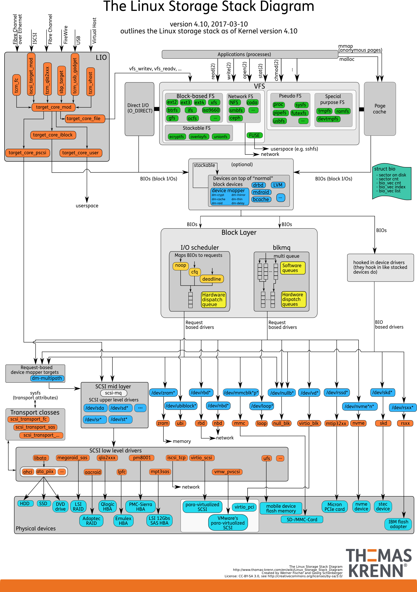
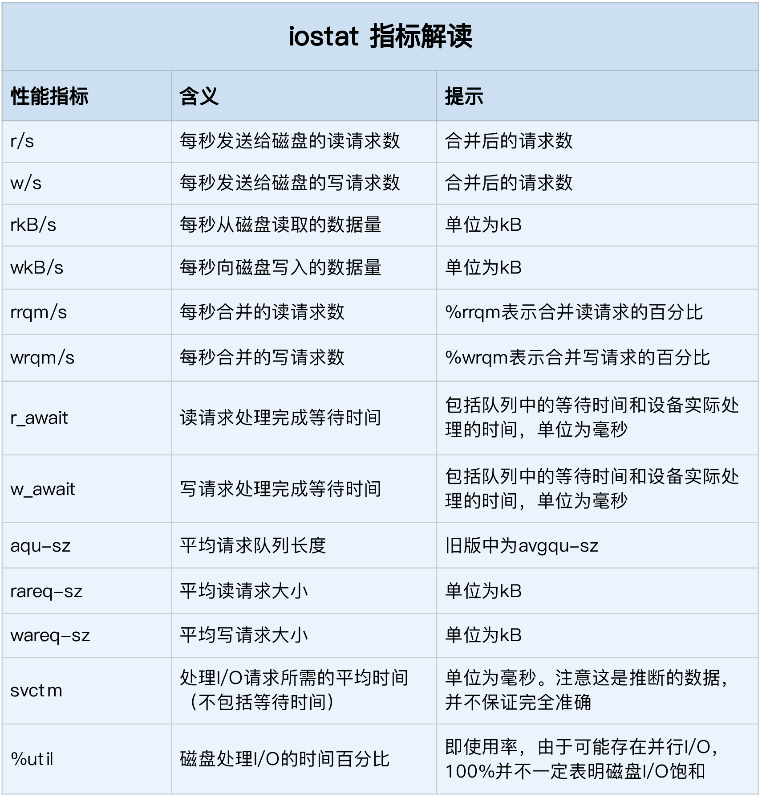

[TOC]

# **操作系统检查**

----
## 1. 性能优化概述
### 1.1 Linux性能优化方法

### 1.2 常用性能指标

### 1.3 性能指标监控工具

### 1.4 性能基准测试工具


## 2. OS性能监控-CPU
### 2.1 进程监控工具

```shell
pstree
ps axwwo user,pid,ppid,%cpu,%mem,vsz,rss,size,stat,start_time,time,maj_flt,cls,nice,pri,nlwp,tty,psr,cmd --forest --cols 300

ps axwwo user,pid,ppid,%cpu,%mem,vsz,rss,stat,time,cmd

ps -auxwww

## 报错需修改
ps -ef | grep -v root | grep -v grep | awk '{print $4}' | grep ^[0-9] | awk '{print "taskset -p",$0}' | sh | grep -v "current affinity mask: [fF]\{1,256\}[fF]"
```

### 2.2 CPU性能指标工具


```shell
vmstat 1 4
cat /proc/cpuinfo
cat /proc/interrupts
cat  /proc/loadavg
lscpu
```

### 2.3 CPU指标工具实例

### 2.4 CPU基准测试工具示例

## 3. OS性能监控-Memory

### 3.1 Memory性能_内存映射


### 3.2 Memory性能指标工具


```shell
free -h
free -g
cat /proc/buddyinfo
cat /proc/cgroups
cat /proc/meminfo
cat /usr/bin/numastat
cat /proc/zoneinfo
cat /proc/slabinfo
cat /proc/vmstat
cat  /sys/kernel/mm/transparent_hugepage/defrag
cat /sys/kernel/mm/transparent_hugepage/khugepaged/defrag
cat /sys/kernel/mm/transparent_hugepage/khugepaged/max_ptes_none
cat /sys/kernel/mm/transparent_hugepage/khugepaged/pages_to_scan
cat /sys/kernel/mm/transparent_hugepage/khugepaged/pages_collapsed
cat /sys/kernel/mm/transparent_hugepage/khugepaged/full_scans
cat /sys/kernel/mm/transparent_hugepage/khugepaged/alloc_sleep_millisecs
cat /sys/kernel/mm/transparent_hugepage/khugepaged/scan_sleep_millisecs
numactl --hardware
pmap PID
```

### 3.3 Memory指标工具实例

### 3.4 Memory基准测试工具示例

## 4. OS性能监控-Disk I/O

### 4.2 I/O原理




### 4.2 I/O性能指标工具




```shell
fdisk -l 2>/dev/null | grep Disk
parted -s /dev/sda unit s print
iostat -x 1 4
lsscsi
scsiinfo -l
lsscsi -H
sfdisk -d
lsblk -o 'NAME,KNAME,MAJ:MIN,FSTYPE,LABEL,RO,RM,MODEL,SIZE,OWNER,GROUP,MODE,ALIGNMENT,MIN-IO,OPT-IO,PHY-SEC,LOG-SEC,ROTA,SCHED,MOUNTPOINT'
cat /proc/partitions
cat /etc/fstab
cat /proc/mounts
cat /etc/mtab
cat /proc/cmdline
cat /proc/consoles
cat /proc/diskstats
cat /proc/filesystems
cat /proc/iomem
cat /proc/ioports
cat /proc/locks
cat /proc/mdstat
cat /etc/lvm/lvm.conf
cat /etc/sysconfig/lvm
ls -l /etc/lvm/backup/*
pvdisplay -vv
vgdisplay -vv
lvdisplay -vv
pvs -vvvv
pvscan -vvv
vgs -vvvv
lvs -vvvv
```

### 4.3 I/O指标工具实例

### 4.4 I/O基准测试工具示例

## 5. OS性能监控-Network

### 5.1 Network原理


### 5.2 Network性能指标工具


**Network性能指标**
实际上，我们通常用带宽、吞吐量、延时、PPS（Packet Per Second）等指标衡量网络的性能。

- **带宽**，表示链路的最大传输速率，单位通常为 b/s （比特 / 秒）。

- **吞吐量**，表示单位时间内成功传输的数据量，单位通常为 b/s（比特 / 秒）或者 B/s（字节 / 秒）。吞吐量受带宽限制，而吞吐量 / 带宽，也就是该网络的使用率。

- **延时**，表示从网络请求发出后，一直到收到远端响应，所需要的时间延迟。在不同场景中，这一指标可能会有不同含义。比如，它可以表示，建立连接需要的时间（比如 TCP 握手延时），或一个数据包往返所需的时间（比如 RTT）。

- **PPS**，是 Packet Per Second（包 / 秒）的缩写，表示以网络包为单位的传输速率。PPS 通常用来评估网络的转发能力，比如硬件交换机，通常可以达到线性转发（即 PPS 可以达到或者接近理论最大值）。而基于 Linux 服务器的转发，则容易受网络包大小的影响。

除了这些指标，**网络的可用性**（网络能否正常通信）、**并发连接数**（TCP 连接数量）、**丢包率**（丢包百分比）、**重传率**（重新传输的网络包比例）等也是常用的性能指标。


### 5.3 Network指标工具实例

#### 5.3.1 网络配置
```shell
## errors 表示发生错误的数据包数，比如校验错误、帧同步错误等；
## dropped 表示丢弃的数据包数，即数据包已经收到了 Ring Buffer，但因为内存不足等原因丢包；
## overruns 表示超限数据包数，即网络 I/O 速度过快，导致 Ring Buffer 中的数据包来不及处理（队列满）而导致的丢包；
## carrier 表示发生 carrirer 错误的数据包数，比如双工模式不匹配、物理电缆出现问题等；
## collisions 表示碰撞数据包数。

# ifconfig ens33
ens33: flags=4163<UP,BROADCAST,RUNNING,MULTICAST>  mtu 1500
        inet 192.168.45.14  netmask 255.255.255.0  broadcast 192.168.45.255
        inet6 fe80::59cd:82bb:758f:ee96  prefixlen 64  scopeid 0x20<link>
        ether 00:0c:29:34:37:07  txqueuelen 1000  (Ethernet)
        RX packets 503  bytes 58639 (57.2 KiB)
        RX errors 0  dropped 0  overruns 0  frame 0
        TX packets 922  bytes 191497 (187.0 KiB)
        TX errors 0  dropped 0 overruns 0  carrier 0  collisions 0
# ip -s  addr show dev ens33
2: ens33: <BROADCAST,MULTICAST,UP,LOWER_UP> mtu 1500 qdisc fq_codel state UP group default qlen 1000
    link/ether 00:0c:29:34:37:07 brd ff:ff:ff:ff:ff:ff
    inet 192.168.45.14/24 brd 192.168.45.255 scope global noprefixroute ens33
       valid_lft forever preferred_lft forever
    inet6 fe80::59cd:82bb:758f:ee96/64 scope link noprefixroute 
       valid_lft forever preferred_lft forever
    RX: bytes  packets  errors  dropped overrun mcast   
    68260      588      0       0       0       0       
    TX: bytes  packets  errors  dropped carrier collsns 
    203045     1010     0       0       0       0 

# ip -s  addr show 
1: lo: <LOOPBACK,UP,LOWER_UP> mtu 65536 qdisc noqueue state UNKNOWN group default qlen 1000
    link/loopback 00:00:00:00:00:00 brd 00:00:00:00:00:00
    inet 127.0.0.1/8 scope host lo
       valid_lft forever preferred_lft forever
    inet6 ::1/128 scope host 
       valid_lft forever preferred_lft forever
    RX: bytes  packets  errors  dropped overrun mcast   
    35992      409      0       0       0       0       
    TX: bytes  packets  errors  dropped carrier collsns 
    35992      409      0       0       0       0       
2: ens33: <BROADCAST,MULTICAST,UP,LOWER_UP> mtu 1500 qdisc fq_codel state UP group default qlen 1000
    link/ether 00:0c:29:34:37:07 brd ff:ff:ff:ff:ff:ff
    inet 192.168.45.14/24 brd 192.168.45.255 scope global noprefixroute ens33
       valid_lft forever preferred_lft forever
    inet6 fe80::59cd:82bb:758f:ee96/64 scope link noprefixroute 
       valid_lft forever preferred_lft forever
    RX: bytes  packets  errors  dropped overrun mcast   
    70834      611      0       0       0       0       
    TX: bytes  packets  errors  dropped carrier collsns 
    205791     1023     0       0       0       0       
3: ens34: <BROADCAST,MULTICAST,UP,LOWER_UP> mtu 1500 qdisc fq_codel state UP group default qlen 1000
    link/ether 00:0c:29:34:37:11 brd ff:ff:ff:ff:ff:ff
    inet 10.0.0.14/24 brd 10.0.0.255 scope global dynamic noprefixroute ens34
       valid_lft 1628sec preferred_lft 1628sec
    inet6 fe80::8639:2b50:cfce:e24c/64 scope link noprefixroute 
       valid_lft forever preferred_lft forever
    RX: bytes  packets  errors  dropped overrun mcast   
    32528425   22650    0       0       0       0       
    TX: bytes  packets  errors  dropped carrier collsns 
    416796     6568     0       0       0       0       
4: virbr0: <NO-CARRIER,BROADCAST,MULTICAST,UP> mtu 1500 qdisc noqueue state DOWN group default qlen 1000
    link/ether 52:54:00:79:94:7c brd ff:ff:ff:ff:ff:ff
    inet 192.168.122.1/24 brd 192.168.122.255 scope global virbr0
       valid_lft forever preferred_lft forever
    RX: bytes  packets  errors  dropped overrun mcast   
    0          0        0       0       0       0       
    TX: bytes  packets  errors  dropped carrier collsns 
    0          0        0       0       0       0       
5: virbr0-nic: <BROADCAST,MULTICAST> mtu 1500 qdisc fq_codel master virbr0 state DOWN group default qlen 1000
    link/ether 52:54:00:79:94:7c brd ff:ff:ff:ff:ff:ff
    RX: bytes  packets  errors  dropped overrun mcast   
    0          0        0       0       0       0       
    TX: bytes  packets  errors  dropped carrier collsns 
    0          0        0       0       0       0 
    
# ip -o addr
1: lo: <LOOPBACK,UP,LOWER_UP> mtu 65536 qdisc noqueue state UNKNOWN \    link/loopback 00:00:00:00:00:00 brd 00:00:00:00:00:00
1: lo    inet 127.0.0.1/8 scope host lo
1: lo    inet6 ::1/128 scope host \       valid_lft forever preferred_lft forever
2: eth0: <BROADCAST,MULTICAST,UP,LOWER_UP> mtu 1500 qdisc pfifo_fast state UP qlen 1000\    link/ether 00:0c:29:ae:1a:6d brd ff:ff:ff:ff:ff:ff
2: eth0    inet 192.168.45.3/24 brd 192.168.45.255 scope global eth0
2: eth0    inet6 fe80::20c:29ff:feae:1a6d/64 scope link \       valid_lft forever preferred_lft forever
3: eth1: <BROADCAST,MULTICAST,UP,LOWER_UP> mtu 1500 qdisc pfifo_fast state UP qlen 1000\    link/ether 00:0c:29:ae:1a:77 brd ff:ff:ff:ff:ff:ff
3: eth1    inet 10.0.0.16/24 brd 10.0.0.255 scope global eth1
3: eth1    inet6 fe80::20c:29ff:feae:1a77/64 scope link \       valid_lft forever preferred_lft forever
```
#### 5.3.2 协议栈统计信息
```shell
netstat -neopa

## head -n 3 表示只显示前面 3 行
## -l 表示只显示监听套接字
## -n 表示显示数字地址和端口 (而不是名字)
## -p 表示显示进程信息
# netstat -nlp|head -n 10
Active Internet connections (only servers)
Proto Recv-Q Send-Q Local Address           Foreign Address         State       PID/Program name    
tcp        0      0 192.168.122.1:53        0.0.0.0:*               LISTEN      1942/dnsmasq        
tcp        0      0 0.0.0.0:22              0.0.0.0:*               LISTEN      1543/sshd           
tcp        0      0 127.0.0.1:631           0.0.0.0:*               LISTEN      1540/cupsd          
tcp6       0      0 :::22                   :::*                    LISTEN      1543/sshd           
tcp6       0      0 ::1:631                 :::*                    LISTEN      1540/cupsd          
udp        0      0 0.0.0.0:58932           0.0.0.0:*                           1386/avahi-daemon:  
udp        0      0 192.168.122.1:53        0.0.0.0:*                           1942/dnsmasq        
udp        0      0 0.0.0.0:67              0.0.0.0:*                           1942/dnsmasq   

# netstat -lntup|head -n 10
Active Internet connections (only servers)
Proto Recv-Q Send-Q Local Address           Foreign Address         State       PID/Program name    
tcp        0      0 192.168.122.1:53        0.0.0.0:*               LISTEN      1942/dnsmasq        
tcp        0      0 0.0.0.0:22              0.0.0.0:*               LISTEN      1543/sshd           
tcp        0      0 127.0.0.1:631           0.0.0.0:*               LISTEN      1540/cupsd          
tcp6       0      0 :::22                   :::*                    LISTEN      1543/sshd           
tcp6       0      0 ::1:631                 :::*                    LISTEN      1540/cupsd          
udp        0      0 0.0.0.0:58932           0.0.0.0:*                           1386/avahi-daemon:  
udp        0      0 192.168.122.1:53        0.0.0.0:*                           1942/dnsmasq        
udp        0      0 0.0.0.0:67              0.0.0.0:*                           1942/dnsmasq 


# ss -ltnp|head -n 10
State     Recv-Q    Send-Q       Local Address:Port        Peer Address:Port                                                
LISTEN    0         32           192.168.122.1:53               0.0.0.0:*        users:(("dnsmasq",pid=1942,fd=6))                                              
LISTEN    0         128                0.0.0.0:22               0.0.0.0:*        users:(("sshd",pid=1543,fd=5))                                                 
LISTEN    0         5                127.0.0.1:631              0.0.0.0:*        users:(("cupsd",pid=1540,fd=10))                                               
LISTEN    0         128                   [::]:22                  [::]:*        users:(("sshd",pid=1543,fd=7))                                                 
LISTEN    0         5                    [::1]:631                 [::]:*        users:(("cupsd",pid=1540,fd=9))

接收队列（Recv-Q）和发送队列（Send-Q）需要你特别关注，它们通常应该是 0。当你发现它们不是 0 时，说明有网络包的堆积发生。当然还要注意，在不同套接字状态下，它们的含义不同.

当套接字处于连接状态（Established）时，
	Recv-Q表示套接字缓冲还没有被应用程序取走的字节数(即接收队列长度)
	而Send-Q表示还没有被远端主机确认的字节数(即发送队列长度)
当套接字处于监听状态（Listening）时，
	Recv-Q表示syn backlog的当前值.
	而Send-Q表示最大的syn backlog值.而syn backlog是TCP 协议栈中的半连接队列长度，相应的也有一个全连接队列（accept queue），它们都是维护 TCP 状态的重要机制。
	
顾名思义，所谓半连接，就是还没有完成 TCP 三次握手的连接，连接只进行了一半，而服务器收到了客户端的 SYN 包后，就会把这个连接放到半连接队列中，然后再向客户端发送 SYN+ACK 包。
而全连接，则是指服务器收到了客户端的 ACK，完成了 TCP 三次握手，然后就会把这个连接挪到全连接队列中。这些全连接中的套接字，还需要再被 accept() 系统调用取走，这样，服务器就可以开始真正处理客户端的请求了。
```
#### 5.3.3 网络吞吐和PPS

```shell
## 数字 1 表示每隔 1 秒输出一组数据
# sar -n DEV 1
Linux 4.20.13-200.fc29.x86_64 (localhost.localdomain)   07/26/2019      _x86_64_        (2 CPU)

04:22:27 PM     IFACE   rxpck/s   txpck/s    rxkB/s    txkB/s   rxcmp/s   txcmp/s  rxmcst/s   %ifutil
04:22:28 PM        lo      0.00      0.00      0.00      0.00      0.00      0.00      0.00      0.00
04:22:28 PM     ens34      1.00      0.00      0.35      0.00      0.00      0.00      0.00      0.00
04:22:28 PM virbr0-nic      0.00      0.00      0.00      0.00      0.00      0.00      0.00      0.00
04:22:28 PM    virbr0      0.00      0.00      0.00      0.00      0.00      0.00      0.00      0.00
04:22:28 PM     ens33      2.00      1.00      0.42      0.24      0.00      0.00      0.00      0.00

rxpck/s 和 txpck/s 分别是接收和发送的 PPS，单位为包 / 秒。
rxkB/s 和 txkB/s 分别是接收和发送的吞吐量，单位是 KB/ 秒。
rxcmp/s 和 txcmp/s 分别是接收和发送的压缩数据包数，单位是包 / 秒。
%ifutil 是网络接口的使用率，即半双工模式下为 (rxkB/s+txkB/s)/Bandwidth，而全双工模式下为 max(rxkB/s, txkB/s)/Bandwidth。
其中，Bandwidth 可以用 ethtool 来查询，它的单位通常是 Gb/s 或者 Mb/s，不过注意这里小写字母 b ，表示比特而不是字节。我们通常提到的千兆网卡、万兆网卡等，单位也都是比特.
```

#### 5.3.4 连通性和延时

```shell
# -c3 表示发送三次 ICMP 包后停止
# ping -c3 114.114.114.114
PING 114.114.114.114 (114.114.114.114) 56(84) bytes of data.
64 bytes from 114.114.114.114: icmp_seq=1 ttl=128 time=2.89 ms
64 bytes from 114.114.114.114: icmp_seq=2 ttl=128 time=2.99 ms
64 bytes from 114.114.114.114: icmp_seq=3 ttl=128 time=3.13 ms

--- 114.114.114.114 ping statistics ---
3 packets transmitted, 3 received, 0% packet loss, time 5ms
rtt min/avg/max/mdev = 2.888/3.002/3.128/0.108 ms

ping 的输出，可以分为两部分。
第一部分，是每个 ICMP 请求的信息，包括 ICMP 序列号（icmp_seq）、TTL（生存时间，或者跳数）以及往返延时。
第二部分，则是三次 ICMP 请求的汇总。
比如上面的示例显示，发送了 3 个网络包，并且接收到 3 个响应，没有丢包发生，这说明测试主机到 114.114.114.114 是连通的；平均往返延时（RTT）是 244ms，也就是从发送 ICMP 开始，到接收到 114.114.114.114 回复的确认，总共经历 244ms。
```

#### 5.3.5 其他工具

```shell
ip neighbour show
ip route list table all
ip route list table cache
ip rule show
ip maddress show
ip tunnel show
ss -s
ss -nlp
ss -aneimp | head -n 5001
ping -s 1300 -W1 -c3 -i0.1 10.0.0.2
ethtool -g eth0
cat /sys/class/net/eth0/statistics/*
cat /proc/net/stat/arp_cache
cat /proc/net/softnet_stat
tc qdisc show
tc filter show
tc class show
```


```shell
vmstat 1 3
mpstat -P ALL 1 3
```

```shell
cat /proc/sys/kernel/tainted   ## 内核模块
ps -elf|egrep " D| Z"        ## 僵尸进程
```

### 5.4 Network基准测试工具示例


## 6. 操作系统版本/架构

### 6.1 查看定时任务

**Linux**

```
crontab -l
crontab -u oracle  -l
crontab -u grid -l
crontab -u acrosspm -l

/etc/cron.deny 表示不能使用 crontab 命令的用户
/etc/cron.allow 表示能使用 crontab 的用户。
如果两个文件同时存在，那么/etc/cron.allow 优先。
如果两个文件都不存在，那么只有超级用户可以安排作业。
每个用户都会生成一个自己的 crontab 文件。这些文件在/var/spool/cron 目录下,查看这些文件，里面的内容和对应用户显示的 crontab -l 一致。

ls -lkt /etc/crontab
```
**HP-UX、Solaris、AIX**

```
crontab -l
crontab -l grid
crontab -l oracle
```
### 6.2 查看系统负载

```
uptime
w
who
who -b
who -r
whoami
cat /proc/uptime
```
### 6.3查看OS内核信息
**AIX**

```
oslevel -r
oslevel -s
bootinfo
```
**Linux/Solaries/HP-UX**

```
uname -a
uname -r
uname -m
uname -sr                          <!--HP-UX操作系统及版本-->

cat /etc/redhat-release
cat /proc/version         ## suse
cat /etc/SuSE-release			## suse
cat /etc/lsb-release

lsb_release			## suse、redhat
lsb_release -a    ## suse、Redhat
```
**Windows**

```
winver>win.txt   或者 我的电脑—属性截图
```
### 6.4 查看IP地址信息

**Windows**

```
hostname>host.txt
ipconfig>ip.txt
```
**Linux/AIX**

```
cat /etc/hosts
ifconfig -a
ethtool eth1
ip addr    <!--linux-->
netstat -in
netstat -r
```
**HP-UX网卡配置**

```
ioscan -fnC lan
lanscan
vi /etc/rc.config.d/netconf
cat /etc/inetd.conf          <!--已经打开的网络协议-->
netstat -in
/opt/ignite/bin/print_manifest
```
## 7. 系统内存检查

**Windows**

```
systeminfo>info.txt   或者   “任务管理器—性能”截图 Windows检查虚拟内存设置
```
**Linux**

```shell
cat /proc/meminfo
grep MemTotal /proc/meminfo
grep SwapTotal /proc/meminfo
free
free -g
free -h                 <!--Redhat6.X以后支持-->

ipcs -m     			## 查看系统使用的IPC共享内存资源
ipcs -q 				## 查看系统使用的IPC队列资源
ipcs -s 				## 查看系统使用的IPC信号量资源

ipcrm -M shmkey			## 移除用shmkey创建的共享内存段
ipcrm -m shmid 			## 移除用shmid标识的共享内存段
ipcrm -Q msgkey			## 移除用msqkey创建的消息队列
ipcrm -q msqid			## 移除用msqid标识的消息队列
ipcrm -S semkey		    ## 移除用semkey创建的信号
ipcrm -s semid 			## 移除用semid标识的信号

## 清除当前用户创建的所有的IPC资源:
ipcs -q | awk '{ print "ipcrm -q "$2}' | sh > /dev/null 2>&1;
ipcs -m | awk '{ print "ipcrm -m "$2}' | sh > /dev/null 2>&1;
ipcs -s | awk '{ print "ipcrm -s "$2}' | sh > /dev/null 2>&1;
```
**AIX**

```
lsattr -El sys0 -a realmem
lsps -a											## 查看交换分区使用
svmon -G
prtconf
lscfg -v
nmon
topas
```
[^注]: 如果不带任何标志运行 prtconf 命令，会显示系统型号、机器序列号、处理器类型、处理器数目、处理器时钟速度、cpu 类型、总内存大小、网络信息、文件系统信息、调页空间信息和设备信息。nmon 然后敲m   巡检报告中务必体现该命令输出信息，可选择截图方式保存

**Solaris**

```
echo ::memstat | mdb -k
/usr/sbin/prtconf |grep "Memory size"
swap -s
prstat -a										## 如需要看具体那个进程占用内存的情况可以使用使用
```

**HP-UX**

```
/usr/contrib/bin/machinfo | grep -i memory
dmesg|grep Physical
swapinfo -atm
```
## 7. 操作系统补丁检查

**AIX**

**11.2 AIX6.1 RAC**

```
lslpp -l abos.adt.base bos.adt.lib bos.adt.libm bos.perf.libperfstat bos.perf.perfstat bos.perf.proctools xlC.aix61.rte xlC.rte rsct.basic.rte rsct.compat.clients.rte gpfs.base
```
**AIX6.1 单机**

```
lslpp -l bos.adt.base bos.adt.lib bos.adt.libm bos.perf.libperfstat bos.perf.perfstat bos.perf.proctools xlC.aix61.rte xlC.rte
```
**Linux**

```shell
/bin/rpm -qa --queryformat "%{DISTRIBUTION}\n" | sort | uniq
```


**11.2 OL7 or RHEL7 (x86-64)**

```
rpm -q compat-libstdc++-33 binutils compat-libcap1 gcc gcc-c++ glibc glibc-devel ksh libaio libaio-devel libgcc libstdc++ libstdc++-devel libXi libXtst make sysstat cpp glibc-headers mpfr
```
[^注 ]: i386和x86_64都要有的包：glibc glibc-devel libaio libaio-devel libgcc libstdc++ libstdc++-devel libXi libXtst
[^参考文章]: Requirements for Installing Oracle 11.2.0.4 RDBMS on OL7 or RHEL7 64-bit (x86-64) (文档 ID 1962100.1)

**11.2 OL6 or RHEL6 (x86-64)**

```
rpm -q binutils compat-libcap1 compat-libstdc++-33 gcc gcc-c++ glibc glibc glibc-devel glibc-devel ksh libgcc libstdc++ libstdc++-devel libaio libaio-devel make sysstat cpp glibc-headers mpfr
```
[^参考文章]: Requirements for Installing Oracle 11gR2 RDBMS on RHEL6 or OL6 64-bit (x86-64) (文档 ID 1441282.1)

**11.2 OL5 or RHEL5 (x86-64)**

```
rpm -q --queryformat "%{NAME}-%{VERSION}-%{RELEASE} (%{ARCH})\n" binutils compat-libstdc++-33 gcc gcc-c++ elfutils-libelf elfutils-libelf-devel elfutils-libelf-devel-static glibc glibc-common glibc-devel glibc-headers ksh libaio libaio-devel libgcc libstdc++ libstdc++-devel make sysstat unixODBC unixODBC-devel
```
[^注 ]: i386和x86_64都要有的包：compat-libstdc++-33 glibc libaio libgcc libstdc++ glibc-devel libaio-devel unixODBC unixODBC-devel

**11.1 OL5 or RHEL5 (x86-64)**

```
rpm -q --queryformat "%{NAME}-%{VERSION}-%{RELEASE} (%{ARCH})\n" binutils compat-libstdc++-33 elfutils-libelf elfutils-libelf-devel gcc gcc-c++ glibc glibc-common glibc-devel libaio libaio-devel libgcc libstdc++ libstdc++-devel make sysstat
```
[^注]: i386和x86_64都要有的包：compat-libstdc++-33 glibc glibc-devel libaio libgcc libstdc++

**10.2 RHEL5**

```
rpm -q --queryformat "%{NAME}-%{VERSION}-%{RELEASE} (%{ARCH})\n" compat-libstdc++-33 gcc-c++ libstdc++-devel glibc-headers glibc-devel glibc-devel libgomp gcc libXp sysstat util-linux
```
[^注]: i386和x86_64都要有的包：compat-libstdc++ glibc-devel   只有i386的包：libXp

**HP-UX查看补丁是否安装命令**

```
swlist –l <补丁名>
swlist –l PHSS_39824

## HP-UX查看系统中安装的所有补丁
/usr/sbin/swlist -l patch | more
swlist –l fileset –a state
swlist -l bundle
swlist -l product
swlist -l product | grep PH
swlist -l fileset -a state -a patch_state
```
## 9. 操作系统参数设置检查

**AIX内核参数检查**

```
cat /etc/security/limits							## AIX检查用户shell资源限制
ulimit -a
lsattr -EH -l sys0 -a maxuproc						## AIX Maxuproc参数设置
ioo -F -a | grep -i aio								## AIX检查AIX系统aio设置
vmo -a -F											## AIX检查虚拟内存参数
```
**Linux内核参数检查**

```
cat /etc/sysctl.conf
cat /etc/security/limits.conf
sysctl -a
ulimit -a
```
```shell
# Oracle 内核参数建议
# sysctl -a|grep vfs_cache_pressure  越低越倾向于使用file_cache
vm.vfs_cache_pressure = 100
建议值:
vm.vfs_cache_pressure = 200
# sysctl -a|grep min_free_kbytes  物理内存少于该值,强制释放
vm.min_free_kbytes = 67584
建议值: 几百M
# sysctl -a|grep swappiness   缺省60,越高SWAP使用率越高
vm.swappiness = 60
建议值: 
vm.swappiness = 0
```

Solaris

```
cat /etc/system
```
**HP-UX查看参数设置**

```
cat /stand/system
sysdef
/usr/sbin/kcweb -F
ulimit -a

kctune| grep shm										## **HP-UX共享内存参数**
kcmodule -d												## **HP-UX显示每个module及描述**
kctune -d												## **HP-UX显示每个内核参数及描述**
kcusage -ht filecache_max								## **HP-UX查看HP-UX的filecache使用率**
kctune filecache_min=5% filecache_max=10%				## **HP-UX修改filecache_max**
ls /stand												## **HP-UX系统内核文件**

## **HP-UX检查UDP和TCP内核参数**
/usr/bin/ndd /dev/tcp tcp_smallest_anon_port tcp_largest_anon_port
/usr/bin/ndd /dev/udp udp_smallest_anon_port udp_largest_anon_port
```
## 10. 操作系统时区、时间检查

**AIX,HP-UX,Solaris**

```
echo $TZ
date

## AIX查看时区
grep TZ /etc/environment

## HP-UX查看时区
cat /etc/default/tz
## HP-UX设置时区
set_parms timezone
## HP-UX查看可用时区
ls -l /usr/lib/tztab
```
**Linux**

```
cat /etc/sysconfig/clock
timedatectl status    										## Linux7.X
date -R
date -u
hwclock
localtime

## 可用时区
 ls -l /usr/share/zoneinfo
```
## 11. 操作系统日志信息
**AIX**

```
errpt -a
errpt
last
```
**Linux**

```
cat /var/log/messages
tail -n 2000 /var/log/messages
dmesg
dmesg | grep -i SCSI
dmesg |grep fail
dmesg |grep error
last -n 100
lastlog
lastb
tail -1000  /var/log/secure
cat /var/log/boot.log   ## redhat
cat /var/log/boot.msg    ## suse
cat /var/log/boot.omsg		## suse
cat /etc/init.d/after.local
ls /var/log/wtmp
last -xF -f /tmp/last_log/wtmp
```
**Solaris**

```
cat /var/adm/messages
```
**HP-UX**

```
/var/adm/syslog/syslog.log                   ## 系统常用信息，如配置、修改、启动、关闭等信息
/var/adm/syslog/mail.log                     ## 电子邮件信息
/var/adm/sulog                               ## 执行su的情况
/var/adm/btmp                                ## 所有注册失败信息
cmviewcl –v                                  ## 检查cluster状况
dmesg
dmesg | grep -i SCSI
dmesg |grep fail
dmesg |grep error
uptime
cat  /var/adm/syslog/syslog.log|grep panic
cat /var/adm/syslog/syslog.log |grep warning
cat /var/adm/syslog/syslog.log |grep err
lastb                                       		## 查看失败登录
last
cat /var/adm/syslog/syslog.log|grep error
cat /var/adm/syslog/syslog.log|grep fail
cat /var/adm/syslog/OLDsyslog.log |grep error
cat /var/adm/syslog/OLDsyslog.log |grep fail
/var/adm/syslog/syslog.log							## **系统日志**
/var/adm/syslog/OLDsyslog.log 						## **上一次系统日志**
/etc/rc.log											## **系统启动日志目录**
/etc/shutdownlog									## **系统关机日志目录**
/var/adm/crash										## **系统CORE DUMP目录**
```
**Tru64**

```
/var/adm/messages
```
**Windows**

```
save Application Log and System Log as .TXT files using Event Viewer
```
## 12. 检查cpu信息
**Windows**

```
wmic cpu list brief>cpu.txt
systeminfo
```
**AIX**

```
pmcycles -m												## **查看逻辑cpu个数**
bindprocessor -q
prtconf|grep Processors									## **查看物理cpu个数**
```
**Linux**

```
cat /proc/cpuinfo
lscpu
```
**HP-UX**

```
machinfo
ioscan -fnC processor
```
**Solaris**

```
mpstat  
psrinfo
prtdiag -v
```
## 13. 查看硬件信息
**Linux**

```
dmidecode
smartctl --all /dev/sda
```
**HP-UX查看硬件信息**

```
machinfo										## HP-UX 查看系统信息
cstm											## HP-UX 查看系统配置
/opt/ignite/bin/print_manifest
glance
model											## HP-UX 查看主机型号
ioscan -fn										## HP-UX硬件状态
parstatus										## HP-UX CELL状态
因该命令组件需要单独收费安装，部分客户系统下无此命令，可选择性搜集（该命令类似AIX下的nmon）
```
**AIX**

```
**查看网卡信息**
lsdev -Cc adapter|grep ent
**查看HBA卡信息**
lsdev -Cc adapter|grep fcs
netstat -in										## ## **查看网络**
netstat -r										## **查看路由表**
```

## 14. 检查文件系统空间

**Linux**

```
df -h
df -hi
df -i
df -al
fdisk -l
mount |column -t
cat /etc/mtab |column -t
cat /etc/fstab
```
**AIX**

```
df -g
mount

## AIX 如若文件系统空间使用率过高，可进一步检查vg信息，在有剩余空间的情况下可以在线扩充文件系统大小；在AIX下可以通过getconf命令去得到裸盘的容量大小
getconf DISK_SIZE /dev/rhdisk1
```
**HP-UX**

```
bdf
df -P
ioscan -m dsf										## **HP-UX检查共享磁盘聚合前后对应关系**

diskinfo /dev/disk/disk								## **HP-UX查看磁盘大小**
diskinfo -v
arraydsp -a

cat /etc/lvmtab										## **HP-UX pv信息**
pvdisplay -v pv名称
vgdisplay -v

ioscan -funC disk									## **HP-UX区别本地磁盘以及外挂磁盘**
ioscan -m lun										## **HP-UX查看lun信息**
ioscan -fnC fc										## **查看HBA卡信息**
lvlnboot -v											## **HP-UX 显示启动卷信息**
setboot												## **HP-UX 启动盘设备path 信息**
lsdev												## **HP-UX 内核加载的设备驱动**
```
**Solaris**

```
df -g 
df -h
```
**Windows**

计算机管理-磁盘管理
## 15. 检查物理卷
**AIX**

```
lspv                                		## 检查pvid 部分，如果使用ASM模式一定要确保删除pvid
lspath										## **查看硬盘**
lsdev -Cc disk								## **列出所有磁盘设备**

## AIX检查reserve policy设置情况
lsattr -El hdisk1 | grep reserve
lsattr -El rhdiskpower1 | grep reserve
for i in `lspv |awk '{print $1}'`;do echo $i `lsattr -El $i |grep reserve` ;done;

## AIX检查共享vg下lv状态
lsvg -l datavg
lslv -l loglv00
```
**HP-UX**

```
strings /etc/lvmtab
```
**Linux**

```
pvscan
vgscan
lvscan
pvdisplay
vgdisplay -vv
lvdisplay
```
## 16. 多路径状态
**Linux 系统下几种多路径状态的查询方法**

```
multipath -ll											## multipath方式多路径状态检查
powermt display dev=all									## EMC存储powerpath
dlnkmgr view -path										## 日立多路径软件
upadmin	show vlun										## 华为存储多路径查询
upResscan/hot_add										## 华为存储扫描
```
----

## 17. VMware检查

```shell
lsmod |grep -E 'vmmemctl|vmw_balloon'
vmware-toolbox-cmd stat balloon
vmware-toolbox-cmd stat swap
/etc/init.d/vmware-tools status
/sbin/chkconfig -l vmware-tools
```

## 18. HBA检查

```shell
lspci | grep Fibre
grep adapter-port /proc/scsi/qla2xxx/*
```

## 19.BMC查看

```shell
ipmitool lan print
ipmitool chassis status
ipmitool mc selftest
ipmitool chassis restart_cause
ipmitool sel info
ipmitool sensor
ipmitool sel list last 300
ipmitool fru list
```
## 20. 系统服务相关

```shell
systemctl list-unit-files|grep enabled   //7.x
chkconfig --list|grep on
```


## 21. 其他OS配置

```shell
cat cat /proc/sys/kernel/tainted
cat /etc/grub.conf
cat  /boot/grub/menu.lst
cat /boot/grub/device.map
hwinfo --framebuffer
cat  /etc/sysconfig/kernel
cat /etc/init.d/boot.local
cat /etc/init.d/before.local 
cat /etc/init.d/after.local
cat /etc/init.d/halt.local
cat /proc/devices
cat /proc/crypto
cat /proc/dma
cat /proc/execdomains
cat /proc/fb
cat  /usr/bin/procinfo
ls -l --time-style=long-iso /usr/lib64/efi
ls -lkt /etc/security
ls -lkt /
ls -lkt /var/log/atop/
ls -lkt /var/
ls -lkt /var/lib/
ls -lkt /var/log/audit/audit.log

stat /etc/security

# 模块
lsmod

# 查看Java安装版本
alternatives --display java
```

## 22. lsof

```sh
lsof -bM -n -l
```

