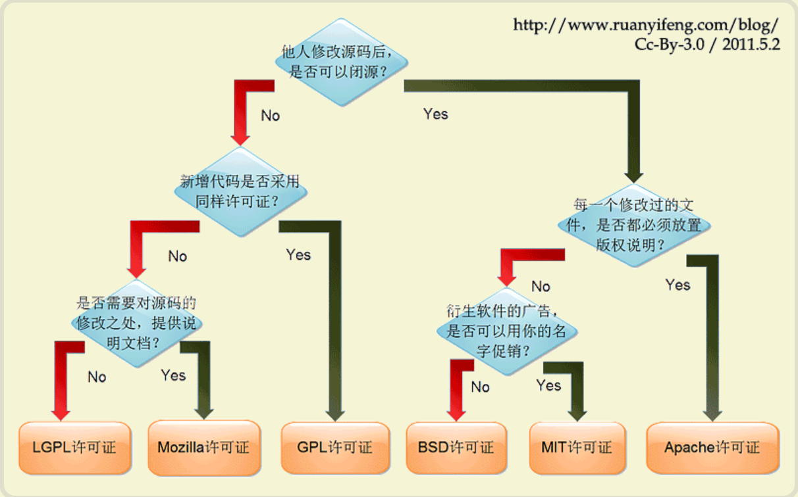

# 硬件、OS及云计算技术讲解
[TOC]


## 一、软件架构及IT设计思想

### 1. 软件架构


==**分层**：应用层、服务层、数据层==

### 2. IT思想

- 万物皆文件

  linux proc文件系统

- 处处皆缓存

  **硬件缓存**：CPU一级、二级缓存，内存、SWAP、硬盘缓存、存储缓存

  


  **软件缓存**：MongoDB、Redis、Memcached


  **buffer与cache**：

  buffer负责写、cache负责读

  buffer : 作为buffer cache的内存，是块设备的读写缓冲区

  cache: 作为page cache的内存，文件系统的cache

- 需求、目的

  [大型网站架构演化历程]: https://www.hollischuang.com/archives/728

- 分层、劳动分工、线性扩展

  闻道有先后、术业有专攻，让合适的人干合适的自己事

  **分层**：应用层、服务层、数据层

  .jpg)

- 最小化原则

- 其他

  - 在数据产生的地方进行数据处理

  - 网络与硬盘使用相同的协议：网络与硬盘一样快

- 对比学习：
  - Oracle-MySQL（RC--SS）；RDB--NoSQL

  - Oracle--MySQL--MongoDB（堆表--有序表--cson、json）

  - Linux--Windows


  少看中国人写的技术书，少用百度、搜狗、360，别安装360、腾讯管家。

  拥抱新技术：关宁铁骑

  CAP、BASE

  贪多嚼不烂  -- 广博未必精通，精通必定广博

**参考文档**：

- 大型网站技术架构：核心原理与案例分析
- 人月神话（40周年中文纪念版）

## 二、硬件、OS

### 整体架构图


### 1. 硬件

#### 1.1 服务器

##### 服务器分类

x86、小机、大型机、云主机-->服务器、云主机

zabbix、bmc patrol

SaltStack、ansible、puppet--堡垒机

NBU、commvault

#### 1.2 光纤交换机

##### 配置流程

设备上架(插入光模块)-->使用管理口连接光纤交换-->激活端口-->创建zone-->映射划分

#####  光纤交换机讲解


##### 光纤交换机级联

光纤网关、光闸

**堆叠**

通过XPAK端口将多台光纤交换机相连，称为光纤交换机的“堆叠”。

采用堆叠方式进行连接时，您需要额外购买堆叠线缆，且堆叠长度有限，堆叠线缆最长为2m；但相对于级联，堆叠具有更高的带宽，且不占用光纤交换机的FC端口。

2台光纤交换机进行堆叠的建议组网如

图11-1

所示，最多可激活和使用40个FC端口。

图11-1  2台光纤交换机堆叠 


3台光纤交换机进行堆叠的建议组网如

图11-2

，最多可激活和使用60个FC端口。

图11-2  3台光纤交换机堆叠 


**级联**

通过任意激活的FC端口将多台光纤交换机相连，称为光纤交换机的“级联”。

采用级联方式进行连接时，光纤交换机部分FC端口将被占用；但相对于堆叠，级联采用的光纤具有更长走线距离。

2台光纤交换机进行级联的建议组网如

图11-3

所示，最多可激活和使用32个FC端口。

图11-3  2台光纤交换机级联 


3台光纤交换机进行级联的建议组网如

图11-4

，最多可激活和使用48个FC端口。

图11-4  3台光纤交换机级联 


#### 1.3 存储

##### 硬盘

SATA --> SAS -->SSD

##### 存储讲解


##### 虚拟存储


#### 1.4 网络交换机

二层交换机：没有路由功能

三层交换机：路由功能、地址转发

### 2.OS

#### 2.1 OS分类

| Linux  |        |        |                 |
| ------ | ------ | ------ | --------------- |
| Redhat | CentOS | Fedora | *Oracle  Linux* |
| Debian | SuSE   | Ubuntu |                 |

| Unix  |                 |
| ----- | --------------- |
| Aix   | ==Power Linux== |
| HP-UX |                 |

#### 2.2 OS知识点

linux目录结构


#### 2.3 命令参数

```
umount -lf  /mnt
mount |column -t
ls -lrt
ps -elf
netstat -lntup
ss -lntup
!export
cd $_
echo $?
iostat -x 1 10
statue
yum provides/yum whatprovide
;; && ||
>/dev/null 2>＆1
fuse -- tasklist /m shell32.dll
ctrl+z --> jobs -->bg %1 --> fg %1
lsof
strace、ltrace
sync
```

#### 2.4 常见知识点

来源协议：



##### vim使用技巧

#### 2.5 常用资源、办公效率提升

SecretCRT

Vmware

Notepad++/UE

Typora/Atom

Git/SourceTree

Chrome

Windows

**参考文档**：

- [Linux性能调优指南]: https://legacy.gitbook.com/book/lihz1990/transoflptg/details

- 性能之巅 洞悉系统、企业与云计算

## 三、云计算

### 1. 云计算概念

计算资源像电一样自由随需获取

Oracle12c资源限定

- cgroup
- namespace
- chroot 
- cpu 指令集

### 2. 云计算技术

#### 2.1 docker

docker --> kubenotes(k8s)

#### 2.2 openstack

AWS --> OpenStack/OpenCloud

#### 2.3 VMware vSphere

私有云

### 3.公有云平台

**国际**

AWS、谷歌云、Azure

**国内**

阿里云、华为云、腾讯云、七牛云

**参考文档**

- docker实力经典
- 官方文档

