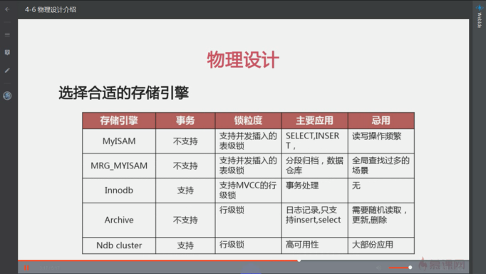

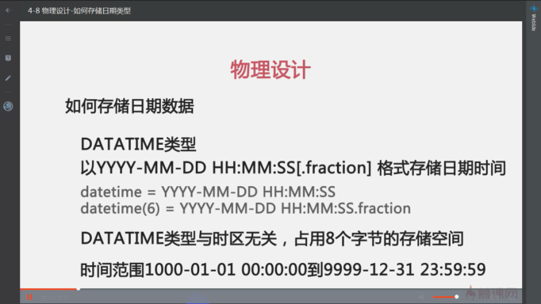

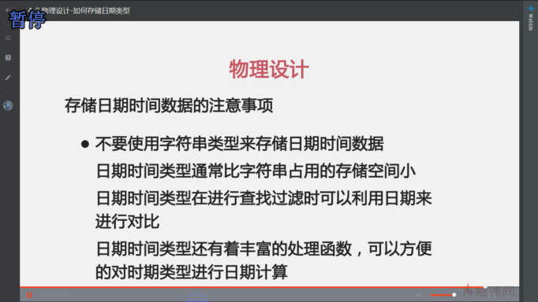
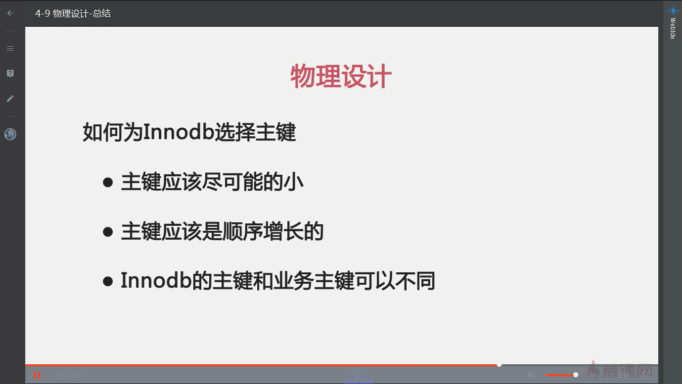

(root@localhost) [(none)]> show variables like 'binlog_format';

+---------------+-------+

| Variable_name | Value |

+---------------+-------+

| binlog_format | ROW   |

+---------------+-------+

1 row in set (0.00 sec)

(root@localhost) [(none)]> show binary logs;

+------------+------------+

| Log_name   | File_size  |

+------------+------------+

| bin.000001 |        177 |

| bin.000002 |        421 |

| bin.000003 |        217 |

| bin.000004 |        217 |

| bin.000005 |        217 |

| bin.000006 |        217 |

| bin.000007 |     120299 |

| bin.000008 |        217 |

| bin.000009 |        217 |

| bin.000010 |        217 |

| bin.000011 |        217 |

| bin.000012 |        217 |

| bin.000013 |        217 |

| bin.000014 |        217 |

| bin.000015 |        217 |

| bin.000016 |        217 |

| bin.000017 |        217 |

| bin.000018 |        217 |

| bin.000019 |        217 |

| bin.000020 |        217 |

| bin.000021 |       6678 |

| bin.000022 |        382 |

| bin.000023 |        217 |

| bin.000024 |        194 |

| bin.000025 |       4613 |

| bin.000026 |       9167 |

| bin.000027 |        217 |

| bin.000028 |       4453 |

| bin.000029 |   66376295 |

| bin.000030 |   10674999 |

| bin.000031 |        217 |

| bin.000032 |        217 |

| bin.000033 |       1960 |

| bin.000034 |        659 |

| bin.000035 |       3174 |

| bin.000036 |        416 |

| bin.000037 |        217 |

| bin.000038 |    2049281 |

| bin.000039 |        217 |

| bin.000040 |        217 |

| bin.000041 |        217 |

| bin.000042 |        217 |

| bin.000043 |        217 |

| bin.000044 |        235 |

| bin.000045 |        217 |

| bin.000046 |        217 |

| bin.000047 |        939 |

| bin.000048 |        217 |

| bin.000049 |        217 |

| bin.000050 | 1075207675 |

| bin.000051 |  848370257 |

| bin.000052 |        194 |

+------------+------------+

52 rows in set (0.00 sec)

(root@localhost) [(none)]> flush logs;

Query OK, 0 rows affected (0.35 sec)

(root@localhost) [(none)]> show variables like 'binlog_row_image';   ###FULL NOBOL  MIN

+------------------+-------+

| Variable_name    | Value |

+------------------+-------+

| binlog_row_image | FULL  |

+------------------+-------+

1 row in set (0.00 sec)

mysqlbinlog -vv 

mysql> show variables like 'log_bin';

+---------------+-------+

| Variable_name | Value |

+---------------+-------+

| log_bin       | ON    |

+---------------+-------+

1 row in set (0.00 sec)

mysql> show variables like 'server_id';

+---------------+-------+

| Variable_name | Value |

+---------------+-------+

| server_id     | 2     |

+---------------+-------+

1 row in set (0.00 sec)

log-bin=mysql-bin

server-id=2

relay_log=mysql-relay-bin

log_slave_updates = 1

read_only = 1

skip-slave-start

mysql> show processlist;

+----+------+-------------+------+-------------+------+---------------------------------------------------------------+------------------+

| Id | User | Host        | db   | Command     | Time | State                                                         | Info             |

+----+------+-------------+------+-------------+------+---------------------------------------------------------------+------------------+

| 14 | root | localhost   | NULL | Query       |    0 | starting                                                      | show processlist |

| 15 | repl | slave:50408 | NULL | Binlog Dump |   88 | Master has sent all binlog to slave; waiting for more updates | NULL             |

+----+------+-------------+------+-------------+------+---------------------------------------------------------------+------------------+

2 rows in set (0.00 sec)

mysql> show processlist;

+----+-------------+-----------+------+---------+------+--------------------------------------------------------+------------------+

| Id | User        | Host      | db   | Command | Time | State                                                  | Info             |

+----+-------------+-----------+------+---------+------+--------------------------------------------------------+------------------+

|  3 | root        | localhost | NULL | Sleep   |  157 |                                                        | NULL             |

|  4 | root        | localhost | NULL | Query   |    0 | starting                                               | show processlist |

|  5 | system user |           | NULL | Connect |   81 | Waiting for master to send event                       | NULL             |

|  6 | system user |           | NULL | Connect |   81 | Slave has read all relay log; waiting for more updates | NULL             |

+----+-------------+-----------+------+---------+------+--------------------------------------------------------+------------------+

4 rows in set (0.00 sec)

mysql>  system perror 1872

MySQL error code 1872 (ER_SLAVE_RLI_INIT_REPOSITORY): Slave failed to initialize relay log info structure from the repository

mysql> show variables like 'gtid_mode';

+---------------+-------+

| Variable_name | Value |

+---------------+-------+

| gtid_mode     | OFF   |

+---------------+-------+

1 row in set (0.00 sec)

## gtid dump

mysqldump --single-transaction --master-data=2 --triggers --routines --events --all-databases -uroot -p> all_gtid.sql     

   

#多线程复制
mysql> stop slave;
Query OK, 0 rows affected (0.00 sec)
mysql> set global slave_parallel_type= 'logical_clock';
Query OK, 0 rows affected (0.00 sec)
mysql> set global slave_parallel_workers=2;
Query OK, 0 rows affected (0.00 sec)
mysql> start slave;
Query OK, 0 rows affected (0.01 sec)
mysql> show processlist;
+----+-------------+-----------+------+---------+------+--------------------------------------------------------+------------------+
| Id | User        | Host      | db   | Command | Time | State                                                  | Info             |
+----+-------------+-----------+------+---------+------+--------------------------------------------------------+------------------+
|  4 | root        | localhost | NULL | Query   |    0 | starting                                               | show processlist |
|  7 | system user |           | NULL | Connect |   54 | Waiting for master to send event                       | NULL             |
|  8 | system user |           | NULL | Connect |   54 | Slave has read all relay log; waiting for more updates | NULL             |
|  9 | system user |           | NULL | Connect |   54 | Waiting for an event from Coordinator                  | NULL             |
| 10 | system user |           | NULL | Connect |   54 | Waiting for an event from Coordinator                  | NULL             |
+----+-------------+-----------+------+---------+------+--------------------------------------------------------+------------------+
5 rows in set (0.00 sec)
mysql> show slave hosts;
+-----------+------+------+-----------+--------------------------------------+
| Server_id | Host | Port | Master_id | Slave_UUID                           |
+-----------+------+------+-----------+--------------------------------------+
|        13 |      | 3306 |        11 | 25b8bfec-35b3-11e8-9657-000c29653458 |
|        12 |      | 3306 |        11 | 23eeb92b-35b3-11e8-94db-000c29b85972 |
+-----------+------+------+-----------+--------------------------------------+
2 rows in set (0.00 sec)
create index index_name on table(col_name(n));
optimize table table_name;

(root@localhost) [sakila]> set profiling =1;
Query OK, 0 rows affected, 1 warning (0.00 sec)
(root@localhost) [sakila]> select count(*) from film;
+----------+
| count(*) |
+----------+
|     1000 |
+----------+
1 row in set (0.00 sec)
(root@localhost) [sakila]> show profiles;
+----------+------------+---------------------------+

| Query_ID | Duration | Query |
| -------- | -------- | ----- |
|          |          |       |
+----------+------------+---------------------------+
| 1    | 0.00037100 | select count(*) from film |
| ---- | ---------- | ------------------------- |
|      |            |                           |
+----------+------------+---------------------------+
1 row in set, 1 warning (0.00 sec)
(root@localhost) [sakila]> show profile for query 1;
+----------------------+----------+
| Status | Duration |
| ------ | -------- |
|        |          |
+----------------------+----------+
| starting | 0.000051 |
| -------- | -------- |
|          |          |
| checking permissions | 0.000005 |
| -------------------- | -------- |
|                      |          |
| Opening tables | 0.000015 |
| -------------- | -------- |
|                |          |
| init | 0.000012 |
| ---- | -------- |
|      |          |
| System lock | 0.000007 |
| ----------- | -------- |
|             |          |
| optimizing | 0.000003 |
| ---------- | -------- |
|            |          |
| statistics | 0.000011 |
| ---------- | -------- |
|            |          |
| preparing | 0.000009 |
| --------- | -------- |
|           |          |
| executing | 0.000002 |
| --------- | -------- |
|           |          |
| Sending data | 0.000224 |
| ------------ | -------- |
|              |          |
| end  | 0.000004 |
| ---- | -------- |
|      |          |
| query end | 0.000007 |
| --------- | -------- |
|           |          |
| closing tables | 0.000006 |
| -------------- | -------- |
|                |          |
| freeing items | 0.000009 |
| ------------- | -------- |
|               |          |
| cleaning up | 0.000008 |
| ----------- | -------- |
|             |          |
+----------------------+----------+
15 rows in set, 1 warning (0.00 sec)
(root@localhost) [sakila]> show profile cpu for query 1;
+----------------------+----------+----------+------------+
| Status | Duration | CPU_user | CPU_system |
| ------ | -------- | -------- | ---------- |
|        |          |          |            |
+----------------------+----------+----------+------------+
| starting | 0.000051 | 0.000000 | 0.000000 |
| -------- | -------- | -------- | -------- |
|          |          |          |          |
| checking permissions | 0.000005 | 0.000000 | 0.000000 |
| -------------------- | -------- | -------- | -------- |
|                      |          |          |          |
| Opening tables | 0.000015 | 0.000000 | 0.000000 |
| -------------- | -------- | -------- | -------- |
|                |          |          |          |
| init | 0.000012 | 0.000000 | 0.000000 |
| ---- | -------- | -------- | -------- |
|      |          |          |          |
| System lock | 0.000007 | 0.000000 | 0.000000 |
| ----------- | -------- | -------- | -------- |
|             |          |          |          |
| optimizing | 0.000003 | 0.000000 | 0.000000 |
| ---------- | -------- | -------- | -------- |
|            |          |          |          |
| statistics | 0.000011 | 0.000000 | 0.000000 |
| ---------- | -------- | -------- | -------- |
|            |          |          |          |
| preparing | 0.000009 | 0.000000 | 0.000000 |
| --------- | -------- | -------- | -------- |
|           |          |          |          |
| executing | 0.000002 | 0.000000 | 0.000000 |
| --------- | -------- | -------- | -------- |
|           |          |          |          |
| Sending data | 0.000224 | 0.000000 | 0.000000 |
| ------------ | -------- | -------- | -------- |
|              |          |          |          |
| end  | 0.000004 | 0.000000 | 0.000000 |
| ---- | -------- | -------- | -------- |
|      |          |          |          |
| query end | 0.000007 | 0.000000 | 0.000000 |
| --------- | -------- | -------- | -------- |
|           |          |          |          |
| closing tables | 0.000006 | 0.000000 | 0.000000 |
| -------------- | -------- | -------- | -------- |
|                |          |          |          |
| freeing items | 0.000009 | 0.000000 | 0.000000 |
| ------------- | -------- | -------- | -------- |
|               |          |          |          |
| cleaning up | 0.000008 | 0.000000 | 0.000000 |
| ----------- | -------- | -------- | -------- |
|             |          |          |          |
+----------------------+----------+----------+------------+
15 rows in set, 1 warning (0.00 sec)
(root@localhost) [sakila]> SELECT @@profiling;
+-------------+
| @@profiling |
+-------------+
|           1 |
+-------------+
1 row in set, 1 warning (0.00 sec)
(root@localhost) [sakila]> SHOW PROFILE;
+----------------------+----------+
| Status | Duration |
| ------ | -------- |
|        |          |
+----------------------+----------+
| starting | 0.000056 |
| -------- | -------- |
|          |          |
| checking permissions | 0.000003 |
| -------------------- | -------- |
|                      |          |
| Opening tables | 0.000004 |
| -------------- | -------- |
|                |          |
| init | 0.000010 |
| ---- | -------- |
|      |          |
| optimizing | 0.000004 |
| ---------- | -------- |
|            |          |
| executing | 0.000007 |
| --------- | -------- |
|           |          |
| end  | 0.000003 |
| ---- | -------- |
|      |          |
| query end | 0.000004 |
| --------- | -------- |
|           |          |
| closing tables | 0.000003 |
| -------------- | -------- |
|                |          |
| freeing items | 0.000008 |
| ------------- | -------- |
|               |          |
| cleaning up | 0.000010 |
| ----------- | -------- |
|             |          |
+----------------------+----------+
11 rows in set, 1 warning (0.00 sec)
(root@localhost) [sakila]> set profiling = 0;
Query OK, 0 rows affected, 1 warning (0.00 sec)
(root@localhost) [sakila]> SHOW VARIABLES LIKE 'performance_schema';
+--------------------+-------+
| Variable_name | Value |
| ------------- | ----- |
|               |       |
+--------------------+-------+
| performance_schema | ON   |
| ------------------ | ---- |
|                    |      |
+--------------------+-------+
1 row in set (0.00 sec)

(root@localhost) [(none)]> select connection_id();
ERROR 2006 (HY000): MySQL server has gone away
No connection. Trying to reconnect...
Connection id:    14
Current database: * NONE *
+-----------------+
| connection_id() |
+-----------------+
|              14 |
+-----------------+
1 row in set (0.00 sec)

(root@localhost) [mytest]> begin;
Query OK, 0 rows affected (0.00 sec)
(root@localhost) [mytest]> insert into t5 (i) values (2),(3);
Query OK, 2 rows affected (0.39 sec)
Records: 2  Duplicates: 0  Warnings: 0
(root@localhost) [mytest]> savepoint s1;
Query OK, 0 rows affected (0.00 sec)
(root@localhost) [mytest]> insert into t5 (i) values (4),(5);
Query OK, 2 rows affected (0.00 sec)
Records: 2  Duplicates: 0  Warnings: 0
(root@localhost) [mytest]> savepoint s2;
Query OK, 0 rows affected (0.00 sec)
(root@localhost) [mytest]> insert into t5 (i) values (6),(7);
Query OK, 2 rows affected (0.00 sec)
Records: 2  Duplicates: 0  Warnings: 0
(root@localhost) [mytest]> select * from t5;
+---+
| i |
+---+
| 2 |
| 3 |
| 4 |
| 5 |
| 6 |
| 7 |
+---+
6 rows in set (0.00 sec)
(root@localhost) [mytest]> rollback to savepoint s2;
Query OK, 0 rows affected (0.00 sec)
(root@localhost) [mytest]> select * from t5;
+---+
| i |
+---+
| 2 |
| 3 |
| 4 |
| 5 |
+---+
4 rows in set (0.00 sec)
(root@localhost) [mytest]> rollback;
Query OK, 0 rows affected (0.00 sec)
(root@localhost) [mytest]> select * from t5;
Empty set (0.00 sec)
SHOW GLOBAL STATUS like '%binlog%';
###/etc/sysctl.cnf
vm.swappiness ≤ 10
vm.dirty_ratio ≤ 5
vm.dirty_background_ratio ≤ 10
or
echo 5 >/proc/sys/vm/swappiness

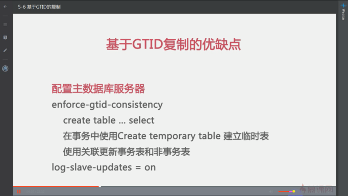
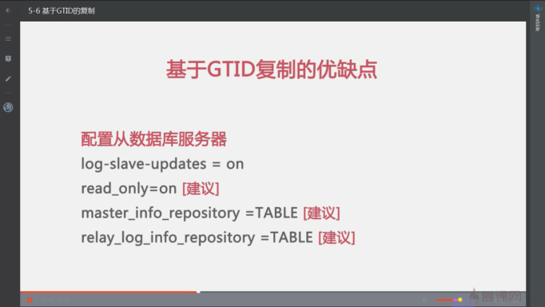
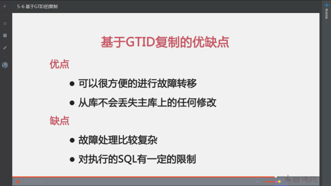

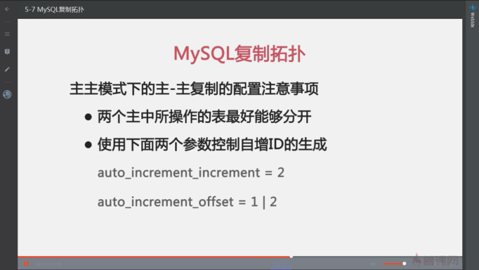

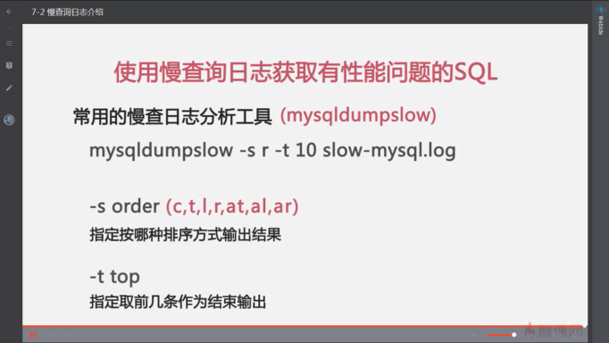

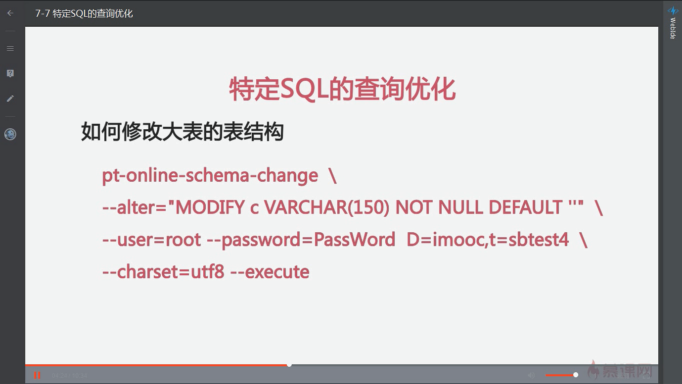

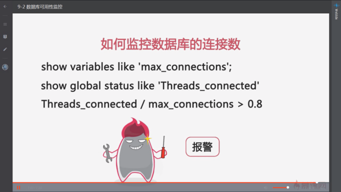

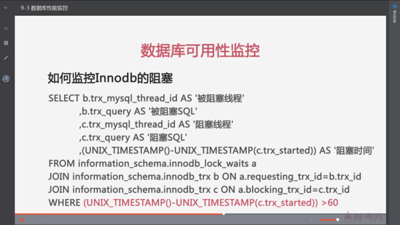

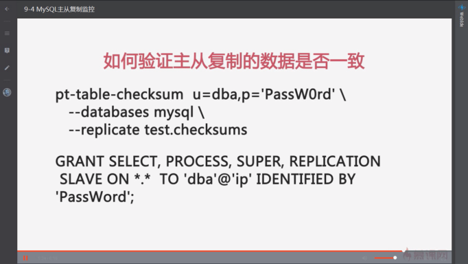

