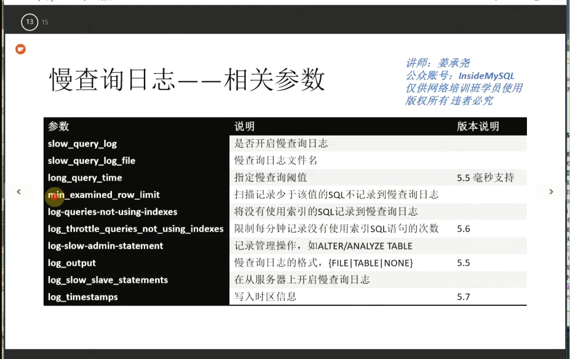

[TOC]

## 查看MySQL连接超时

```
mysql> SHOW GLOBAL VARIABLES LIKE '%TIMEOUT';
+-----------------------------+----------+
| Variable_name               | Value    |
+-----------------------------+----------+
| connect_timeout             | 10       |
| delayed_insert_timeout      | 300      |
| have_statement_timeout      | YES      |
| innodb_flush_log_at_timeout | 1        |
| innodb_lock_wait_timeout    | 50       |
| innodb_rollback_on_timeout  | OFF      |
| interactive_timeout         | 28800    |
| lock_wait_timeout           | 31536000 |
| net_read_timeout            | 30       |
| net_write_timeout           | 60       |
| rpl_stop_slave_timeout      | 31536000 |
| slave_net_timeout           | 60       |
|c               | 28800    |
+-----------------------------+----------+
13 rows in set (0.01 sec)
```
## 查看MySQL运行多长时间
```
mysql> show global status like 'UPTIME';
+---------------+-------+
| Variable_name | Value |
+---------------+-------+
| Uptime        | 1030  |
+---------------+-------+
1 row in set (0.00 sec)
```
## 查看mysql请求链接进程被主动杀死
```
mysql> SHOW GLOBAL STATUS LIKE 'COM_KILL';
+---------------+-------+
| Variable_name | Value |
+---------------+-------+
| Com_kill      | 0     |
+---------------+-------+
1 row in set (0.01 sec)
```
## 查看MySQL通信信息包最大值
```
mysql> SHOW GLOBAL VARIABLES LIKE 'MAX_ALLOWED_PACKET';
+--------------------+---------+
| Variable_name      | Value   |
+--------------------+---------+
| max_allowed_packet | 4194304 |
+--------------------+---------+
1 row in set (0.00 sec)
```
## 如下脚本创建数据库yourdbname，并制定默认的字符集是utf8
```
CREATE DATABASE IF NOT EXISTS yourdbname DEFAULT CHARSET utf8 COLLATE utf8_general_ci;
```
## 如果要创建默认gbk字符集的数据库可以用下面的sql
```
create database yourdb DEFAULT CHARACTER SET gbk COLLATE gbk_chinese_ci;
```
## 权限
```
show grants for 'root'@'localhost';
show privileges
```
## mysql常用参数
```
mysql --help
```
## create user和赋权、修改密码
```
create user 'root'@'%' identified by 'oracle';
GRANT ALL PRIVILEGES ON . TO 'root'@'%'  WITH GRANT OPTION;
GRANT ALL PRIVILEGES ON . TO 'root'@'*.mysql.com'  WITH GRANT OPTION;
GRANT ALL PRIVILEGES ON . TO 'root'@'192.168.45.0/255.255.255.0'  WITH GRANT OPTION;
drop user 'root'@'192.168.45.52';
rename user  'system'@'192.168.45.52' to 'test'@'192.168.45.52';
set password for 'sys'@'192.168.45.52' = password('oracle');
set password = "oracle";       ###mysql5.7写法
```
## mysql字符集
```
root@mysql 14:00:  [(none)]> show variables like '%char%';
+--------------------------+----------------------------------------------------------------+
| Variable_name            | Value                                                          |
+--------------------------+----------------------------------------------------------------+
| character_set_client     | utf8                                                           |
| character_set_connection | utf8                                                           |
| character_set_database   | utf8mb4                                                        |
| character_set_filesystem | binary                                                         |
| character_set_results    | utf8                                                           |
| character_set_server     | utf8mb4                                                        |
| character_set_system     | utf8                                                           |
| character_sets_dir       | /usr/local/mysql-5.7.21-linux-glibc2.12-x86_64/share/charsets/ |
+--------------------------+----------------------------------------------------------------+
8 rows in set (0.00 sec)
```
## mysql dual表
```
MySQL:
mysql> select 4*4 from dual;
+-----+
| 4*4 |
+-----+
|  16 |
+-----+
1 row in set (0.07 sec)
mysql> select 4*4;
+-----+
| 4*4 |
+-----+
|  16 |
+-----+
1 row in set (0.00 sec)
mysql> select * from dual;
ERROR 1096 (HY000): No tables used
Oracle:
sys@ORCL> select * from dual;
D
-
X
sys@ORCL> select 4*4;
select 4*4
*
ERROR at line 1:
ORA-00923: FROM keyword not found where expected
sys@ORCL> select 4*4 from dual;

4*4
--
16
```
## mysql快捷键
```
ctrl + l      ###清屏快捷键
```
## create、alter、drop
```
alter table test rename test1;
alter table test1 add email varchar(100);
alter table test1 drop email;
alter table test1 drop column email;
alter table test1 modify email varchar(80);
alter table test1 change email link varchar(100);
insert into test1 values(13,'2018-02-27',NULL);
insert into test1(student_id,date) values(23,'2018-02-27');
select distinct event_id from score;
show create database sampdb;
show character set;
alter database sampdb character set utf8 collate utf8_general_ci;
show variables like 'character_set%';
show variables like 'collation%';
/etc/init.d/mysqld stop
mysqladmin -uroot -p shutdown
netstat -lntup|grep mysql
ps -elf|grep -v grep|grep mysql
histroy -c
history -d 2
--不记录敏感命令
HIStCONTROL=ignorespace
prompt \u@centos \r:\m:\s->
help contents

Option  Description
\c  A counter that increments for each statement you issue
\D  The full current date
\d  The default database
\h  The server host
\l  The current delimiter (new in 5.0.25)
\m  Minutes of the current time
\n  A newline character
\O  The current month in three-letter format (Jan, Feb, …)
 \o  The current month in numeric format
 \P  am/pm
 \p  The current TCP/IP port or socket file
 \R  The current time, in 24-hour military time (0–23)
 \r  The current time, standard 12-hour time (1–12)
 \S  Semicolon
 \s  Seconds of the current time
 \t  A tab character
 \U  Your full user_name@host_name account name
 \u  Your user name
 \v  The server version
 \w  The current day of the week in three-letter format (Mon, Tue, …)
 \Y  The current year, four digits
 \y  The current year, two digits
 _  A space
 \   A space (a space follows the backslash)
 \'  Single quote
 \"  Double quote
 \  A literal “\” backslash character
 \x
 x, for any “x” not listed above
```
## MySQL修改密码
```
mysqladmin  -uroot -p password "oracle"
set password for 'root'@'localhost'=password('password');
update mysql.user set authentication_string=password('galaxy') where user='root' and host='localhost';
```
## mysql免密码
```
mysqld_safe  --skip-grant-tables --user=mysql &  
```
## mysql密码复杂设置
```
5.7 my.cnf文件中祛除validate-password = off

修改MySQL密码检查策略
mysql> SET GLOBAL validate_password_policy = LOW;
Query OK, 0 rows affected (0.00 sec)

mysql> alter user user() identified by '12345678';
Query OK, 0 rows affected (0.00 sec)
```
## mysql版本升级
```
软连接重建
mysql_upgrade -s     ###只升级系统表
[root@centos ~]# mysql_config_editor remove -G mysql5.7
[root@centos ~]# mysql_config_editor print --all
[client]
host = elp
[root@centos ~]# mysql_config_editor set -G mysql5.7 -hlocalhost -uroot -p
Enter password:
[root@centos ~]# mysql_config_editor print --all
[client]
host = elp
[mysql5.7]
user = root
password = *
host = localhost
[root@centos ~]# mysql --help|grep login
-u, --user=name     User for login if not current user.
except for login file.
--login-path=#          Read this path from the login file.
[root@centos ~]# mysql --login-path=mysql5.7
```

## mysql查看参数
```
mysql> select @@session.autocommit;
+----------------------+
| @@session.autocommit |
+----------------------+
|                    0 |
+----------------------+
1 row in set (0.00 sec)
mysql> select @@global.autocommit;
+---------------------+
| @@global.autocommit |
+---------------------+
|                   0 |
+---------------------+
1 row in set (0.00 sec)
mysql> set global autocommit = 1;
Query OK, 0 rows affected (0.00 sec)
mysql> select @@global.autocommit;
+---------------------+
| @@global.autocommit |
+---------------------+
|                   1 |
+---------------------+
1 row in set (0.00 sec)
mysql> select @@session.autocommit;
+----------------------+
| @@session.autocommit |
+----------------------+
|                    0 |
+----------------------+
1 row in set (0.00 sec)
mysq>set session autocommit = 1;
```

```
select * from mysql.user limit 1\G
select * from mysql.db limit 1\G
select * from mysql.tables_priv limit 1\G
select * from mysql.columns_priv limit 1\G
show warnings;
```
```
mysql> show grants;
+---------------------------------------------------------------------+
| Grants for root@localhost                                           |
+---------------------------------------------------------------------+
| GRANT ALL PRIVILEGES ON . TO 'root'@'localhost' WITH GRANT OPTION |
| GRANT PROXY ON ''@'' TO 'root'@'localhost' WITH GRANT OPTION        |
+---------------------------------------------------------------------+
2 rows in set (0.00 sec)
mysql> show grants for current_user;
+---------------------------------------------------------------------+
| Grants for root@localhost                                           |
+---------------------------------------------------------------------+
| GRANT ALL PRIVILEGES ON . TO 'root'@'localhost' WITH GRANT OPTION |
| GRANT PROXY ON ''@'' TO 'root'@'localhost' WITH GRANT OPTION        |
+---------------------------------------------------------------------+
2 rows in set (0.00 sec)
mysql> show grants for current_user();
+---------------------------------------------------------------------+
| Grants for root@localhost                                           |
+---------------------------------------------------------------------+
| GRANT ALL PRIVILEGES ON . TO 'root'@'localhost' WITH GRANT OPTION |
| GRANT PROXY ON ''@'' TO 'root'@'localhost' WITH GRANT OPTION        |
+---------------------------------------------------------------------+
2 rows in set (0.00 sec)
```
```
[root@centos sampdb]# mysqlfrm  --diagnostic   absence.frm
# WARNING: Cannot generate character set or collation names without the --server option.
# CAUTION: The diagnostic mode is a best-effort parse of the .frm file. As such, it may not identify all of the components of the table correctly. This is especially true for damaged files. It will also not read the default values for the columns and the resulting statement may not be syntactically correct.
# Reading .frm file for absence.frm:
# The .frm file is a TABLE.
```
## CREATE TABLE Statement:
```
CREATE TABLE absence (
student_id int(10) unsigned NOT NULL,
date date NOT NULL,
PRIMARY KEY PRIMARY (student_id,date)
) ENGINE=InnoDB;
#...done.
```

