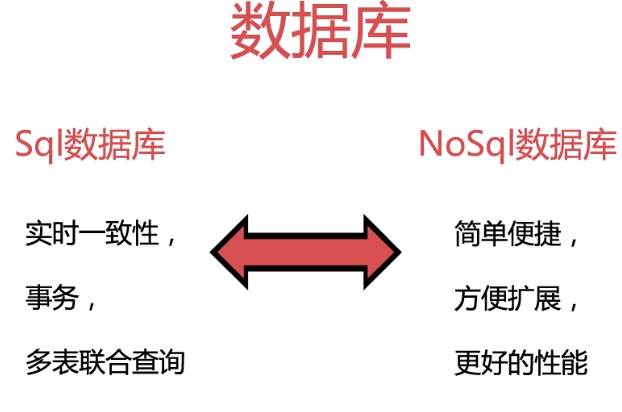
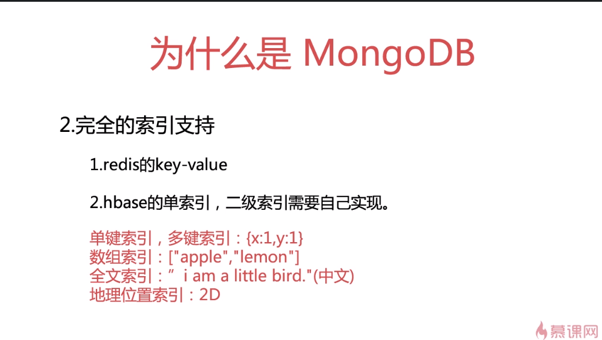
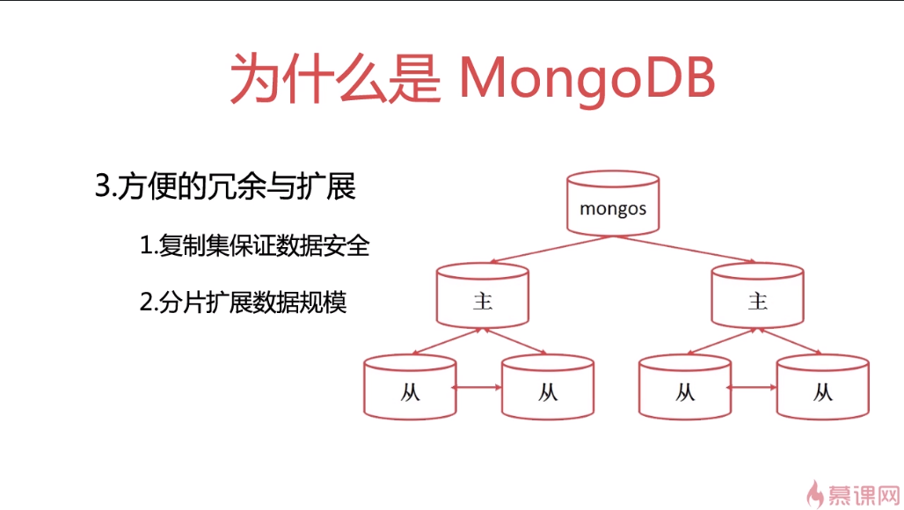

## MongoDB的概念

* Mongodb
* mongo
* 索引
* 集合
* 复制集
* 分片
* 数据均衡

## MongoDB的搭建

* 搭建简单的单机服务
* 搭建具有冗余容错功能的复制集
* 搭建大规模数据集群
* 完成集群的自动部署

## MongoDB的使用

* 最基本的文档的读写更新删除
* 各种不同类型索引的创建与使用
* 复杂的聚合查询
* 对数据集合进行分片，在不同分片间维持数据均衡
* 数据备份与恢复
* 数据迁移

## MongoDB运维

- 部署MongoDB集群
- 处理多种常见的故障
  - 单节点失效，如何恢复工作
  - 数据库意外被杀死如何进行数据恢复
  - 数据库拒绝服务时如何排查原因
  - 数据库磁盘快满时如何处理

## 几个重要的网站

1. MongoDB官网: www.mongodb.org

   - 安装包下载
   - 使用文档
2. MongoDB国内官方网站: www.mongoing.com
3. 中文MongoDB文档地址: docs.mongoing.com
4. MongoDB的github: https//github.com/mongodb
5. mongoDB的jira：<https://jira.mongodb.org/secure/Dashboard.jspa>  bug提交










## MongoDB常用命令

```
mongo
mongod
mongoexport
mongoimport
mongodump
mongorestore
mongostat
mongooplog
```

```
mongo 127.0.0.1:27017/test
use admin
db.shutdownServer()
```

```
[root@mongodb ~]# mongo --help
MongoDB shell version v3.6.2
usage: mongo [options] [db address] [file names (ending in .js)]
db address can be:
  foo                   foo database on local machine
  192.168.0.5/foo       foo database on 192.168.0.5 machine
  192.168.0.5:9999/foo  foo database on 192.168.0.5 machine on port 9999
Options:
  --shell                             run the shell after executing files
  --nodb                              don't connect to mongod on startup - no 
                                      'db address' arg expected
  --norc                              will not run the ".mongorc.js" file on 
                                      start up
  --quiet                             be less chatty
  --port arg                          port to connect to
  --host arg                          server to connect to
  --eval arg                          evaluate javascript
  -h [ --help ]                       show this usage information
  --version                           show version information
  --verbose                           increase verbosity
  --ipv6                              enable IPv6 support (disabled by default)
  --disableJavaScriptJIT              disable the Javascript Just In Time 
                                      compiler
  --disableJavaScriptProtection       allow automatic JavaScript function 
                                      marshalling
  --ssl                               use SSL for all connections
  --sslCAFile arg                     Certificate Authority file for SSL
  --sslPEMKeyFile arg                 PEM certificate/key file for SSL
  --sslPEMKeyPassword arg             password for key in PEM file for SSL
  --sslCRLFile arg                    Certificate Revocation List file for SSL
  --sslAllowInvalidHostnames          allow connections to servers with 
                                      non-matching hostnames
  --sslAllowInvalidCertificates       allow connections to servers with invalid
                                      certificates
  --sslFIPSMode                       activate FIPS 140-2 mode at startup
  --retryWrites                       automatically retry write operations upon
                                      transient network errors
  --jsHeapLimitMB arg                 set the js scope's heap size limit

Authentication Options:
  -u [ --username ] arg               username for authentication
  -p [ --password ] arg               password for authentication
  --authenticationDatabase arg        user source (defaults to dbname)
  --authenticationMechanism arg       authentication mechanism
  --gssapiServiceName arg (=mongodb)  Service name to use when authenticating 
                                      using GSSAPI/Kerberos
  --gssapiHostName arg                Remote host name to use for purpose of 
                                      GSSAPI/Kerberos authentication

file names: a list of files to run. files have to end in .js and will exit after unless --shell is specified
```

```
//关闭mongo
db.shutdownServer()
```
