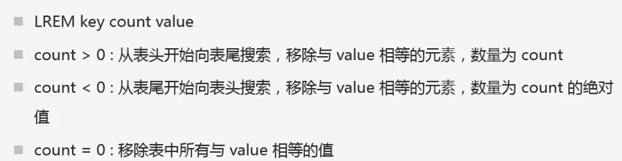

# Redis常用命令

## 1. login redis

```
[root@redis utils]# redis-cli
127.0.0.1:6379> set mykey abc
OK

127.0.0.1:6379> get mykey
"abc"

127.0.0.1:6379> select 16
(error) ERR DB index is out of range

127.0.0.1:6379> select 0
OK

127.0.0.1:6379> help
redis-cli 4.0.8
To get help about Redis commands type:
     "help @<group>" to get a list of commands in <group>
     "help <command>" for help on <command>
     "help <tab>" to get a list of possible help topics
     "quit" to exit
To set redis-cli preferences:
     ":set hints" enable online hints
     ":set nohints" disable online hints
Set your preferences in ~/.redisclirc

127.0.0.1:6379> get mytests
(nil)
```

## 2. set  nx=not exist

```
127.0.0.1:6379> set msg "redis" nx
OK

127.0.0.1:6379> set msg "oracle" nx
(nil)

127.0.0.1:6379> set msg2 "mysql" xx
(nil)

127.0.0.1:6379> set temp "test" ex 10
OK

127.0.0.1:6379> get temp
"test"

127.0.0.1:6379> get temp
"test"

127.0.0.1:6379> get temp
(nil)
```
## 3. mset,mget

```
127.0.0.1:6379> mset a 1 b 2 c 3
OK

127.0.0.1:6379> get a
"1"

127.0.0.1:6379> mget a b c
1) "1"
2) "2"
3) "3"
```

## 4. 命名规范


## 5. keys

```
127.0.0.1:6379> keys *
1) "a"
2) "b"
3) "mykey"
4) "c"
5) "msg"
```

## 6. 原子性

```
127.0.0.1:6379> keys *
1) "a"
2) "b"
3) "mykey"
4) "c"
5) "msg"

127.0.0.1:6379> MSETNX d 4 a 5
(integer) 0

127.0.0.1:6379> keys *
1) "a"
2) "b"
3) "mykey"
4) "c"
5) "msg"

127.0.0.1:6379> keys my*
1) "myphone"
2) "mykey"

127.0.0.1:6379> keys my???
1) "mykey"
```

## 7.getset

```nosql
127.0.0.1:6379> getset a 7
"1"

127.0.0.1:6379> get a
"7"
```

## 8. append

```
127.0.0.1:6379> set myphone "nokie"
OK

127.0.0.1:6379> get myphone
"nokie"

127.0.0.1:6379> APPEND myphone "-1110"
(integer) 10

127.0.0.1:6379> get myphone
"nokie-1110"
```


###strlen
```
127.0.0.1:6379> STRLEN myphone
(integer) 10
```

## 9. 数字会转化为字符串

```
127.0.0.1:6379> set num 100
OK

127.0.0.1:6379> STRLEN num
(integer) 3

127.0.0.1:6379> APPEND num 222
(integer) 6

127.0.0.1:6379> get num
"100222"
```

## 10. setrange

```
127.0.0.1:6379> set msg hello
OK

127.0.0.1:6379> get msg
"hello"

127.0.0.1:6379> SETRANGE msg 1 apply
(integer) 6

127.0.0.1:6379> get msg
"happly"
```

## 11. getrange

```
127.0.0.1:6379> get msg
"happly"

127.0.0.1:6379> getrange msg 0 4
"happl"

127.0.0.1:6379> getrange msg -5 -1
"apply"

127.0.0.1:6379> getrange msg -1 -5
""

127.0.0.1:6379> getrange msg 0 -1
"happly"
```

## 12. incrby、decrby

```
127.0.0.1:6379> incrby num 100
(integer) 100

127.0.0.1:6379> get num
"100"

127.0.0.1:6379> DECRBY num 50
(integer) 50

127.0.0.1:6379> get num
"50"
```

## 13. incr、decr

```
127.0.0.1:6379> get num
"50"

127.0.0.1:6379> incr num
(integer) 51

127.0.0.1:6379> get num
"51"

127.0.0.1:6379> decr num
(integer) 50

127.0.0.1:6379> get num
"50"
```

## 14. incrbyfloat

```
127.0.0.1:6379> set num 10
OK

127.0.0.1:6379> get num
"10"

127.0.0.1:6379> INCRBYFLOAT num 12.54
"22.54"

127.0.0.1:6379> get num
"22.54"

127.0.0.1:6379> INCRBYFLOAT num -2242.1
"-2219.56000000000000005"

127.0.0.1:6379> get num
"-2219.56000000000000005"
```

## 15. help

```
127.0.0.1:6379> help
redis-cli 4.0.8
To get help about Redis commands type:
     "help @<group>" to get a list of commands in <group>
     "help <command>" for help on <command>
     "help <tab>" to get a list of possible help topics
     "quit" to exit
     
To set redis-cli preferences:
     ":set hints" enable online hints
     ":set nohints" disable online hints
Set your preferences in ~/.redisclirc

127.0.0.1:6379> help set
  SET key value [EX seconds] [PX milliseconds] [NX|XX]
  summary: Set the string value of a key
  since: 1.0.0
  group: string
  
127.0.0.1:6379> help @set
  SADD key member [member ...]
  summary: Add one or more members to a set
  since: 1.0.0
  SCARD key
  summary: Get the number of members in a set
  since: 1.0.0

127.0.0.1:6379> help @string
  APPEND key value
  summary: Append a value to a key
  since: 2.0.0
  BITCOUNT key [start end]
  summary: Count set bits in a string
  since: 2.6.0
  BITFIELD key [GET type offset
```

## 16. flushdb,flushall

```
127.0.0.1:6379> flushdb
OK
```

## 17. expire

```
127.0.0.1:6379> set mykey2 100
OK

127.0.0.1:6379> keys *
1) "b"
2) "mykey2"
3) "mykey"
4) "c"
5) "msg"
6) "a"
7) "num"
8) "myphone"
9) "name"

127.0.0.1:6379> EXPIRE mykey2 10
(integer) 1

127.0.0.1:6379> get mykey2
(nil)
```

## 18. ttl,  persist(删除过期)

```
127.0.0.1:6379> ttl name
(integer) -1

127.0.0.1:6379> set id 01 ex 50
OK

127.0.0.1:6379> ttl id
(integer) 47

127.0.0.1:6379> ttl id
(integer) 46

127.0.0.1:6379> ttl id
(integer) 45

127.0.0.1:6379> ttl mykey2
(integer) -2
```

## 19. type

```
127.0.0.1:6379> type mykey2
none

127.0.0.1:6379> type mykey
string
```

## 20. rename del

```
127.0.0.1:6379> type mykey
string

127.0.0.1:6379> rename mykey oracle
OK

127.0.0.1:6379> keys *
1) "b"
2) "c"
3) "oracle"
4) "msg"
5) "a"
6) "num"
7) "myphone"
8) "name"

127.0.0.1:6379> del oracle
(integer) 1

127.0.0.1:6379> keys *
1) "b"
2) "c"
3) "msg"
4) "a"
5) "num"
6) "myphone"
7) "name"
```

## 21. bitcount

```
127.0.0.1:6379> setbit u500 1 1
(integer) 0

127.0.0.1:6379> setbit u500 30 1
(integer) 0

127.0.0.1:6379> bitcount u500
(integer) 2

127.0.0.1:6379> bitcount u500
(integer) 2

127.0.0.1:6379> type u500
string

127.0.0.1:6379> get u500
"@\x00\x00\x02"
```

## 22. lrem




## 23. list

```
127.0.0.1:6379> lpush list a
(integer) 1

127.0.0.1:6379> lpush list java python oracle
(integer) 4

127.0.0.1:6379> rpush list mysql
(integer) 5

127.0.0.1:6379>  rpush list php
(integer) 6

127.0.0.1:6379> LLEN list
(integer) 6

127.0.0.1:6379> rpop list
"php"

127.0.0.1:6379> LLEN list
(integer) 5

127.0.0.1:6379> LRANGE list 0 -1
1) "oracle"
2) "python"
3) "java"
4) "a"
5) "mysql"

127.0.0.1:6379> LINDEX list 0
"oracle"

127.0.0.1:6379> lset list 0 b
OK

127.0.0.1:6379> LRANGE list 0 -1
1) "b"
2) "python"
3) "java"
4) "a"
5) "mysql"

127.0.0.1:6379> LREM list 1 b
(integer) 1

127.0.0.1:6379> LRANGE list 0 -1
1) "python"
2) "java"
3) "a"
4) "mysql"
```

## 24. slave

```
#方法一
redis-server  --port 6380 --slaveof 127.0.0.1 6379

#方法二
redis-server --port 6381
redis-cli -p 6381
127.0.0.1:6381> slaveof 127.0.0.1 6379

#方法三
[root@redis redis]# redis-server 6380.conf
[root@redis redis]# netstat -lntup|grep 6380
tcp        0      0 0.0.0.0:6380                0.0.0.0:*                   LISTEN      1399/redis-server * tcp        0      0 :::6380                     :::*    
```

## 25. change master

```
127.0.0.1:6381> slaveof no one
OK

127.0.0.1:6381> set myley 2121
OK
```