# Oracle Goldengate数据库复制与容灾实施

GoldenGate软件是一种基于日志的结构化数据复制软件.

大量数据的实时捕捉,变换和投递,实现源数据库与目标数据库的数据同步,保持亚秒级的数据库延迟.

拓扑结构: 一对一,一对多,多对一,层叠和双向复制

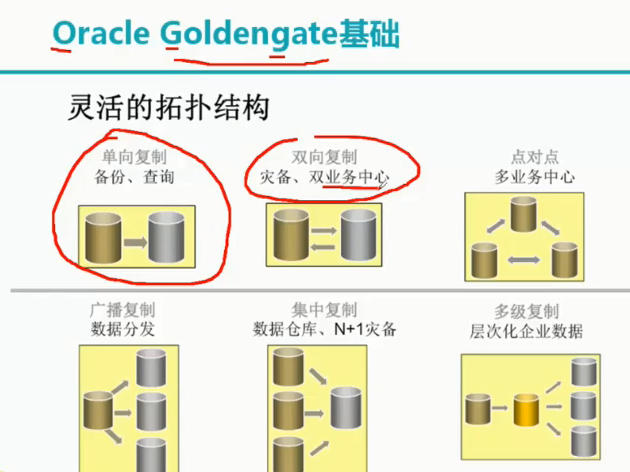

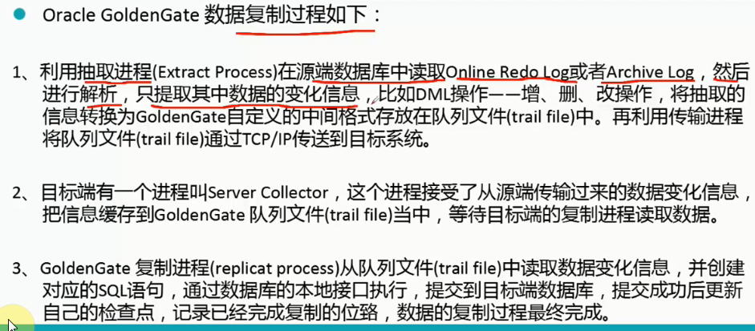

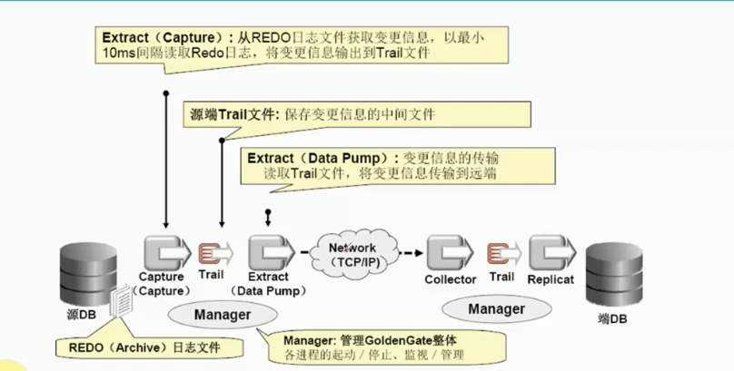

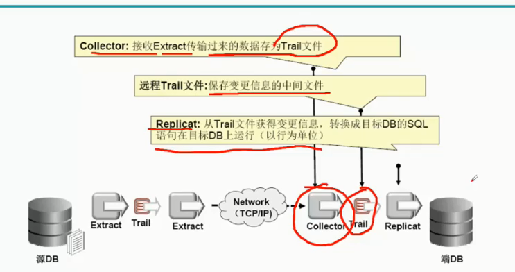

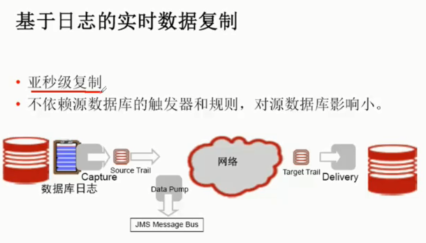

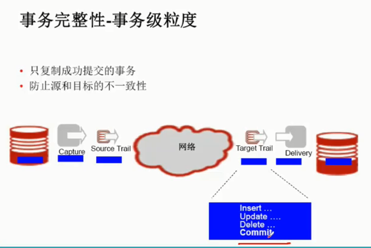

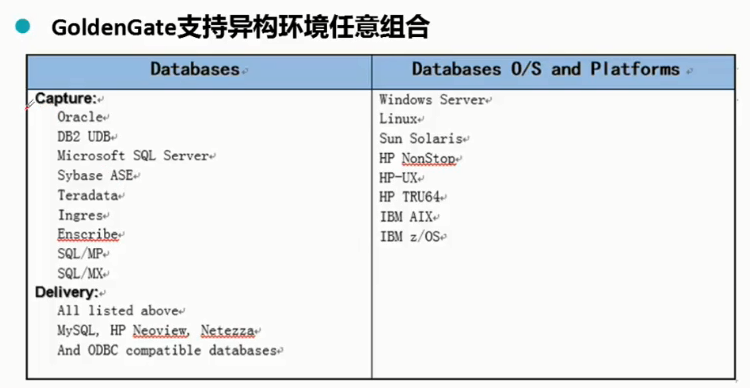

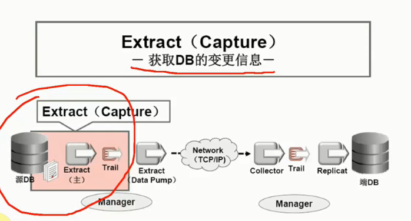

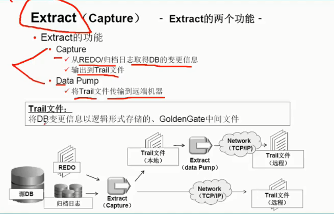

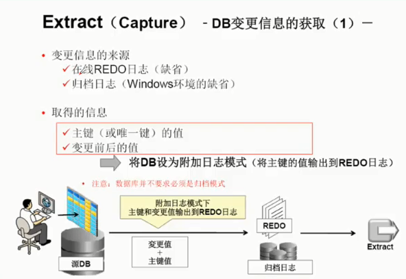

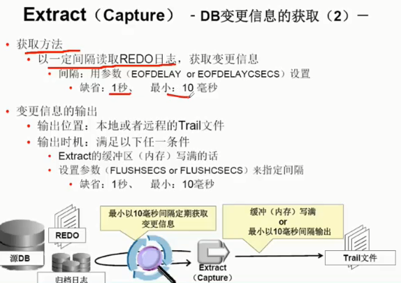

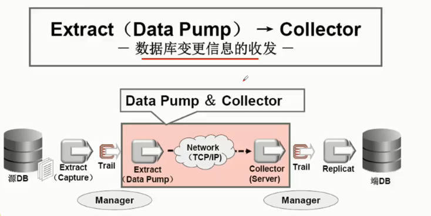

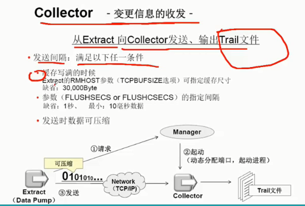

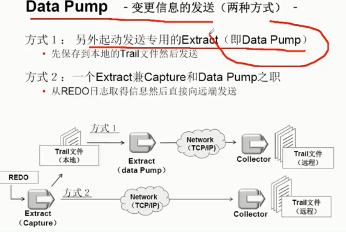

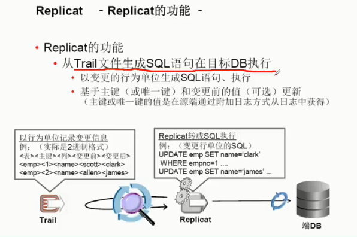

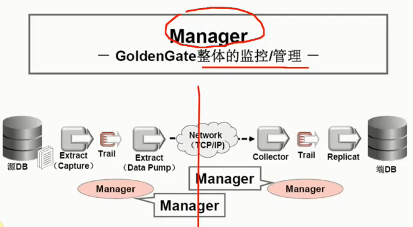

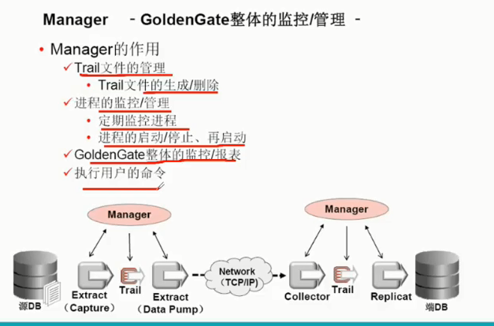

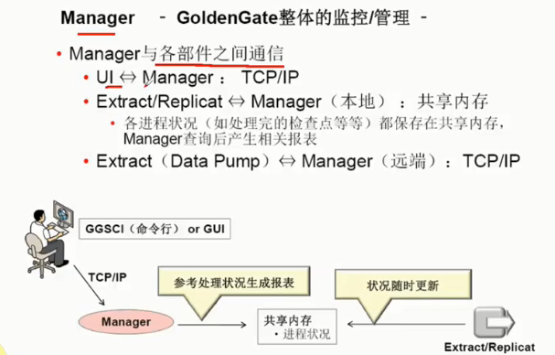

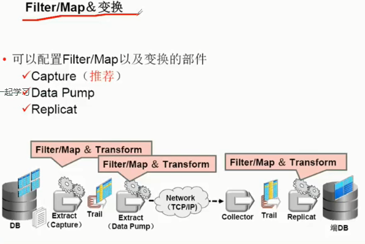

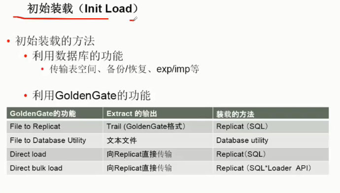

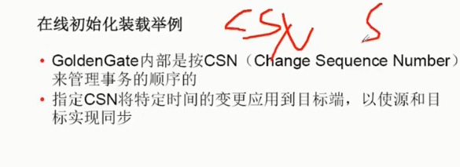

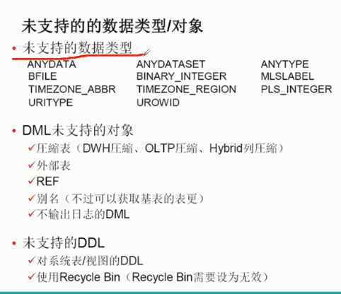

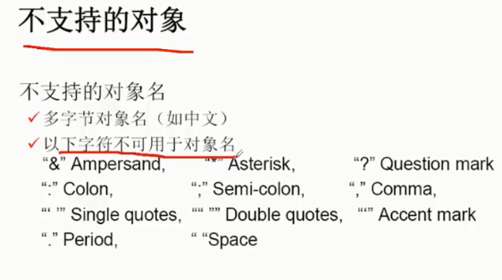

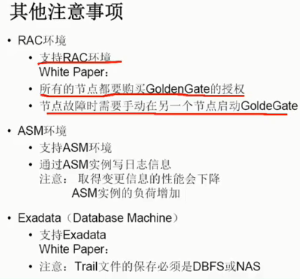

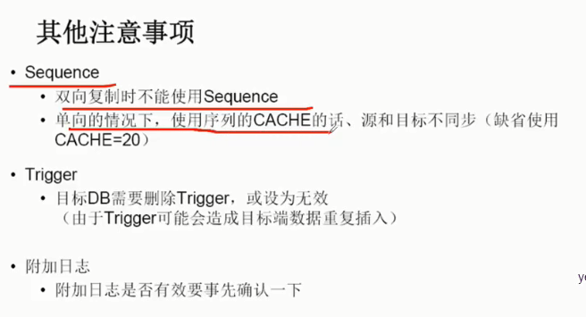

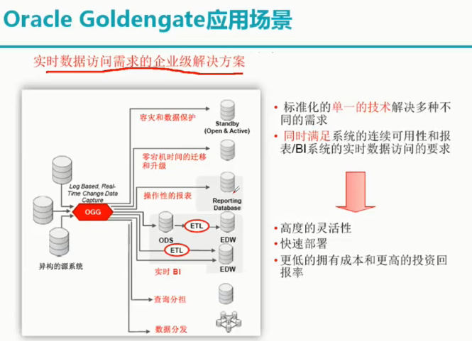

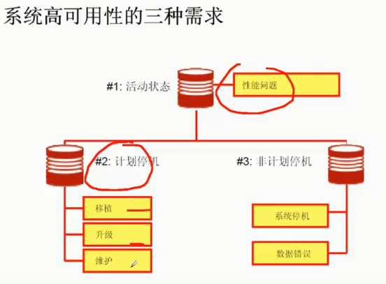

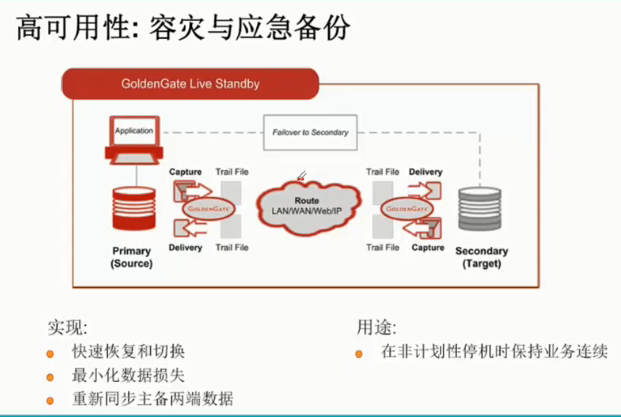

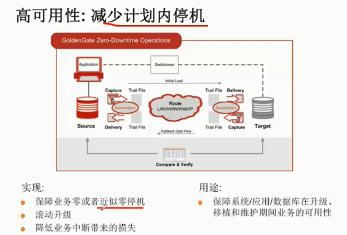

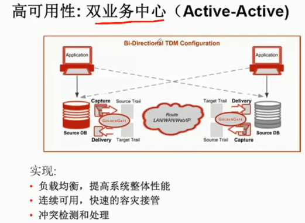

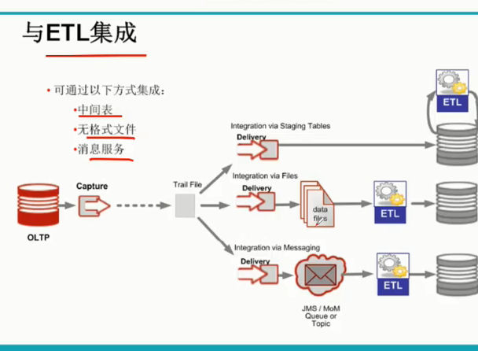

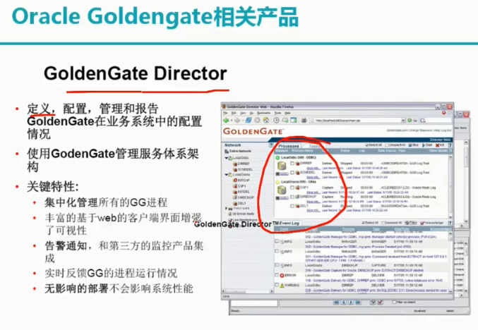

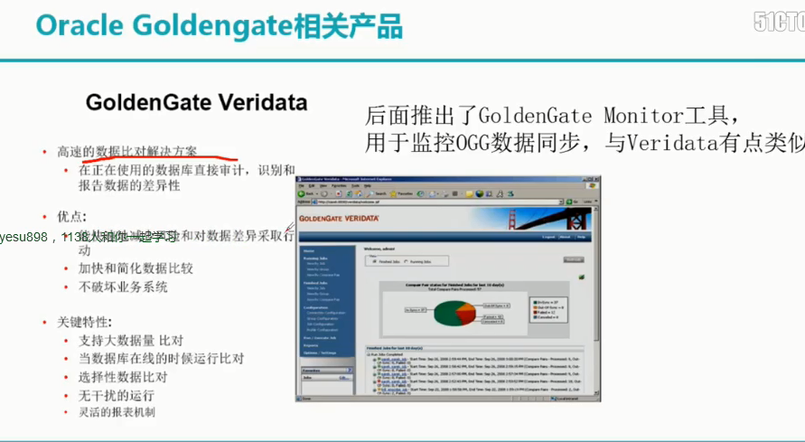

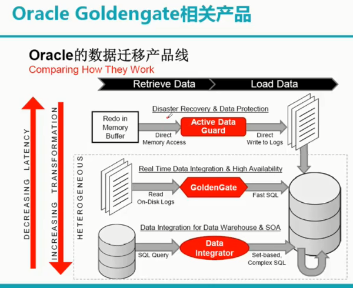

## Goldengate数据复制与容灾项目实施1(文件系统1+1)

## Goldengate数据复制与容灾项目实施2(ASM 1+1)

## Goldengate数据复制与容灾项目实施3(RAC\*2 +FS\*1)

## Goldengate常用的3种数据初始化方式

## Goldengate基础功能操作与测试

## Goldengate日常维护与管理

## Goldengate DDL功能的配置

## Goldengate安全加密的配置

## Goldengate常用参数及函数汇总

## Goldengate其他工具软件介绍