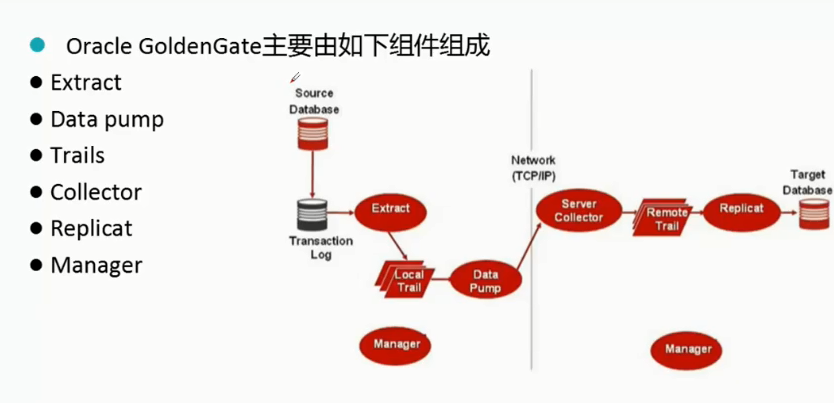

# Oracle GoldenGate数据库复制与容灾实施

# 一、原理

Oracle Goldengate数据库==复制==与==容灾==实施

GoldenGate软件是一种基于日志的结构化数据复制软件.

大量数据的实时捕捉,变换和投递,实现源数据库与目标数据库的数据同步,保持亚秒级的数据库延迟.

## 1. 拓扑结构

拓扑结构: 一对一,一对多,多对一,层叠和双向复制

常用场景：单向复制、广播复制、集中复制、多级复制


## 2. 组件/进程



## 3. 复制流程


## 4. 特性


## 5. 进程

### 5.1 Extract


 


### 5.2 Data Pump


### 5.3 Replicat


### 5.4 Manager


## 6. Filter/Map


## 7. 初始化


## 8. 兼容性


**约束** 最好禁用，约束会导致复制缓慢

## 9. 应用场景


**Veridata比对大表存在严重性能问题，容易hang；不建议使用。**


# 二、部署

## 1.资源需求

- 内存：每个extract、replicat  >>>  50M左右

- 磁盘：100G~200G

- 权限：win-管理员 unix/linux-dba组

```sql
-- 数据库权限
GRANT CONNECT,RESOURCE,unlimited tablespace TO ogg;                           
GRANT ALTER ANY TABLE TO ogg;
GRANT ALTER SESSION TO   ogg;                     
GRANT CREATE SESSION TO   ogg;                    
GRANT FLASHBACK ANY TABLE TO  ogg;               
GRANT SELECT ANY DICTIONARY TO ogg;             
GRANT SELECT ANY TABLE TO  ogg;                   
GRANT SELECT ANY TRANSACTION to ogg;
GRANT execute on utl_file to  ogg;
GRANT execute on dbms_flashback to ogg;
GRANT SELECT ANY TRANSACTION to ogg;
GRANT insert any table,update any table,delete any table,alter any table to ogg;   ## for target
```

- 生产环境先建立测试用户测试，再进行正式部署

- 注意源库与目标库的时间同步问题，以免导致业务问题
- 禁用触发器、job、约束、回收站
- 最好表都存在主键，且主键可用

## 2. 文件系统

## 3. ASM

## 4. RAC +FS

## 5. DDL功能

**50G以下数据量可以开启DDL，50G以上不建议开启，开启存在性能问题。**

```sql
SQL> show parameter golden

NAME                                 TYPE        VALUE
------------------------------------ ----------- ------------------------------
enable_goldengate_replication        boolean     TRUE
```


## 6. 安全加密


# 三、初始化

## 1.  initial load直接传输初始化


# 四、管理

## 1. 进程管理

```shell
## 查看进程状态
GGSCI (11g) 1> info all
GGSCI (11g) 1> info mgr

## 停止进程
GGSCI (11g) 2> stop exta

## 删除进程
GGSCI (11g) 6> delete exta

## 清除参数
 cd dirprm;rm -rf *
 
## 清除Trails 文件
cd dirdat;rm -rf la*

## 查看 mgr 参数配置
GGSCI (11g) 3> view param mgr
```

出现进程僵死或则有大事务或者主机性能较差时，进程无法关闭：

```sh
stop EXTRACT DPESZ
stop REPLICAT REPLCMD
```

使用kill命令强制杀死进程：

```sh
kill EXTRACT DPESZ
kill REPLICAT REPLCMD
```

## 2. 目录

```sql
-- 创建子目录
GGSCI (11g) 3> create subdirs

add schematrandata SCOTT
add trandata SCOTT.*
add trandata SCOTT.emp

view report mgr
```

```
GGSCI (source as ogg@orcl) 30> info EXT_1

EXTRACT    EXT_1     Last Started 2020-07-20 16:27   Status RUNNING
Checkpoint Lag       00:00:00 (updated 00:00:02 ago)
Process ID           8303
Log Read Checkpoint  Oracle Redo Logs
                     2020-07-20 16:28:17  Seqno 169, RBA 7038464
                     SCN 0.1914730 (1914730)


GGSCI (target) 3> show parameter golden

Parameter settings:

SET DEBUG      OFF

Current directory: /u01/app/goldengate

Editor:  vi

Reports (.rpt)                 /u01/app/goldengate/dirrpt
Parameters (.prm)              /u01/app/goldengate/dirprm
Replicat Checkpoints (.cpr)    /u01/app/goldengate/dirchk
Extract Checkpoints (.cpe)     /u01/app/goldengate/dirchk
Process Status (.pcs)          /u01/app/goldengate/dirpcs
SQL Scripts (.sql)             /u01/app/goldengate/dirsql
Database Definitions (.def)    /u01/app/goldengate/dirdef
Dump files (.dmp)              /u01/app/goldengate/dirdmp
Masterkey wallet files (.wlt)  /u01/app/goldengate/dirwlt
Credential store files (.crd)  /u01/app/goldengate/dircrd

```


# 五、参数、函数


# 六、其他工具