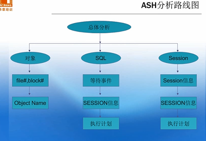
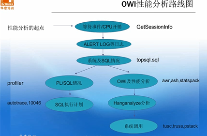

# 1. AWR、ASH

## 1.1 生成AWR、ASH、ADDM

**脚本目录  $ORACLE_HOME/rdbms/admin**

```
@?/rdbms/admin/addmrpt.sql
@?/rdbms/admin/awrrpt.sql
@?/rdbms/admin/ashrpt.sql
```
## 1.2 快照设置
```
-- 修改快照时间间隔
EXEC DBMS_WORKLOAD_REPOSITORY.MODIFY_SNAPSHOT_SETTINGS( interval => 30);
-- 手动生成快照
EXEC DBMS_WORKLOAD_REPOSITORY.CREATE_SNAPSHOT('TYPICAL');
或
BEGIN 
  DBMS_WORKLOAD_REPOSITORY.create_snapshot(); 
END; 
/

-- 生成 AWR 基线：
BEGIN 
  DBMS_WORKLOAD_REPOSITORY.create_baseline ( 
    start_snap_id => 10,  
    end_snap_id   => 100, 
    baseline_name => 'AWR First baseline'); 
END; 
/

-- 生成 AWR 基线(11g)：
BEGIN
DBMS_WORKLOAD_REPOSITORY.CREATE_BASELINE_TEMPLATE (
start_time => to_date('&start_date_time','&start_date_time_format'),
end_time => to_date('&end_date_time','&end_date_time_format'),
baseline_name => 'MORNING',
template_name => 'MORNING',
expiration => NULL ) ;
END;
/

-- 基于重复时间周期来制定用于创建和删除 AWR 基线的模板：
BEGIN
DBMS_WORKLOAD_REPOSITORY.CREATE_BASELINE_TEMPLATE (
day_of_week => 'MONDAY',
hour_in_day => 9,
duration => 3,
start_time => to_date('&start_date_time','&start_date_time_format'),
end_time => to_date('&end_date_time','&end_date_time_format'),
baseline_name_prefix => 'MONDAY_MORNING'
template_name => 'MONDAY_MORNING',
expiration => 30 );
END;
/

-- 删除 AWR 基线：
BEGIN
    DBMS_WORKLOAD_REPOSITORY.DROP_BASELINE (baseline_name => 'AWR First baseline');
END;
/
```
## 1.3 其他AWR脚本
```
awrrpt.sql 
展示一段时间范围两个快照之间的数据库性能指标。
awrrpti.sql 
展示一段时间范围两个快照之间的特定数据库和特定实例的性能指标。
awrsqrpt.sql
展示特定 SQL 在一段时间范围两个快照之间的性能指标，运行这个脚本来检查和诊断一个特定 SQL 的性能问题。
awrsqrpi.sql 
展示特定 SQL 在特定数据库和特定实例的一段时间范围内两个快照之间的性能指标。
awrddrpt.sql
用于比较两个指定的时间段之间数据库详细性能指标和配置情况。
awrddrpi.sql 
用于在特定的数据库和特定实例上，比较两个指定的时间段之间的数据库详细性能指标和配置情况。
awrextr.sql/awrload.sql
导出/导入AWR数据
```

## 1.4 AWR 相关的视图

如下系统视图与 AWR 相关：

```
V$ACTIVE_SESSION_HISTORY - 展示每秒采样的 active session history (ASH)。
V$METRIC - 展示度量信息。
V$METRICNAME - 展示每个度量组的度量信息。
V$METRIC_HISTORY - 展示历史度量信息。
V$METRICGROUP - 展示所有的度量组。
DBA_HIST_ACTIVE_SESS_HISTORY - 展示 active session history 的历史信息。
DBA_HIST_BASELINE - 展示 AWR 基线信息。
DBA_HIST_DATABASE_INSTANCE - 展示数据库环境信息。
DBA_HIST_SNAPSHOT - 展示 AWR 快照信息。
DBA_HIST_SQL_PLAN - 展示 SQL 执行计划信息。
DBA_HIST_WR_CONTROL - 展示 AWR 设置信息。
```
## 1.5 查看ASH信息



```plsql
select SESSION_ID,NAME,P1,P2,P3,WAIT_TIME,CURRENT_OBJ#,CURRENT_FILE#,CURRENT_BLOCK#
       from v$active_session_history ash, v$event_name enm 
       where ash.event#=enm.event# 
       and SESSION_ID=&SID and SAMPLE_TIME>=(sysdate-&minute/(24*60));

-- Input is:
-- Enter value for sid: 15 
-- Enter value for minute: 1  /* How many minutes activity you want to see */


-- ASH
-- Most Active SQL in the Previous Hour	desc gv$active_session_history

SELECT sql_id,COUNT(*),ROUND(COUNT(*)/SUM(COUNT(*)) OVER(), 2) PCTLOAD
FROM gv$active_session_history ash
WHERE ash.sample_time > SYSDATE - 1/24
AND ash.session_type = 'BACKGROUND'
GROUP BY ash.sql_id
ORDER BY COUNT(*) DESC;

SELECT ash.sql_id,COUNT(*),ROUND(COUNT(*)/SUM(COUNT(*)) OVER(), 2) PCTLOAD
FROM gv$active_session_history ash
WHERE ash.sample_time > SYSDATE - 1/24
AND ash.session_type = 'FOREGROUND'
GROUP BY ash.sql_id
ORDER BY COUNT(*) DESC;
-- Most Active I/O	
SELECT DISTINCT wait_class
FROM gv$event_name
ORDER BY 1;

SELECT sql_id, COUNT(*)
FROM gv$active_session_history ash, v$event_name evt
WHERE ash.sample_time > SYSDATE - 3/24
AND ash.session_state = 'WAITING'
AND ash.event_id = evt.event_id
AND evt.wait_class = 'System I/O'
GROUP BY sql_id
ORDER BY COUNT(*) DESC;

-- modify the above query, if necessary, until the condition yields a SQL_ID
set linesize 121
SELECT * FROM TABLE(dbms_xplan.display_cursor('424h0nf7bhqzd'));
```

# 2. 会话相关

## 2.1 查看查询SID、SPID

```
-- 方法一：
column line format a79
set heading off
select 'ospid: ' || p.spid || ' # ''' ||s.sid||','||s.serial#||''' '||
  s.osuser || ' ' ||s.machine ||' '||s.username ||' '||s.program line
from v$session s , v$process p
where p.addr = s.paddr
and s.username <> ' ';

-- 方法二
select p.pid, p.spid, s.username  
        from v$process p, v$session s  
        where p.addr = s.paddr;
 -- 方法三       
 select 'ospid: ' || p.spid || ' # ''' ||s.sid||','||s.serial#||''' '||'inst_id: '||s.inst_id||' '||
  s.osuser || ' ' ||s.machine ||' '||s.username ||' '||s.program line
from gv$session s , v$process p
where p.addr = s.paddr
and s.username <> ' '
and s.sid=851;

LINE
--------------------------------------------------------------------------------
ospid: 15749 # '851,27493' inst_id: 1 acrosspm SPCIS-PRFHWI-SGR07 PM4H_HW alarmM

-- 方法四
set line 500
col sid format 9999
col s# format 99999
col username format a10
col event format a30
col machine format a20
col p123 format a18
col wt format 999
col SQL_ID for a18
alter session set cursor_sharing=force;
SELECT /* XJ LEADING(S) FIRST_ROWS */
 S.SID,
 S.SERIAL# S#,
 P.SPID,
 NVL(S.USERNAME, SUBSTR(P.PROGRAM, LENGTH(P.PROGRAM) - 6)) USERNAME,
 S.MACHINE,
 S.EVENT,
 S.P1 || '/' || S.P2 || '/' || S.P3 P123,
 S.WAIT_TIME WT,
 NVL(SQL_ID, S.PREV_SQL_ID) SQL_ID
  FROM V$PROCESS P, V$SESSION S
 WHERE P.ADDR = S.PADDR
   AND S.STATUS = 'ACTIVE'
   AND P.BACKGROUND IS NULL;
```
## 2.2 表相关SQL、SID、SPID

```plsql
--- 单实例
select
substr(s.username,1,18) username,
P.spid,
s.sid,s.serial#,s.machine,y.sql_text,
'ALTER SYSTEM KILL SESSION '''||s.sid||','||s.serial#||''';' "kill Session "
from gv$session s,
v$process p,v$transaction t,v$rollstat r,v$rollname n,gv$sql y
where 
s.paddr = p.addr
and s.taddr = t.addr (+)
and t.xidusn = r.usn (+)
and r.usn = n.usn (+)
and s.username is not null
and s.sql_address=y.address
and y.sql_text like '%IND_TOH_39251_1%'
```

##  2.3 查询SQL以及session

```plsql
-- 查询执行最慢的sql

select *
 from (select sa.SQL_TEXT,
        sa.SQL_FULLTEXT,
        sa.EXECUTIONS "执行次数",
        round(sa.ELAPSED_TIME / 1000000, 2) "总执行时间",
        round(sa.ELAPSED_TIME / 1000000 / sa.EXECUTIONS, 2) "平均执行时间",
        sa.COMMAND_TYPE,
        sa.PARSING_USER_ID "用户ID",
        u.username "用户名",
        sa.HASH_VALUE
     from v$sqlarea sa
     left join all_users u
      on sa.PARSING_USER_ID = u.user_id
     where sa.EXECUTIONS > 0
     order by (sa.ELAPSED_TIME / sa.EXECUTIONS) desc)
 where rownum <= 50;
```


```
select
substr(s.username,1,18) username,
s.sid,s.serial#,s.machine,y.sql_text,
'ALTER SYSTEM KILL SESSION '''||s.sid||','||s.serial#||''';' "kill Session "
from v$session s,v$process p,v$transaction t,v$rollstat r,v$rollname n,v$sql y
where s.paddr = p.addr
and s.taddr = t.addr (+)
and t.xidusn = r.usn (+)
and r.usn = n.usn (+)
and s.username is not null
and s.sql_address=y.address
order by s.sid,s.serial#,s.username,s.status
```

```
select
substr(s.username,1,18) username,
s.sid,s.serial#,s.machine,y.sql_text,
'ALTER SYSTEM KILL SESSION '''||s.sid||','||s.serial#||''';' "kill Session "
from v$session s,v$process p,v$transaction t,v$rollstat r,v$rollname n,v$sql y
where s.paddr = p.addr
and s.taddr = t.addr (+)
and t.xidusn = r.usn (+)
and r.usn = n.usn (+)
and s.username is not null
and s.sql_address=y.address
order by s.sid,s.serial#,s.username,s.status
```

```plsql
--会话信息
select machine , event ,SERIAL#, TERMINAL, PROGRAM, ACTION,TYPE, SQL_ID, LOGON_TIME
from gv$session where sid=1568 and INST_ID=2;

--阻塞会话
select inst_id,sid,serial#,status,sql_id,sql_exec_start,module,blocking_session from gv$session where machine='spcis-prfhwi-sdb01' and module like 'sqlplus%'; 

select inst_id,sid,sql_id,event,module,machine,blocking_session  from gv$session where module ='PL/SQL Developer';
```

## 2.4 查杀会话

```
SELECT 'Lock' "Status",
a.username "用户名", a.sid "SID", a.serial# "SERIAL#",
b.type "锁类型",
DECODE(b.lmode, 1, 'No Lock', 2, 'Row Share', 3, 'Row Exclusive', 4, 'Share', 5, 'Share Row Exclusive', 6, 'Exclusive', 'NONE') "占用的模式",
DECODE(b.request, 1, 'No Lock', 2, 'Row Share', 3, 'Row Exclusive', 4, 'Share', 5, 'Share Row Exclusive', 6, 'Exclusive', 'NONE') "请求的模式",
c.object_name "对象名",
c.owner "对象所有者", c.object_type "对象类型",
b.id1 "资源ID1", b.id2 "资源ID2",b.ctime "ctime(秒) ",
'ALTER SYSTEM KILL SESSION '''||a.sid||','||a.serial#||''';' "kill Session ",
'kill -9 '||d.spid "Kill Process (Unix Linux)", 
'orakill '||f.instance_name||' '||d.spid "Kill Process (Windows)" 
FROM v$session a, v$lock b, v$locked_object b1, dba_objects c, v$process d, v$instance f
WHERE a.type <> 'BACKGROUND'
AND a.sid = b.sid
AND b.request = 0
AND d.addr = a.paddr
AND b1.session_id = a.sid
AND b1.object_id = c.object_id
AND f.status = 'OPEN'
AND f.database_status = 'ACTIVE'
order by b.ctime;

alter system kill session '1568,27761,@2' immediate; 
```

## 2.5 根据SID查询SQL

```plsql
select sql_text from v$sqlarea a,v$session b where a.SQL_ID=b.PREV_SQL_ID and b.SID=&sid;

set line 120;
SELECT 'ps -ef|grep ' || TO_CHAR(SPID) ||
       '|grep LOCAL=NO|awk ''{print " -9 "\$2}''|xargs kill' KILL_SH
  FROM GV$PROCESS P, GV$SESSION S
 WHERE S.PADDR = P.ADDR
   AND S.SQL_ID = '$2';
```

## 2.6 会话资源占用
sessions with highest CPU consumption

```plsql
SELECT s.sid, s.serial#, p.spid as "OS PID",s.username, s.module, st.value/100 as "CPU sec"
FROM v$sesstat st, v$statname sn, v$session s, v$process p
WHERE sn.name = 'CPU used by this session' -- CPU
AND st.statistic# = sn.statistic#
AND st.sid = s.sid
AND s.paddr = p.addr
AND s.last_call_et < 1800 -- active within last 1/2 hour
AND s.logon_time > (SYSDATE - 240/1440) -- sessions logged on within 4 hours
ORDER BY st.value;
```
 sessions with the highest time for a certain wait

```plsql
SELECT s.sid, s.serial#, p.spid as "OS PID", s.username, s.module, se.time_waited
FROM v$session_event se, v$session s, v$process p
WHERE se.event = '&event_name' 
AND s.last_call_et < 1800 -- active within last 1/2 hour
AND s.logon_time > (SYSDATE - 240/1440) -- sessions logged on within 4 hours
AND se.sid = s.sid
AND s.paddr = p.addr
ORDER BY se.time_waited;
```
sessions with highest DB Time usage (10g or higher)

```plsql
SELECT s.sid, s.serial#, p.spid as "OS PID", s.username, s.module, st.value/100 as "DB Time (sec)"
, stcpu.value/100 as "CPU Time (sec)", round(stcpu.value / st.value * 100,2) as "% CPU"
FROM v$sesstat st, v$statname sn, v$session s, v$sesstat stcpu, v$statname sncpu, v$process p
WHERE sn.name = 'DB time' -- CPU
AND st.statistic# = sn.statistic#
AND st.sid = s.sid
AND  sncpu.name = 'CPU used by this session' -- CPU
AND stcpu.statistic# = sncpu.statistic#
AND stcpu.sid = st.sid
AND s.paddr = p.addr
AND s.last_call_et < 1800 -- active within last 1/2 hour
AND s.logon_time > (SYSDATE - 240/1440) -- sessions logged on within 4 hours
AND st.value > 0;
```

## 2.7 查询SQL语句的SQL_ID

```
SELECT sql_id, plan_hash_value, substr(sql_text,1,40) sql_text FROM v$sql WHERE sql_text like 'SELECT /* TARGET SQL */%'

-- 根据SQL 查询到操作用户
select s.username from v$active_session_history t,dba_users s  where t.USER_ID=s.user_id and t.SQL_ID='0nx7fbv1w5xg2';
 
-- 查询并获取当前sql的杀会话语句
select 'alter system kill session '''|| t.SID||','||t.SERIAL#||',@'||t.inst_id||''' immediate;' from gv$session t where t.SQL_ID='c6yz84stnau9b';

-- 查询并获取当前会话的执行计划清空过程语句
select SQL_TEXT,sql_id, address, hash_value, executions, loads, parse_calls, invalidations from v$sqlarea  where sql_id='0nx7fbv1w5xg2';

call sys.dbms_shared_pool.purge('0000000816530A98,3284334050','c');
```

# 3. Top SQL

## 3.1 SQL ordered by Elapsed Time

方法一: 来源AWR

```plsql
define DBID=1478953437
define beg_snap=1677
define end_snap=1679
define INST_NUM=1
select *
  from (select nvl((sqt.elap / 1000000), to_number(null)),
               nvl((sqt.cput / 1000000), to_number(null)),
               sqt.exec,
               decode(sqt.exec,
                      0,
                      to_number(null),
                      (sqt.elap / sqt.exec / 1000000)),
               (100 *
               (sqt.elap / (SELECT sum(e.VALUE) - sum(b.value)
                               FROM DBA_HIST_SYSSTAT b, DBA_HIST_SYSSTAT e
                              WHERE B.SNAP_ID = &beg_snap
                                AND E.SNAP_ID = &end_snap
                                AND B.DBID = &DBID
                                AND E.DBID = &DBID
                                AND B.INSTANCE_NUMBER = &INST_NUM
                                AND E.INSTANCE_NUMBER = &INST_NUM
                                and e.STAT_NAME = 'DB time'
                                and b.stat_name = 'DB time'))) norm_val,
               sqt.sql_id,
               to_clob(decode(sqt.module,
                              null,
                              null,
                              'Module: ' || sqt.module)),
               nvl(st.sql_text, to_clob(' ** SQL Text Not Available ** '))
          from (select sql_id,
                       max(module) module,
                       sum(elapsed_time_delta) elap,
                       sum(cpu_time_delta) cput,
                       sum(executions_delta) exec
                  from dba_hist_sqlstat
                 where dbid = &dbid
                   and instance_number = &inst_num
                   and &beg_snap < snap_id
                   and snap_id <= &end_snap
                 group by sql_id) sqt,
               dba_hist_sqltext st
         where st.sql_id(+) = sqt.sql_id
           and st.dbid(+) = &dbid
         order by nvl(sqt.elap, -1) desc, sqt.sql_id)
 where rownum < 65
   and (rownum <=10 or norm_val > 1);
```

方法二:

```plsql
/*** SQL Script to get the top SQLs ordered by Elapsed time ***/

set head on
column module format a20
set lines 200
prompt SQL Ordered by Elapsed time

select * from (
select sql_id, module,
sum(ELAPSED_TIME_DELTA)/1000000 "Elapsed Time(s)",
sum(CPU_TIME_DELTA)/1000000 "CPU Time(s)",
sum(executions_delta) "Executions",
sum(ROWS_PROCESSED_DELTA) rows1,
sum(BUFFER_GETS_DELTA) "Buffer Gets",
sum(DISK_READS_DELTA) "Physical Reads",
sum(iowait_delta)/1000000 "IO Wait",
sum(ccwait_delta)/1000000 cc_wait,
sum(apwait_delta)/1000000 ap_wait,
sum(clwait_delta)/1000000 cl_wait,
sum(BUFFER_GETS_DELTA)/decode(sum(ROWS_PROCESSED_DELTA), 0, 1, sum(ROWS_PROCESSED_DELTA)) gets_per_row,
sum(DISK_READS_DELTA)/decode(sum(ROWS_PROCESSED_DELTA), 0, 1, sum(ROWS_PROCESSED_DELTA)) prds_per_row,
sum(BUFFER_GETS_DELTA)/decode(sum(executions_delta), 0, 1, sum(executions_delta)) gets_per_exec
from dba_hist_sqlstat
where snap_id between &min_snap_id and &max_snap_id
group by sql_id, module
order by 3 desc
) where rownum <= &rnum;
```

[NOTE]():
Provide the BEGIN & END SNAP_ID and no.of top N SQLs to be displayed.
The Same script can be modified to get the Top SQLs ordered by CPU Time, Buffer gets etc.

## 3.2 Top 10 by Buffer Gets

```plsql
set linesize 100
set pagesize 100
SELECT * FROM
(SELECT substr(sql_text,1,40) sql,
        buffer_gets, executions, buffer_gets/executions "Gets/Exec",
        hash_value,address
   FROM V$SQLAREA
  WHERE buffer_gets > 10000
 ORDER BY buffer_gets DESC)
WHERE rownum <=10
;
```

## 3.3 Top 10 by Physical Reads

```plsql
set linesize 100
set pagesize 100
SELECT * FROM
(SELECT substr(sql_text,1,40) sql,
        disk_reads, executions, disk_reads/executions "Reads/Exec",
        hash_value,address
   FROM V$SQLAREA
  WHERE disk_reads > 1000
 ORDER BY disk_reads DESC)
WHERE rownum  <=10
;
```

## 3.4 Top 10 by Executions

```plsql
set linesize 100
set pagesize 100
SELECT * FROM
(SELECT substr(sql_text,1,40) sql,
        executions, rows_processed, rows_processed/executions "Rows/Exec",
        hash_value,address
   FROM V$SQLAREA
  WHERE executions > 100
 ORDER BY executions DESC)
WHERE rownum  <=10
;
```

## 3.5 Top 10 by Parse Calls

```plsql
set linesize 100
set pagesize 100
SELECT * FROM
(SELECT substr(sql_text,1,40) sql,
        parse_calls, executions, hash_value,address
   FROM V$SQLAREA
  WHERE parse_calls > 1000
 ORDER BY parse_calls DESC)
WHERE rownum  <=10
;
```

## 3.6 Top 10 by Sharable Memory

```plsql
set linesize 100
set pagesize 100
SELECT * FROM 
(SELECT substr(sql_text,1,40) sql,
        sharable_mem, executions, hash_value,address
   FROM V$SQLAREA
  WHERE sharable_mem > 1048576
 ORDER BY sharable_mem DESC)
WHERE rownum  <=10
;
```

## 3.7 Top 10 by Version Count

```plsql
set linesize 100
set pagesize 100
SELECT * FROM 
(SELECT substr(sql_text,1,40) sql,
        version_count, executions, hash_value,address
   FROM V$SQLAREA
  WHERE version_count > 20
 ORDER BY version_count DESC)
WHERE rownum  <=10
;
```

## 3.8  SQL Ordered by Reloads or Invalidations

**SQL Ordered by Reloads**

```plsql
set lines 200
column FIRST_LOAD_TIME format a20
column LAST_LOAD_TIME format a20
select * from (select sql_id, address, hash_value, loads, first_load_time, last_load_time from v$sql where loads>0  order by 4 desc) where rownum<=10;
```

**SQL Ordered by Invalidations**

```plsql
 set lines 200
 column FIRST_LOAD_TIME format a20
 column LAST_LOAD_TIME format a20
 select * from (select sql_id, address, hash_value, invalidations, loads, first_load_time, last_load_time from v$sql where invalidations>0 order by 4 desc) where rownum<=10;
```

The following script can be used to identify the top 10 SQLs ordered by reloads & invalidations from AWR.

[NOTE:]() Identify the range of SNAP_IDs using DBA_HIST_SNAPSHOT during which you want to find the top SQLs by reloads & invalidations.
 **SQL Ordered by reloads from AWR**

```plsql
 set lines 200
 select * from (select sql_id, LOADS_TOTAL,LOADS_DELTA from dba_hist_sqlstat where snap_id between &begin_snap and &end_snap and LOADS_DELTA>0 order by 3 desc) where rownum<=10;
```

**SQL Ordered by invalidations from AWR**

```plsql
 set lines 200
 select * from (select sql_id, INVALIDATIONS_TOTAL, INVALIDATIONS_DELTA from dba_hist_sqlstat where snap_id between &begin_snap and &end_snap and INVALIDATIONS_DELTA>0 order by 3 desc) where rownum<=10;
```

## 3.9 SQL执行历史

**From Memory**

```plsql
set pages 1000 lines 200
col first_load_time for a20
col last_load_time for a20
col outline_category for a20
col sql_profile for a32
select sql_id, child_number, plan_hash_value, first_load_time, last_load_time,
outline_category, sql_profile, executions,
trunc(decode(executions, 0, 0, rows_processed/executions)) rows_avg,
trunc(decode(executions, 0, 0, fetches/executions)) fetches_avg,
trunc(decode(executions, 0, 0, disk_reads/executions)) disk_reads_avg,
trunc(decode(executions, 0, 0, buffer_gets/executions)) buffer_gets_avg,
trunc(decode(executions, 0, 0, cpu_time/executions)) cpu_time_avg,
trunc(decode(executions, 0, 0, elapsed_time/executions)) elapsed_time_avg,
trunc(decode(executions, 0, 0, application_wait_time/executions)) apwait_time_avg,
trunc(decode(executions, 0, 0, concurrency_wait_time/executions)) cwait_time_avg,
trunc(decode(executions, 0, 0, cluster_wait_time/executions)) clwait_time_avg,
trunc(decode(executions, 0, 0, user_io_wait_time/executions)) iowait_time_avg,
trunc(decode(executions, 0, 0, plsql_exec_time/executions)) plsexec_time_avg,
trunc(decode(executions, 0, 0, java_exec_time/executions)) javexec_time_avg
from v$sql
where sql_id = '&sql_id'
order by sql_id, child_number;
```

**From AWR**

```plsql
set pages 1000 lines 200
col sql_profile for a32
select sql_id, snap_id, plan_hash_value, sql_profile, executions_total,
trunc(decode(executions_total, 0, 0, rows_processed_total/executions_total)) rows_avg,
trunc(decode(executions_total, 0, 0, fetches_total/executions_total)) fetches_avg,
trunc(decode(executions_total, 0, 0, disk_reads_total/executions_total)) disk_reads_avg,
trunc(decode(executions_total, 0, 0, buffer_gets_total/executions_total)) buffer_gets_avg,
trunc(decode(executions_total, 0, 0, cpu_time_total/executions_total)) cpu_time_avg,
trunc(decode(executions_total, 0, 0, elapsed_time_total/executions_total)) elapsed_time_avg,
trunc(decode(executions_total, 0, 0, iowait_total/executions_total)) iowait_time_avg,
trunc(decode(executions_total, 0, 0, clwait_total/executions_total)) clwait_time_avg,
trunc(decode(executions_total, 0, 0, apwait_total/executions_total)) apwait_time_avg,
trunc(decode(executions_total, 0, 0, ccwait_total/executions_total)) ccwait_time_avg,
trunc(decode(executions_total, 0, 0, plsexec_time_total/executions_total)) plsexec_time_avg,
trunc(decode(executions_total, 0, 0, javexec_time_total/executions_total)) javexec_time_avg
from dba_hist_sqlstat
where sql_id = '&sql_id'
order by sql_id, snap_id;
```

#  3.等待事件



## 3.1  等待事件的历史会话信息

```plsql
select user_id,sql_id,count(*) from  dba_hist_active_sess_history a
where sample_time > to_date('2019-10-29 08:00:00','yyyy-mm-dd hh24:mi:ss')
and sample_time < to_date('2019-10-29 09:00:00','yyyy-mm-dd hh24:mi:ss')
and a.instance_number =1 and a.event ='latch: cache buffers chains'
group by user_id,sql_id
order by 3;
```

##  3.2  数据库当前的等待事件

```
select inst_id,event,count(1) from gv$session where wait_class#<> 6 group by inst_id,event order by 1,3;
 
-- "查询结果中，15分钟内“EVENT”列中不包含以下等待事件：
 read by other session、buffer busy waits
 control file parallel write
 enqueue
 latch free
 log file sync
 log file switch（checkpoint incomplete）
 log file switch（archiving needed）
 global cache busy、gc current block busy、gc cr block busy
 log buffer space
 log file parallel write
 cursor: mutex S
 cursor: mutex X
 cursor: pin S
 cursor: pin S wait on X
 cursor: pin X
 DFS lock handle
 library cache lock
 library cache pin
 row cache lock
如果15分钟内“EVENT”列包括以上等待事件，但等待次数小于或等于30次，则检查通过。例如，15分钟内“log file sync”总共等待16次。
"

select * from (select a.event, count(*) from v$active_session_history a  where a.sample_time > sysdate - 15 / (24 * 60) and a.sample_time < sysdate and a.session_state = 'WAITING' and a.wait_class not in ('Idle') group by a.event order by 2 desc, 1) where rownum <= 5;
```

## 3.3 检查锁与library闩锁等待

```plsql
1. 查询锁等待。
    select 'session ' || c.locker || ' lock ' || c.locked ||
    ', alter system kill session ' || '''' || c.locker || ',' ||
    d.serial# || '''' || ', OS:kill -9 ' || e.spid as "result"
    from (select a.sid locked, b.sid locker
    from v$lock a, v$lock b
    where a.request > 0
    and a.id1 = b.id1
    and a.id2 = b.ID2
    and a.type = b.type
    and a.addr <> b.addr) c,
    v$session d,
    v$process e
   where c.locker = d.sid
    and d.paddr = e.addr;
   如果返回结果为空，则表示系统无锁等待事件。
2. 查询library闩锁等待。
    select 'session ' || d.locker || ' lock ' || d.locked ||
    ', alter system kill session ' || '''' || d.locker || ',' ||
    d.serial# || '''' || ', OS:kill -9 ' || d.os as "result"
    from (select distinct s.sid locker, s.serial#, p.spid os, w.sid locked
    from dba_kgllock k, v$session s, v$session_wait w, v$process p
    where w.event like 'library cache%'
    and k.kgllkhdl = w.p1raw
    and k.kgllkuse = s.saddr
    and s.sid <> w.sid
    and s.paddr = p.addr) d
   order by d.locker;
   如果返回结果为空，则表示系统无library闩锁等待事件
```

## 3.4 查看会话等待事件

```plsql
--查询等待的会话ID ， 阻塞的等待时间类型、事件ID 、 SQLID 等等信息

select *
  from v$active_session_history h
where sample_time > trunc(sysdate)
  and session_state = 'WAITING'
  and exists(
        select 1 from v$sql s 
          where upper(s.sql_text) like '%T_USER%'
            and s.sql_id = h.sql_id     
  )
  order by sample_time desc;

--会话阻塞的事件查询

select * from v$session_wait where sid = 148;

--会话发生过的所有等待事件查询

select s.time_waited/1000,s.* from v$session_event s where sid = 148;

--被锁了之后，查看持有该锁的会话查询

select a.sid blocker_sid,
       a.serial#, 
       a.username as blocker_username,
       b.type,
       decode(b.lmode,0,'None',1,'Null',2,'Row share',3,'Row Exclusive',4,'Share',5,'Share Row Exclusive',6,'Exclusive') lock_mode,
       b.ctime as time_held,
       c.sid as waiter_sid,
       decode(c.request,0,'None',1,'Null',2,'Row share',3,'Row Exclusive',4,'Share',5,'Share Row Exclusive',6,'Exclusive') request_mode,
       c.ctime time_waited  
from   v$lock b, v$enqueue_lock c, v$session a  
where  a.sid = b.sid  
  and  b.id1= c.id1(+)
  and  b.id2 = c.id2(+)
  and  c.type(+) = 'TX'
  and  b.type = 'TX' 
  and  b.block   = 1
  and  c.sid = 148
order by time_held, time_waited;

--查询持有锁的会话执行了的SQL

select s.sql_text,h.* from v$active_session_history h,v$sql s
 where h.sql_id = s.sql_id
   and h.session_id = 150;
```

## 3.5 等待时间统计

```plsql
-- 查询数据库等待时间和实际执行时间的相对百分比
select *
from v$sysmetric a
where a.METRIC_NAME in
      ('Database CPU Time Ratio', 'Database Wait Time Ratio')
  and a.INTSIZE_CSEC = (select max(intsize_csec) from v$sysmetric);
  
-- 查询数据库中过去30分钟引起最多等待的sql语句
select ash.USER_ID,
      u.username,
      sum(ash.WAIT_TIME) ttl_wait_time,
      s.SQL_TEXT
from v$active_session_history ash, v$sqlarea s, dba_users u
where ash.SAMPLE_TIME between sysdate - 60 / 2880 and sysdate
  and ash.SQL_ID = s.SQL_ID
  and ash.USER_ID = u.user_id
group by ash.USER_ID, s.SQL_TEXT, u.username
order by ttl_wait_time desc;


-- 查询数据库过去15分钟最重要的等待事件
select ash.EVENT, sum(ash.WAIT_TIME + ash.TIME_WAITED) total_wait_time
from v$active_session_history ash
where ash.SAMPLE_TIME between sysdate - 30 / 2880 and sysdate
group by event
order by total_wait_time desc

-- 在过去15分钟哪些用户经历了等待
select s.SID,
      s.USERNAME,
      sum(ash.WAIT_TIME + ash.TIME_WAITED) total_wait_time
from v$active_session_history ash, v$session s
where ash.SAMPLE_TIME between sysdate - 30 / 2880 and sysdate
  and ash.SESSION_ID = s.SID
group by s.SID, s.USERNAME
order by total_wait_time desc;

-- 查询等待时间最长的对象
select a.CURRENT_OBJ#,
      d.object_name,
      d.object_type,
      a.EVENT,
      sum(a.WAIT_TIME + a.TIME_WAITED) total_wait_time
from v$active_session_history a, dba_objects d
where a.SAMPLE_TIME between sysdate - 30 / 2880 and sysdate
  and a.CURRENT_OBJ# = d.object_id
group by a.CURRENT_OBJ#, d.object_name, d.object_type, a.EVENT
order by total_wait_time desc;

-- 查询过去15分钟等待时间最长的sql语句
select a.USER_ID,
      u.username,
      s.SQL_TEXT,
      sum(a.WAIT_TIME + a.TIME_WAITED) total_wait_time
from v$active_session_history a, v$sqlarea s, dba_users u
where a.SAMPLE_TIME between sysdate - 30 / 2880 and sysdate
  and a.SQL_ID = s.SQL_ID
  and a.USER_ID = u.user_id
group by a.USER_ID, s.SQL_TEXT, u.username
order by total_wait_time desc;

-- 那些SQL消耗更多的IO
select *
from (select s.PARSING_SCHEMA_NAME,
              s.DIRECT_WRITES,
              substr(s.SQL_TEXT, 1, 500),
              s.DISK_READS
        from v$sql s
        order by s.DISK_READS desc)
where rownum < 20
-- 查看哪些会话正在等待IO资源
SELECT username, program, machine, sql_id
FROM V$SESSION
WHERE EVENT LIKE 'db file%read';

-- 查看正在等待IO资源的对象
SELECT d.object_name, d.object_type, d.owner
FROM V$SESSION s, dba_objects d
WHERE EVENT LIKE 'db file%read'
　　and s.ROW_WAIT_OBJ# = d.object_id
```

## 3.6 等待事件相关视图
```plsql
几个视图的总结

V$SESSION 代表数据库活动的开始，视为源起。

V$SESSION_WAIT 视图用以实时记录活动SESSION的等待情况，是当前信息。

V$SESSION_WAIT_HISTORY 是对V$SESSION_WAIT的简单增强，记录活动SESSION的最近10次等待。

V$ACTIVE_SESSION_HISTORY 是ASH的核心，用以记录活动SESSION的历史等待信息，每秒采样一次，这部分内容记录在内存中，期望值是记录一个小时的内容。

WRH#_ACTIVE_SESSION_HISTORY 是V$ACTIVE_SESSION_HISTORY在AWR的存储地。

V$ACTIVE_SESSION_HISTORY中的信息会被定期(每小时一次)的刷新到负载库中，并缺省保留一个星期用于分析。

DBA_HIST_ACTIVE_SESS_HISTORY视图是WRH#_ACTIVE_SESSION_HISTORY视图和其他几个视图的联合展现，通常通过这个视图进行历史数据的访问。

V$SYSTEM_EVENT 由于V$SESSION记录的是动态信息，和SESSION的生命周期相关，而并不记录历史信息，所以ORACLE提供视图V$SYSTEM_EVENT来记录数据库自启动以来所有等待事件的汇总信息。通过这个视图，用户可以迅速获得数据库运行的总体概况。

V$SQLTEXT 当数据库出现瓶颈时，通常可以从V$SESSION_WAIT找到那些正在等待资源的SESSION，通过SESSION的SID，联合V$SESSION和V$SQLTEXT视图就可以捕获这些SESSION正在执行的SQL语句。

-- 总体性视图
--event :名称
--total_waits:自从实例启动以来的等待次数
--total_timeouts:事件被唤醒的总次数
--time_waited:按照cs统计的总的等待时间
--average_wait:平均每次等待的等待时间,单位为CS
--sid:v$session_event, session id number
select * from v$system_event;

-- 按照session划分的总体性视图
--sid:session id
--seq#:等待次数统计
--event:事件
--p[1-3]:等待的详细参数 p1:文件号 p2:块号 p3:每次读的数量
--p[1-3]让我:参数的raw模式
--p[1-3]text:参数的名字
select * from v$session_event;
-- 明细信息,每三秒钟刷新一次等待时间
select * from v$session_wait;

select wait_class#,wait_class,sum(total_waits),sum(time_waited) from v$system_event  group by wait_class#,wait_class order by wait_class#;

select event,p1,p2,p3 from v$session_wait where event like 'latch%';
-- 等待直方图
select * from v$event_histogram;
v$file_histogram;
v$temp_histogram;

v$session_wait_class
v$session_wait_history

-- v$sys_time_model
select * from v$sys_time_model;

-- v$sess_time_model
select * from v$sess_time_model;

metric:系统自动统计的数据,大多数指标60秒钟采集一次,历史数据可以从*_histroy视图中获取
v$sysmetric v$sysmetric_history
v$sessmetric
v$filemetric v$filemetric_history
v$eventmetric
v$waitclassmetric v$waitclassmetric_history
v$metricname

--osstat操作系统统计数据
select * from v$osstat;

--ASH:Active Session Histroy AWR的一部分
--从v$session中每秒一次采样,除去IDEL是见,除去非ACTIVEdesession,除了存储在AWR中外,1/10的采样可以在视图中看到
v$active_session_history
dba_hist_active_sess_history

--OWI诊断的方法
从系统级开始
    v$system_event
    v$session_wait
    statspack/AWR报告
关注存在较大等待时间和次数的事件
    注意过滤掉IDEL事件 IDLE事件一般存放在statspack报告的时间的尾部
对关键事件进行细致跟踪
    v$session_wait  statspack/AWR报告
建立基线

局部变慢或hang住的分析方法
    查看alert log中是否有报错
    查看相关会话信息
    通过v$session_wait查看等待事件
    ash报告
    检查长时间执行的SQL
    通过hanganalyze分析查看是否有hang住现象
    检查OS资源
    
获取会话的信息
    session基本信息
    session统计信息
    session Event信息
    
使用ADDM分析系统性能问题 --使用ADDM验证AWR分析结果;使用AWR分析细节;使用ADDM分析主要问题
	优点:直接看到结论;不需要很专业的技术能力;适合解决主要问题
	缺点:缺乏细节;分析的深度不够;对次要矛盾的把握能力较弱
```

# 4. 追踪数据库修改

## 4.1 DDLs/New objects

The following script can be used to track the changes (**DDLs or new objects**) that are implemented to the schema objects in 30 days.

```plsql
 SET LINES 120
 SET PAGES 100
 COLUMN OWNER FORMAT A15
 COLUMN OBJECT_NAME FORMAT A25
 COLUMN OBJECT_TYPE FORMAT A10
 SPOOL SCHEMA_CHANGES.LOG
 SELECT OWNER, OBJECT_NAME, OBJECT_TYPE, CREATED, LAST_DDL_TIME, TIMESTAMP,STATUS FROM DBA_OBJECTS WHERE (CREATED>=SYSDATE-30 OR LAST_DDL_TIME>=SYSDATE-30) AND OWNER NOT IN ('SYS','SYSTEM','SYSMAN','DBSNMP') ORDER BY LAST_DDL_TIME DESC;
 SPOOL OFF
```
## 4.2 Parameters

The following script can be used to identify the **database parameters** that are modified at system level or session level.

[Note]():This script ONLY gives the information about the parameter changes after the instance startup.

```plsql
 column name format a40
 column value format a15
 select name, value, ISMODIFIED from v$parameter where name in (select nam.ksppinm NAME from x$ksppi nam, x$ksppsv val where nam.indx = val.indx) and ISMODIFIED!='FALSE';
```
**[NOTE]():**

1. If the value of ISMODIFIED shows "SYSTEM_MOD" then the parameter is modified at SYSTEM level.
2. If the value of ISMODIFIED shows "MODIFIED" then the parameter is modified at SESSION level.

3. The following script can be used to identify the database parameters that are modified before the instance startup. This is achieved through the DBA_HIST* views.

[Note](): Identify the range of SNAP_IDs using DBA_HIST_SNAPSHOT during which you want to find the parameter changes.

```plsql
 column parameter_name format a40
 select snap_id,parameter_name, value, ISMODIFIED from dba_hist_parameter where parameter_name in (select nam.ksppinm NAME from x$ksppi nam, x$ksppsv val where nam.indx = val.indx) and ISMODIFIED!='FALSE' and snap_id between &begin_snap and &end_snap;
```

[NOTE]():
1. If the value of ISMODIFIED shows "SYSTEM_MOD" then the parameter is modified at SYSTEM level.
2. If the value of ISMODIFIED shows "MODIFIED" then the parameter is modified at SESSION level.

ALERT_LOG can be used to identify the parameter and DB configuration changes that are done at SYSTEM level in past as V$PARAMETER stores only the information from the last instance startup.

## 4.3 CBO Parameters

The following script can be used to identify the OPTIMIZER parameters that are modified from default value at session level. This tells the SID of the sessions that have undergone the modifications.

```plsql
 column name format a40
 column value format a10
 column ISDEFAULT format a10
 column SQL_FEATURE format a20
 set lines 120
 select sid,name,value,SQL_FEATURE,ISDEFAULT from v$SES_OPTIMIZER_ENV where ISDEFAULT='NO';

-- For 10g, use the following.

 select sid,name,value,ISDEFAULT from v$SES_OPTIMIZER_ENV where ISDEFAULT='NO';
```

[NOTE](): IS_DEFAULT => Indicates whether the parameter is set to the default value (YES) or not (NO)

The following script can be used to identify the OPTIMIZER parameters that are modified from default value at SYSTEM level.

```plsql
 column name format a40
 column value format a10
 column ISDEFAULT format a10
 column SQL_FEATURE format a20
 set lines 120
 select name,value,SQL_FEATURE, ISDEFAULT from v$SYS_OPTIMIZER_ENV where ISDEFAULT='NO';

-- For 10g, use the following.

 select name,value, ISDEFAULT from v$SYS_OPTIMIZER_ENV where ISDEFAULT='NO';
```

[NOTE](): IS_DEFAULT => Indicates whether the parameter is set to the default value (YES) or not (NO)

## 4.4 Fix control

The following script can be used to identify the optimizer "_FIX_CONTROL" parameters that are modified from default value at SESSION level. This tells the SID of the session that has undergone the modifications.

```plsql
 column bugno format a15
 column value format a30
 column ISDEFAULT format a10
 column SQL_FEATURE format a20
 set lines 120
 select session_id, bugno,value,SQL_FEATURE, OPTIMIZER_FEATURE_ENABLE, IS_DEFAULT from v$session_fix_control where IS_DEFAULT=0;

-- For 10g, use the following.

 select session_id, bugno, value, OPTIMIZER_FEATURE_ENABLE, IS_DEFAULT from v$session_fix_control where IS_DEFAULT=0;
```
[NOTE](): IS_DEFAULT => Indicates whether the current value is the same as the default (1) or not (0)

The following script can be used to identify the optimizer "_FIX_CONTROL" parameters that are modified from default value at SYSTEM level.

```plsql
 column bugno format a15
 column value format a30
 column ISDEFAULT format a10
 column SQL_FEATURE format a20
 set lines 120
 select bugno,value,SQL_FEATURE, OPTIMIZER_FEATURE_ENABLE, IS_DEFAULT from v$system_fix_control where IS_DEFAULT=0;

-- For 10g, use the following.

 select bugno, value, OPTIMIZER_FEATURE_ENABLE, IS_DEFAULT from v$system_fix_control where IS_DEFAULT=0;
```
[NOTE](): IS_DEFAULT => Indicates whether the current value is the same as the default (1) or not (0)

**Benefit / Impact:**

1. Changes to schema objects & parameters could lead to bad execution plan for the SQL statements affecting the performance.
2. Investigating the changes may help in identifying the root cause behind the sudden change in the execution plan for the SQL statements or slow application performance.

**Action / Repair:**
Check with DBAs or Application Developers about the changes to the schema objects or parameters and take corrective actions such as reverting back and monitor the performance.

# 5.  连接数/连接客户端

```plsql
-- 查询每个客户端连接每个实例的连接数
select inst_id,machine ,count(*) from gv$session group by machine,inst_id order by 3;

select INST_ID,status,count(status) from gv$session group by status,INST_ID order by status,INST_ID;
```

# 6. oradebug

```
11:33:20 sys@ORCL> oradebug help
HELP           [command]                 Describe one or all commands
SETMYPID                                 Debug current process
SETOSPID       <ospid>                   Set OS pid of process to debug
SETORAPID      <orapid> ['force']        Set Oracle pid of process to debug
SETORAPNAME    <orapname>                Set Oracle process name to debug
SHORT_STACK                              Get abridged OS stack
CURRENT_SQL                              Get current SQL
DUMP           <dump_name> <lvl> [addr]  Invoke named dump
PDUMP          [interval=<interval>]     Invoke named dump periodically
               [ndumps=<count>]  <dump_name> <lvl> [addr]
DUMPSGA        [bytes]                   Dump fixed SGA
DUMPLIST                                 Print a list of available dumps
EVENT          <text>                    Set trace event in process
SESSION_EVENT  <text>                    Set trace event in session
DUMPVAR        <p|s|uga> <name> [level]  Print/dump a fixed PGA/SGA/UGA variable
DUMPTYPE       <address> <type> <count>  Print/dump an address with type info
SETVAR         <p|s|uga> <name> <value>  Modify a fixed PGA/SGA/UGA variable
PEEK           <addr> <len> [level]      Print/Dump memory
POKE           <addr> <len> <value>      Modify memory
WAKEUP         <orapid>                  Wake up Oracle process
SUSPEND                                  Suspend execution
RESUME                                   Resume execution
FLUSH                                    Flush pending writes to trace file
CLOSE_TRACE                              Close trace file
TRACEFILE_NAME                           Get name of trace file
SETTRACEFILEID <identifier name>         Set tracefile identifier
LKDEBUG                                  Invoke global enqueue service debugger
NSDBX                                    Invoke CGS name-service debugger
-G             <Inst-List | def | all>   Parallel oradebug command prefix
-R             <Inst-List | def | all>   Parallel oradebug prefix (return output
SETINST        <instance# .. | all>      Set instance list in double quotes
SGATOFILE      <SGA dump dir>         Dump SGA to file; dirname in double quotes
DMPCOWSGA      <SGA dump dir> Dump & map SGA as COW; dirname in double quotes
MAPCOWSGA      <SGA dump dir>         Map SGA as COW; dirname in double quotes
HANGANALYZE    [level] [syslevel]        Analyze system hang
FFBEGIN                                  Flash Freeze the Instance
FFDEREGISTER                             FF deregister instance from cluster
FFTERMINST                               Call exit and terminate instance
FFRESUMEINST                             Resume the flash frozen instance
FFSTATUS                                 Flash freeze status of instance
SKDSTTPCS      <ifname>  <ofname>        Helps translate PCs to names
WATCH          <address> <len> <self|exist|all|target>  Watch a region of memory
DELETE         <local|global|target> watchpoint <id>    Delete a watchpoint
SHOW           <local|global|target> watchpoints        Show  watchpoints
DIRECT_ACCESS  <set/enable/disable command | select query> Fixed table access
IPC                                      Dump ipc information
UNLIMIT                                  Unlimit the size of the trace file
CALL           [-t count] <func> [arg1]...[argn]  Invoke function with arguments
CORE                                     Dump core without crashing process
PROCSTAT                                 Dump process statistics
```

# 7. 查看长事务/全表扫描

### 7.1 长事务

```
set linesize 200
set pagesize 5000
col transaction_duration format a45
 
with transaction_details as
( select inst_id
  , ses_addr
  , sysdate - start_date as diff
  from gv$transaction
)
select s.username
, to_char(trunc(t.diff))
             || ' days, '
             || to_char(trunc(mod(t.diff * 24,24)))
             || ' hours, '
             || to_char(trunc(mod(t.diff * 24 * 60,24)))
             || ' minutes, '
             || to_char(trunc(mod(t.diff * 24 * 60 * 60,60)))
             || ' seconds' as transaction_duration
, s.program
, s.terminal
, s.status
, s.sid
, s.serial#
from gv$session s
, transaction_details t
where s.inst_id = t.inst_id
and s.saddr = t.ses_addr
order by t.diff desc
/

-- Get long run query 方法2
set linesize 120
col MESSAGE format a30
col opname for a20
col username for a20
set pagesize 1000
SELECT OPNAME,
       TIME_REMAINING  REMAIN,
       ELAPSED_SECONDS ELAPSE,
       MESSAGE,
       SQL_ID,
       SID,
       USERNAME
  FROM V$SESSION_LONGOPS
 WHERE TIME_REMAINING > 0;
```

[^注]: set transaction 只命名、配置事务，并不开启事务，随后的SQL才开启事务

### 7.2 全表扫描

```plsql
SELECT
    t.inst_id,
    t.sid,
    t.serial#,
    target,
    t.sql_exec_start,
    t.username,
    t.sql_id
FROM
    gv$session_longops t
WHERE
    t.sql_plan_operation = 'TABLE ACCESS'
    AND sql_plan_options = 'FULL';
```

# 8. 10046Trace

### 8.1 在Session级打开trace

```plsql
适用于SQL语句可以在新的session创建后再运行。
在session级收集10046 trace：
alter session set tracefile_identifier='10046'; 
alter session set timed_statistics = true;
alter session set statistics_level=all;
alter session set max_dump_file_size = unlimited;
alter session set events '10046 trace name context forever,level 12';

-- 执行需要被trace的SQL --

select * from dual;
exit;
如果不退出当前session, 可以用以下命令关闭trace:
alter session set events '10046 trace name context off';
注意，如果session没有被彻底地关闭并且跟踪被停止了，某些重要的trace信息的可能会丢失。
注意：这里我们将"statistics_level"设置为all，这是因为有可能这个参数在系统级不是默认值"TYPICAL"（比如 BASIC）。为了收集性能相关问题的信息我们需要打开某个级别的statistics。我们推荐在 session 级将这个参数设置成 ALL 以便于收集更多的信息，尽管这不是必须的。
 
```

### 8.2 跟踪一个已经开始的进程

```
如果需要跟踪一个已经存在session，可以用 oradebug连接到session上，并发起10046 trace。
首先，用某种方法找到需要被跟踪的session.
例如，在SQL*Plus里，找出目标session的OS的进程ID(spid):
select p.PID,p.SPID,s.SID from v$process p,v$session s where s.paddr = p.addr and s.sid = &SESSION_ID;
SPID 是操作系统的进程标识符（os pid）
PID 是Oracle的进程标识符(ora pid)
如果你不知道session的ID, 那么可以使用类似下面的SQL语句来帮助你找到它
column line format a79
set heading off
select 'ospid: ' || p.spid || ' # ''' ||s.sid||','||s.serial#||''' '||
  s.osuser || ' ' ||s.machine ||' '||s.username ||' '||s.program line
from v$session s , v$process p
where p.addr = s.paddr
and s.username <> ' ';
```

### 8.3 oradebug产生10046

```plsql
如果是使用了12c的multi thread下，那么需要使用v$process中新的列stid来找到对应的thread, 因为Oracle把多个processes放进了一个单独的 ospid 中。如果想找到特定的thread, 使用下面的语法:
oradebug setospid <spid> <stid>
一旦找到OS PID，就可以用以下命令初始化跟踪：
假设需要被跟踪的OSPID是9834。
以sysdba的身份登录到SQL*Plus并执行下面的命令：
connect / as sysdba
oradebug setospid 9834
oradebug unlimit
oradebug event 10046 trace name context forever,level 12
记得把例子中的'9834' 替换成真实的os pid。
注:也可以通过oradebug使用 'setorapid'命令连接到一个session。
 
下面的例中， 使用PID（Oracle进程标识符）(而不是SPID), oradebug命令将被改为：
connect / as sysdba
oradebug setorapid 9834
oradebug unlimit
oradebug event 10046 trace name context forever,level 12
记得把例子中的9834替换成真实的ora pid。
跟踪过程完成以后，关闭oradebug跟踪：
oradebug event 10046 trace name context off
如果是使用了12c的multi thread下，那么需要使用v$process中新的列stid来找到对应的thread, 因为Oracle把多个processes放进了一个单独的 ospid 中。如果想找到特定的thread, 使用下面的语法:
oradebug setospid <spid> <stid>oradebug unlimit
tracefile名字会是 <instance><spid>_<stid>.trc 的格式.
```

# 9. 10053Trace

# 10. 数据字典

```plsql
-- 基表
select * from v$fixed_table;
-- 动态性能视图定义
select * from v$fixed_view_definition;
-- 数据字典
select * from dba_views;
select * from dict where table_name like 'DBA_HIST_%';
```

# 11.LATCH

```PLSQL
LATCH/LOCK分类
	应用级锁(TM,TX)
    	v$lock
    	?/rdbms/admin/cablock.sql 
    	使用dba_waiters,dba_blockers来查找阻塞
        	select * from dba_waiters;
        	select * from dba_blockers;
	数据字典锁 v$lock
	内存控制锁(LATCH,MUTEX) 
    	保证核心内存访问的高效性和一致性
    	一个LATCH可以保护多个内核内存区域,但是一个内核内存区域只有一个LATCH
    	
LATCH相关的时间开销
    三个方面消耗的时间
        获取LATCH的时间(SPIN:CPU时间,SLEEP等)
        持有LATCH的时间(内核代码:CPU时间,OS调用,锁等待)
        LATCH释放的时间(内核代码:CPU时间)
    注意的要点
        spin消耗CPU资源你,因此提高_spin_count会加大CPU开销
        spin不产生等待事件
        sleep不消耗cpu时间，会记录latch free等待
        
如何发现闩锁等待
    v$session_wait,v$latch,v$latch_children等视图
    Statspack报告/AWR报告：最好的工具
    
LATCH分析的主要思路
    理解LATCH的基本原理和算法
    发现LATCH FREE问题
    找出存在严重冲突的LATCH
    找出存在问题的LATCH相关的内核对象
    分析为什么该闩锁请求那么高，为什么等待时间那么长
    综合系统和应用情况提出优化建议
    
AWR报告是最好的LATCH问题分析工具
    Latch Activity for DB
    Latch Sleep breakdown for DB
    Latch Miss Sources for DB
    Child Latch Statistics DB
    
共享池相关的闩锁
    shared pool
    library cache
    library cache pin
    row cache objects
    row cache enqueue latch
    
DB CACHE相关闩锁:和LRU CHAINS或者HASH CHAINS相关
    cache buffer handles
    cache buffers chains
    cache buffers lru chain
    multiblock read objects
    
REDO LOG相关闩锁
    REDO LOG相关闩锁竞争一般由于以下原因：LOG BUFFER太小;过于频繁的COMMIT;REDO LOG的IO性能不佳;LOG SWITCH过于频繁;归档出现问题或者归档过慢
    主要闩锁: Redo Copy;
            Redo  allocation;
                9.2:LOG_PARALLELISM
                10G:_log_parallelism_max
            Redo writing
            redo on-disk SCN 
            
其他闩锁
    archive control：和归档目录有关
    process allocation：和进程状态修改有关，在短连接的系统中可能存在竞争
    session allocation：和SESSION信息修改有关
    sort extent pool：和硬盘排序有关
    child cursor hash table：和SQL分析以及CURSOR VERSION有关
    enqueue hash chains和锁的管理有关
    modify parameters values：动态调整参数有关
    parallel query alloc buffer,parallel query stats :和并行查询有关
    GES*：和全局锁有关
    GCS*：和全局CACHE有关
```

## 9. 表nologging

```plsql
alter session enable parallel dml;
ALTER TABLE PPCMGR.PFP_ACCT_SNP_FCT NOLOGGING;  
DELETE /*+parallel(a,4)*/ FROM PPCMGR.PFP_ACCT_SNP_FCT a where time_key >=20151223;
ALTER TABLE PPCMGR.PFP_ACCT_SNP_FCT LOGGING; 
```

## 10. SQL执行进度

```plsql
select a.username,
       a.target,
       a.sid,
       a.SERIAL#,
       a.opname,
       round(a.sofar * 100 / a.totalwork, 0) || '%' as progress, --进度条
       time_remaining second, --剩余时间：秒
       trunc(a.time_remaining / 60, 2) minute,--剩余时间：分钟
       b.sql_text,
       b.LAST_ACTIVE_TIME
  from v$session_longops a, v$sqlarea b
 where a.time_remaining <> 0
   and a.sql_address = b.address
   and a.sql_hash_value = b.hash_value
   and a.username = 'GGS';

select  target,SOFAR  /  TOTALWORK *100 from V$session_longops order by SOFAR desc;


SELECT SE.SID,  
OPNAME,  
TRUNC(SOFAR / TOTALWORK * 100, 2) || '%' AS PCT_WORK,  
ELAPSED_SECONDS ELAPSED,  
ROUND(ELAPSED_SECONDS * (TOTALWORK - SOFAR) / SOFAR) REMAIN_TIME,  
SQL_TEXT  
FROM V$SESSION_LONGOPS SL, V$SQLAREA SA, V$SESSION SE  
WHERE SL.SQL_HASH_VALUE = SA.HASH_VALUE  
AND SL.SID = SE.SID  
AND SOFAR != TOTALWORK  
ORDER BY START_TIME;  
```

## 11.行锁等待时间

```plsql
select t.SEQ#,
(max(t.SAMPLE_TIME) - min(t.SAMPLE_TIME)) "持续时间",
t.SESSION_ID "当前会话id",
t.SESSION_SERIAL# "当前会话SERIAL#",
t.event "等待事件",
t.BLOCKING_SESSION "阻塞会话id",
t.BLOCKING_SESSION_SERIAL# "阻塞会话SERIAL#"
from dba_hist_active_sess_history t
where sample_time between
to_date('2019-06-21 9:30:00', 'yyyy-mm-dd hh24:mi:ss') and
to_date('2019-06-21 10:45:00', 'yyyy-mm-dd hh24:mi:ss')
group by t.SESSION_ID,
t.SESSION_SERIAL#,
t.BLOCKING_SESSION,
t.BLOCKING_SESSION_SERIAL#,
t.EVENT,
t.SEQ#;
```

## 12.高水位、空间碎片

```plsql
--查看块总数
SELECT SEGMENT_NAME, EXTENTS, BLOCKS
  FROM USER_SEGMENTS
 WHERE SEGMENT_NAME = 'GJDS_BUS_OIL_LOG';
--查看高水位
SELECT BLOCKS, EMPTY_BLOCKS
  FROM DBA_TABLES
 WHERE TABLE_NAME = 'GJDS_BUS_OIL_LOG'
   AND OWNER = 'BUS';
--查看实际用了多少块
SELECT COUNT(DISTINCT DBMS_ROWID.ROWID_BLOCK_NUMBER(ROWID)) USED_BLOCK
  FROM GJDS_BUS_OIL_LOG S;
```

## 13. 查看执行较高的SQL模块

```plsql
set linesize 150
col sql_t format a50;
SELECT SUBSTR(SQL_TEXT, 1, 50) AS SQL_T,
       TRIM(PROGRAM),
       MIN(SQL_ID),
       COUNT(*)
  FROM (SELECT SQL_TEXT, A.SQL_ID, PROGRAM
          FROM V$SESSION A, V$SQLAREA B
         WHERE A.SQL_ID = B.SQL_ID
           AND A.STATUS = 'ACTIVE'
           AND A.SQL_ID IS NOT NULL
        UNION ALL
        SELECT SQL_TEXT, A.PREV_SQL_ID AS SQL_ID, PROGRAM
          FROM V$SESSION A, V$SQLAREA B
         WHERE A.SQL_ID IS NULL
           AND A.PREV_SQL_ID = B.SQL_ID
           AND A.STATUS = 'ACTIVE')
 GROUP BY SUBSTR(SQL_TEXT, 1, 50), TRIM(PROGRAM)
 ORDER BY 1;
 
 SQL_T                                              TRIM(PROGRAM)                    MIN(SQL_ID)     COUNT(*)
-------------------------------------------------- ------------------------------------------------ ------------- ----------
select 1 from sys.aq$_subscriber_table where rownu oracle@mapy (Q001)                               cv959u044n88s          1
select 1 from sys.aq$_subscriber_table where rownu oracle@mapy (Q004)                               cv959u044n88s          1
select f.file#, f.block#, f.ts#, f.length from fet oracle@mapy (SMON)                               chsyr0gssbuqf          1
select file# from file$ where ts#=:1          oracle@mapy (MMNL)                               bsa0wjtftg3uw          1
select grantee#, privilege#, max(nvl(option$,0)) f oracle@mapy (DBRM)                               8wxxddd1nswfw          1
```

## 14. 调优工具包DBMS_SQLTUNE

```plsql
SELECT * FROM TESTTABLE WHERE ID BETWEEN 200 AND 400;

SELECT * FROM V$SQLTEXT T WHERE T.SQL_TEXT LIKE '%TESTTABLE%';

DECLARE
  MY_TASK_NAME VARCHAR2(50);
BEGIN
  MY_TASK_NAME := DBMS_SQLTUNE.CREATE_TUNING_TASK(SQL_ID     => '0j3ypx51zud1r',
                                  SCOPE      => 'COMPREHENSIVE',
                                  TIME_LIMIT   => 60,
                                  TASK_NAME   => 'Lunar_tunning_0j3ypx51zud1r',
                                  DESCRIPTION  => 'Task to tune a query on bjgduva68mbqm by Lunar');
  DBMS_SQLTUNE.EXECUTE_TUNING_TASK(MY_TASK_NAME);
  DBMS_OUTPUT.PUT_LINE(MY_TASK_NAME);
END;
/

SELECT DBMS_SQLTUNE.REPORT_TUNING_TASK('&task_name') FROM DUAL;

EXEC DBMS_SQLTUNE.DROP_TUNING_TASK('Lunar_tunning_0j3ypx51zud1r');
```
## 15.Get the max contiguous free space of tablespace

```plsql
set line 200;
SELECT T.TABLESPACE_NAME,
       SUM(D.BYTES) / 1024 / 1024 / 1024 "表空间大小(G)",
       T.FREE "最大连续段大小(G)"
  FROM (SELECT TABLESPACE_NAME, MAX(FREE_SPACE) FREE
          FROM (SELECT F.TABLESPACE_NAME,
                       F.FILE_ID,
                       BLOCK_ID,
                       SUM(F.BYTES) / 1024 / 1024 / 1024 FREE_SPACE
                  FROM DBA_FREE_SPACE F, DBA_TABLESPACES T
                 WHERE T.TABLESPACE_NAME = F.TABLESPACE_NAME
                   AND T.ALLOCATION_TYPE = 'SYSTEM'
                   AND T.CONTENTS <> 'UNDO'
                   AND T.TABLESPACE_NAME NOT IN
                       ('SYSAUX', 'SYSTEM', 'USERS', 'TIVOLIORTS')
                 GROUP BY F.TABLESPACE_NAME, F.FILE_ID, BLOCK_ID) T
         GROUP BY T.TABLESPACE_NAME) T,
       DBA_DATA_FILES D
 WHERE T.TABLESPACE_NAME = D.TABLESPACE_NAME
 GROUP BY T.TABLESPACE_NAME, T.FREE
HAVING T.FREE < 2;
```

## 16. Get top5 sql for the last n hours

```plsql
set line 300;
set pagesize 300;
col module for a30;
col PARSING_SCHEMA_NAME for a10;
SELECT TO_CHAR(A.BEGIN_TIME, 'yyyymmdd hh24:mi'),
       TO_CHAR(A.END_TIME, 'yyyymmdd hh24:mi'),
       A.INSTANCE_NUMBER,
       A.PARSING_SCHEMA_NAME,
       A.MODULE,
       A.SQL_ID,
       A.BUFFER_GETS_DELTA,
       A.CPU_TIME_DELTA / B.VALUE * 100 CPU_PCT
  FROM (SELECT *
          FROM (SELECT SS.SNAP_ID,
                       SN.BEGIN_INTERVAL_TIME BEGIN_TIME,
                       SN.END_INTERVAL_TIME END_TIME,
                       SN.INSTANCE_NUMBER,
                       PARSING_SCHEMA_NAME,
                       MODULE,
                       SQL_ID,
                       BUFFER_GETS_DELTA,
                       CPU_TIME_DELTA,
                       RANK() OVER(PARTITION BY SS.SNAP_ID, SN.INSTANCE_NUMBER ORDER BY CPU_TIME_DELTA DESC) RANK
                  FROM DBA_HIST_SQLSTAT SS, DBA_HIST_SNAPSHOT SN
                 WHERE SN.SNAP_ID = SS.SNAP_ID
                   AND SN.BEGIN_INTERVAL_TIME BETWEEN SYSDATE - N / 24 AND
                       SYSDATE
                   AND SS.INSTANCE_NUMBER = SN.INSTANCE_NUMBER)
         WHERE RANK < 6) A,
       DBA_HIST_SYSSTAT B
 WHERE A.SNAP_ID = B.SNAP_ID
   AND A.INSTANCE_NUMBER = B.INSTANCE_NUMBER
   AND B.STAT_ID = 3649082374
 ORDER BY 1, 3 ASC, 8 DESC;
```

## 17. Get fragment table

```plsql
set line 300
set pagesize 300
col table_name for a35
col owner for a6
col tab_size for 999999.999999
col safe_space for 999999.999999
SELECT OWNER,
       TABLE_NAME,
       BLOCKS * 8 / 1024 TAB_SIZE,
       (AVG_ROW_LEN * NUM_ROWS + INI_TRANS * 24) / (BLOCKS * 8 * 1024) * 100 USED_PCT,
       ((BLOCKS * 8 * 1024) - (AVG_ROW_LEN * NUM_ROWS + INI_TRANS * 24)) / 1024 / 1024 * 0.9 SAFE_SPACE
  FROM DBA_TABLES
 WHERE (OWNER LIKE '__YY' OR OWNER LIKE '__ZW' OR OWNER = 'COMMON')
   AND BLOCKS > 1024 * 10
   AND (AVG_ROW_LEN * NUM_ROWS + INI_TRANS * 24) / (BLOCKS * 8 * 1024) * 100 < 50
 ORDER BY 4;
```

## 18.get top top_value process of consume by cpu

```plsql
col username for a10
col program for a50
col event for a30
set line 300
SELECT S.INST_ID,
       S.USERNAME,
       S.PROGRAM,
       S.SQL_ID,
       S.EVENT,
       P.SPID,
       SQL.CPU_TIME / 1000000 / DECODE(EXECUTIONS, 0, 1, EXECUTIONS) CPU,
       SQL.BUFFER_GETS / DECODE(EXECUTIONS, 0, 1, EXECUTIONS) BUFF
  FROM GV$SQL SQL, GV$SESSION S, GV$PROCESS P
 WHERE S.SQL_ID = SQL.SQL_ID
   AND S.STATUS = 'ACTIVE'
   AND WAIT_CLASS# <> 6
   AND S.PADDR = P.ADDR
 ORDER BY 6 DESC;
```

## 26.Get session info of cost more than cost_value

```plsql
SELECT DISTINCT SESS.USERNAME,
                NVL(DECODE(NVL(SESS.MODULE, SESS.PROGRAM),
                                 'SQL*Plus',
                                 SESS.PROGRAM,
                                 SESS.MODULE),
                    SESS.MACHINE || ':' || SESS.PROCESS) PROGRAM,
                SESS.SQL_ID,
                P.SPID,
                SESS.EVENT,
                PLAN.COST
  FROM V$SESSION SESS, V$SQL_PLAN PLAN, V$PROCESS P
 WHERE SESS.SQL_ID = PLAN.SQL_ID
   AND PLAN.ID = 0
   AND COST > 3
   AND SESS.STATUS = 'ACTIVE'
   AND P.ADDR = SESS.PADDR
 ORDER BY COST DESC;
```

## 27.Get Active Session

```plsql
set linesize 140
col sid format 9999
col s# format 99999
col username format a10
col event format a30
col machine format a20
col p123 format a18
col wt format 999
col SQL_ID for a18
alter session set cursor_sharing=force;
SELECT /* XJ LEADING(S) FIRST_ROWS */
 S.SID,
 S.SERIAL# S#,
 P.SPID,
 NVL(S.USERNAME, SUBSTR(P.PROGRAM, LENGTH(P.PROGRAM) - 6)) USERNAME,
 S.MACHINE,
 S.EVENT,
 S.P1 || '/' || S.P2 || '/' || S.P3 P123,
 S.WAIT_TIME WT,
 NVL(SQL_ID, S.PREV_SQL_ID) SQL_ID
  FROM V$PROCESS P, V$SESSION S
 WHERE P.ADDR = S.PADDR
   AND S.STATUS = 'ACTIVE'
   AND P.BACKGROUND IS NULL;
```

## 28.get hight pararllel module

```plsql
set linesize 150
col sql_t format a50;
SELECT SUBSTR(SQL_TEXT, 1, 50) AS SQL_T,
       TRIM(PROGRAM),
       MIN(SQL_ID),
       COUNT(*)
  FROM (SELECT SQL_TEXT, A.SQL_ID, PROGRAM
          FROM V$SESSION A, V$SQLAREA B
         WHERE A.SQL_ID = B.SQL_ID
           AND A.STATUS = 'ACTIVE'
           AND A.SQL_ID IS NOT NULL
        UNION ALL
        SELECT SQL_TEXT, A.PREV_SQL_ID AS SQL_ID, PROGRAM
          FROM V$SESSION A, V$SQLAREA B
         WHERE A.SQL_ID IS NULL
           AND A.PREV_SQL_ID = B.SQL_ID
           AND A.STATUS = 'ACTIVE')
 GROUP BY SUBSTR(SQL_TEXT, 1, 50), TRIM(PROGRAM)
 ORDER BY 1;
```

## 29.Get lock information by sid

```plsql
set linesize 120
col type format a12
col hold format a12
col request format a12
col BLOCK_OTHERS format a16
alter session set cursor_sharing=force;
SELECT /* SHSNC */ /*+ RULE */
 SID,
 DECODE(TYPE,
        'MR',
        'Media Recovery',
        'RT',
        'Redo Thread',
        'UN',
        'User Name',
        'TX',
        'Transaction',
        'TM',
        'DML',
        'UL',
        'PL/SQL User Lock',
        'DX',
        'Distributed Xaction',
        'CF',
        'Control File',
        'IS',
        'Instance State',
        'FS',
        'File Set',
        'IR',
        'Instance Recovery',
        'ST',
        'Disk Space Transaction',
        'TS',
        'Temp Segment',
        'IV',
        'Library Cache Invalidation',
        'LS',
        'Log Start or Switch',
        'RW',
        'Row Wait',
        'SQ',
        'Sequence Number',
        'TE',
        'Extend Table',
        'TT',
        'Temp Table',
        'TC',
        'Thread Checkpoint',
        'SS',
        'Sort Segment',
        'JQ',
        'Job Queue',
        'PI',
        'Parallel operation',
        'PS',
        'Parallel operation',
        'DL',
        'Direct Index Creation',
        TYPE) TYPE,
 DECODE(LMODE,
        0,
        'None',
        1,
        'Null',
        2,
        'Row-S (SS)',
        3,
        'Row-X (SX)',
        4,
        'Share',
        5,
        'S/Row-X (SSX)',
        6,
        'Exclusive',
        TO_CHAR(LMODE)) HOLD,
 DECODE(REQUEST,
        0,
        'None',
        1,
        'Null',
        2,
        'Row-S (SS)',
        3,
        'Row-X (SX)',
        4,
        'Share',
        5,
        'S/Row-X (SSX)',
        6,
        'Exclusive',
        TO_CHAR(REQUEST)) REQUEST,
 ID1,
 ID2,
 CTIME,
 DECODE(BLOCK,
        0,
        'Not Blocking',
        1,
        'Blocking',
        2,
        'Global',
        TO_CHAR(BLOCK)) BLOCK_OTHERS
  FROM V$LOCK
 WHERE TYPE <> 'MR'
   AND TO_CHAR(SID) = NVL('$2', TO_CHAR(SID));
--$2为SID
```

## 30.查看表结构

```plsql
set linesize 120
col name format a30
col nullable format a8
col type format a30
alter session set cursor_sharing=force;
SELECT /* SHSNC D5 */
 COLUMN_ID NO#,
 COLUMN_NAME NAME,
 DECODE(NULLABLE, 'N', 'NOT NULL', '') NULLABLE,
 (CASE
   WHEN DATA_TYPE = 'CHAR' THEN
    DATA_TYPE || '(' || DATA_LENGTH || ')'
   WHEN DATA_TYPE = 'VARCHAR' THEN
    DATA_TYPE || '(' || DATA_LENGTH || ')'
   WHEN DATA_TYPE = 'VARCHAR2' THEN
    DATA_TYPE || '(' || DATA_LENGTH || ')'
   WHEN DATA_TYPE = 'NCHAR' THEN
    DATA_TYPE || '(' || DATA_LENGTH || ')'
   WHEN DATA_TYPE = 'NVARCHAR' THEN
    DATA_TYPE || '(' || DATA_LENGTH || ')'
   WHEN DATA_TYPE = 'NVARCHAR2' THEN
    DATA_TYPE || '(' || DATA_LENGTH || ')'
   WHEN DATA_TYPE = 'RAW' THEN
    DATA_TYPE || '(' || DATA_LENGTH || ')'
   WHEN DATA_TYPE = 'NUMBER' THEN
    (CASE
      WHEN DATA_SCALE IS NULL AND DATA_PRECISION IS NULL THEN
       'NUMBER'
      WHEN DATA_SCALE <> 0 THEN
       'NUMBER(' || NVL(DATA_PRECISION, 38) || ',' || DATA_SCALE || ')'
      ELSE
       'NUMBER(' || NVL(DATA_PRECISION, 38) || ')'
    END)
   ELSE
    (CASE
      WHEN DATA_TYPE_OWNER IS NOT NULL THEN
       DATA_TYPE_OWNER || '.' || DATA_TYPE
      ELSE
       DATA_TYPE
    END)
 END) TYPE
  FROM ALL_TAB_COLUMNS
 WHERE UPPER(OWNER) = UPPER(NVL('SCOTT', OWNER))
   AND TABLE_NAME = UPPER('TESTTABLE')
 ORDER BY 1;
```

## 34.List view by name pattern

```plsql
set linesize 120
col TYPE_NAME format a30
SELECT /* SHSNC */
 OWNER,
 VIEW_NAME,
 DECODE(VIEW_TYPE_OWNER, NULL, NULL, VIEW_TYPE_OWNER || '.' || VIEW_TYPE) TYPE_NAME
  FROM ALL_VIEWS
 WHERE OWNER = '$3'
   AND VIEW_NAME LIKE '%A%'
   AND OWNER NOT IN ('SYS', 'SYSTEM', 'CTXSYS', 'WMSYS');
```

## 35.查看Sequence

```plsql
set linesize 120
col owner format a12
col MAX_VALUE format 999999999999
SELECT /* SHSNC */
 SEQUENCE_OWNER OWNER,
 SEQUENCE_NAME,
 MIN_VALUE      LOW,
 MAX_VALUE      HIGH,
 INCREMENT_BY   STEP,
 CYCLE_FLAG     CYC,
 ORDER_FLAG     ORD,
 CACHE_SIZE     CACHE,
 LAST_NUMBER    CURVAL
  FROM ALL_SEQUENCES
 WHERE SEQUENCE_OWNER = 'SCOTT'
   AND SEQUENCE_NAME LIKE '$2';
```

## 37.排序操作

```plsql
set linesize 120
col USERNAME format a12
col MACHINE format a16
col TABLESPACE format a10
SELECT /* SHSNC */ /*+ ordered */
 B.SID,
 B.SERIAL#,
 B.USERNAME,
 B.MACHINE,
 A.BLOCKS,
 A.TABLESPACE,
 A.SEGTYPE,
 A.SEGFILE#   FILE#,
 A.SEGBLK#    BLOCK#
  FROM V$SORT_USAGE A, V$SESSION B
 WHERE A.SESSION_ADDR = B.SADDR;
```

## 38.Who have lock on given object?

```plsql
set linesize 120
col USERNAME format a16
col MACHINE format a20
SELECT /* SHSNC */ /*+ RULE */
 S.SID, S.SERIAL#, P.SPID, S.USERNAME, S.MACHINE, S.STATUS
  FROM V$PROCESS P, V$SESSION S, V$LOCKED_OBJECT O
 WHERE P.ADDR = S.PADDR
   AND O.SESSION_ID = S.SID
   AND S.USERNAME IS NOT NULL
   AND O.OBJECT_ID = TO_NUMBER('$2');
```

## 39.Get latch name by latch id

```plsql
set linesize 120
SELECT /* SHSNC */ NAME FROM V$LATCHNAME WHERE LATCH#=TO_NUMBER('$2');
```

## 40.Get dependency information

```plsql
set linesize 120
SELECT /* SHSNC */
 TYPE,
 REFERENCED_OWNER     D_OWNER,
 REFERENCED_NAME      D_NAME,
 REFERENCED_TYPE      D_TYPE,
 REFERENCED_LINK_NAME DBLINK,
 DEPENDENCY_TYPE      DEPEND
  FROM ALL_DEPENDENCIES
 WHERE OWNER = '$3'
   AND NAME = '$2';
	 
SELECT /* SHSNC */
 REFERENCED_TYPE TYPE,
 OWNER           R_OWNER,
 NAME            R_NAME,
 TYPE            R_TYPE,
 DEPENDENCY_TYPE DEPEND
  FROM ALL_DEPENDENCIES
 WHERE REFERENCED_OWNER = '$3'
   AND REFERENCED_NAME = '$2'
   AND REFERENCED_LINK_NAME IS NULL;
```

## 41.Get all the transactions

```plsql
set linesize 120
col USERNAME format a12
col rbs format a12
col BLKS_RECS format a16
col START_TIME format a17
col LOGIO format 99999
col PHY_IO FORMAT 99999
COL CRGET FORMAT 99999
COL CRMOD FORMAT 99999
SELECT /* SHSNC */ /* RULE */
 S.SID,
 S.SERIAL#,
 S.USERNAME,
 R.NAME RBS,
 T.START_TIME,
 TO_CHAR(T.USED_UBLK) || ',' || TO_CHAR(T.USED_UREC) BLKS_RECS,
 T.LOG_IO LOGIO,
 T.PHY_IO PHYIO,
 T.CR_GET CRGET,
 T.CR_CHANGE CRMOD
  FROM V$TRANSACTION T, V$SESSION S, V$ROLLNAME R, V$ROLLSTAT RS
 WHERE T.SES_ADDR(+) = S.SADDR
   AND T.XIDUSN = R.USN
   AND S.USERNAME IS NOT NULL
   AND R.USN = RS.USN;
```

## 42.Get SQLs by object name

```plsql
set linesize 120
col vers format 999
SELECT /* SHSNC */
 HASH_VALUE,
 OPEN_VERSIONS  VERS,
 SORTS,
 EXECUTIONS     EXECS,
 DISK_READS     READS,
 BUFFER_GETS    GETS,
 ROWS_PROCESSED ROWCNT
  FROM V$SQL
 WHERE EXECUTIONS > 10
   AND HASH_VALUE IN
       (SELECT /*+ NL_SJ */
        DISTINCT HASH_VALUE
          FROM V$SQL_PLAN
         WHERE OBJECT_NAME = UPPER('$2')
           AND NVL(OBJECT_OWNER, 'A') = UPPER(NVL('$3', 'A')));
```

## 43.Get lock requestor/blocker

```plsql
set linesize 180
col HOLD_SID format 99999
col WAIT_SID format 99999
col type format a20
col hold format a12
col request format a12
SELECT /* SHSNC */ /*+ ORDERED USE_HASH(H,R) */
 H.SID HOLD_SID,
 R.SID WAIT_SID,
 DECODE(H.TYPE,
        'MR',
        'Media Recovery',
        'RT',
        'Redo Thread',
        'UN',
        'User Name',
        'TX',
        'Transaction',
        'TM',
        'DML',
        'UL',
        'PL/SQL User Lock',
        'DX',
        'Distributed Xaction',
        'CF',
        'Control File',
        'IS',
        'Instance State',
        'FS',
        'File Set',
        'IR',
        'Instance Recovery',
        'ST',
        'Disk Space Transaction',
        'TS',
        'Temp Segment',
        'IV',
        'Library Cache Invalidation',
        'LS',
        'Log Start or Switch',
        'RW',
        'Row Wait',
        'SQ',
        'Sequence Number',
        'TE',
        'Extend Table',
        'TT',
        'Temp Table',
        'TC',
        'Thread Checkpoint',
        'SS',
        'Sort Segment',
        'JQ',
        'Job Queue',
        'PI',
        'Parallel operation',
        'PS',
        'Parallel operation',
        'DL',
        'Direct Index Creation',
        H.TYPE) TYPE,
 DECODE(H.LMODE,
        0,
        'None',
        1,
        'Null',
        2,
        'Row-S (SS)',
        3,
        'Row-X (SX)',
        4,
        'Share',
        5,
        'S/Row-X (SSX)',
        6,
        'Exclusive',
        TO_CHAR(H.LMODE)) HOLD,
 DECODE(R.REQUEST,
        0,
        'None',
        1,
        'Null',
        2,
        'Row-S (SS)',
        3,
        'Row-X (SX)',
        4,
        'Share',
        5,
        'S/Row-X (SSX)',
        6,
        'Exclusive',
        TO_CHAR(R.REQUEST)) REQUEST,
 R.ID1,
 R.ID2,
 R.CTIME
  FROM V $LOCK H, V $LOCK R
 WHERE H.BLOCK = 1
   AND R.REQUEST > 0
   AND H.SID <> R.SID
   AND H.TYPE <> 'MR'
   AND R.TYPE <> 'MR'
   AND H.ID1 = R.ID1
   AND H.ID2 = R.ID2
   AND H.TYPE = R.TYPE
   AND H.LMODE > 0
   AND R.REQUEST > 0
 ORDER BY 1, 2;
```

## 44.Get top5 sql for the last n hours

```plsql
set line 300;
set pagesize 300;
col module for a30;
col PARSING_SCHEMA_NAME for a10;
SELECT TO_CHAR(A.BEGIN_TIME, 'yyyymmdd hh24:mi'),
       TO_CHAR(A.END_TIME, 'yyyymmdd hh24:mi'),
       A.INSTANCE_NUMBER,
       A.PARSING_SCHEMA_NAME,
       A.MODULE,
       A.SQL_ID,
       A.BUFFER_GETS_DELTA,
       A.CPU_TIME_DELTA / B.VALUE * 100 CPU_PCT
  FROM (SELECT *
          FROM (SELECT SS.SNAP_ID,
                       SN.BEGIN_INTERVAL_TIME BEGIN_TIME,
                       SN.END_INTERVAL_TIME END_TIME,
                       SN.INSTANCE_NUMBER,
                       PARSING_SCHEMA_NAME,
                       MODULE,
                       SQL_ID,
                       BUFFER_GETS_DELTA,
                       CPU_TIME_DELTA,
                       RANK() OVER(PARTITION BY SS.SNAP_ID, SN.INSTANCE_NUMBER ORDER BY CPU_TIME_DELTA DESC) RANK
                  FROM DBA_HIST_SQLSTAT SS, DBA_HIST_SNAPSHOT SN
                 WHERE SN.SNAP_ID = SS.SNAP_ID
                   AND SN.BEGIN_INTERVAL_TIME BETWEEN SYSDATE - $2 / 24 AND
                       SYSDATE
                   AND SS.INSTANCE_NUMBER = SN.INSTANCE_NUMBER)
         WHERE RANK < 6) A,
       DBA_HIST_SYSSTAT B
 WHERE A.SNAP_ID = B.SNAP_ID
   AND A.INSTANCE_NUMBER = B.INSTANCE_NUMBER
   AND B.STAT_ID = 3649082374
 ORDER BY 1, 3 ASC, 8 DESC;
```

## 45.DB 资源使用

```plsql
SELECT INSTANCE_NUMBER,
       SNAP_ID,
       MIN(BEGIN_TIME) AS 快照开始时间,
       MAX(END_TIME) AS 快照停止时间,
       ROUND(SUM(CASE METRIC_NAME
                   WHEN 'Host CPU Utilization (%)' THEN
                    AVERAGE
                 END)) AS CPU使用率,
       SUM(CASE METRIC_NAME
             WHEN 'Current OS Load' THEN
              MAXVAL
           END) AS 最大OS负载,
       SUM(CASE METRIC_NAME
             WHEN 'Current OS Load' THEN
              AVERAGE
           END) AS 平均OS负载,
       ROUND(SUM(CASE METRIC_NAME
                   WHEN 'User Transaction Per Sec' THEN
                    AVERAGE
                 END)) AS 每秒事务数,
       ROUND(SUM(CASE METRIC_NAME
                   WHEN 'Executions Per Sec' THEN
                    AVERAGE
                 END)) AS 每秒SQL执行次数,
       ROUND(SUM(CASE METRIC_NAME
                   WHEN 'Logical Reads Per Sec' THEN
                    AVERAGE
                 END)) AS 每秒逻辑读总量,
       ROUND(SUM(CASE METRIC_NAME
                   WHEN 'Physical Read Total IO Requests Per Sec' THEN
                    AVERAGE
                 END)) AS 物理读IOPS,
       ROUND(SUM(CASE METRIC_NAME
                   WHEN 'Physical Write Total IO Requests Per Sec' THEN
                    AVERAGE
                 END)) AS 物理写IOPS,
       ROUND(SUM(CASE METRIC_NAME
                   WHEN 'Redo Writes Per Sec' THEN
                    AVERAGE
                 END)) AS REDO_IOPS,
       ROUND(SUM(CASE METRIC_NAME
                   WHEN 'Physical Read Total Bytes Per Sec' THEN
                    AVERAGE / 1024 / 1024
                 END)) AS 物理读MBPS,
       ROUND(SUM(CASE METRIC_NAME
                   WHEN 'Physical Write Total Bytes Per Sec' THEN
                    AVERAGE / 1024 / 1024
                 END)) AS 物理写MBPS,
       ROUND(SUM(CASE METRIC_NAME
                   WHEN 'Redo Generated Per Sec' THEN
                    AVERAGE / 1024 / 1024
                 END)) AS REDO_MBPS,
       ROUND(SUM(CASE METRIC_NAME
                   WHEN 'Network Traffic Volume Per Sec' THEN
                    AVERAGE / 1024 / 1024
                 END)) AS 每秒网络流量_MB
  FROM DBA_HIST_SYSMETRIC_SUMMARY T
 WHERE T.INSTANCE_NUMBER IN (1 /*, 2*/)
   AND BEGIN_TIME >= TRUNC(SYSDATE)
 GROUP BY INSTANCE_NUMBER, SNAP_ID
 ORDER BY SNAP_ID DESC, INSTANCE_NUMBER;
```

## 47.内存参数优化

```plsql
-- Memory Target
select * from v$memory_target_advice order by memory_size;

-- SGA Target
select * from v$sga_target_advice order by sga_size;

-- PGA Target
select * from V$PGA_TARGET_ADVICE order by pga_target_for_estimate;
```

- 工具专题

  

-  索引专题

- 执行计划专题

-  统计信息专题

-  Hint专题

- 并行专题

- 开发与设计

- OLAP/数仓技术