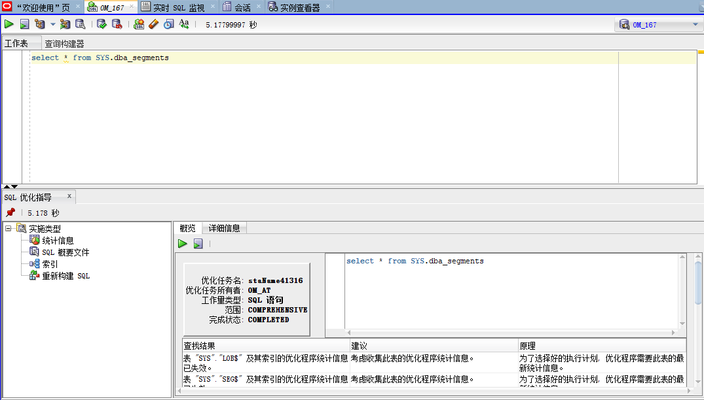
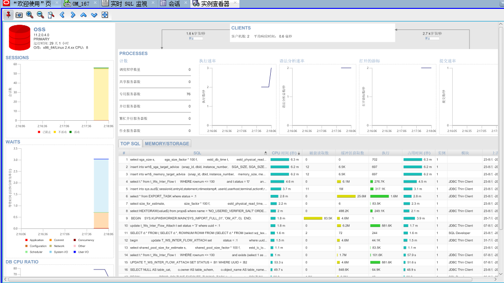
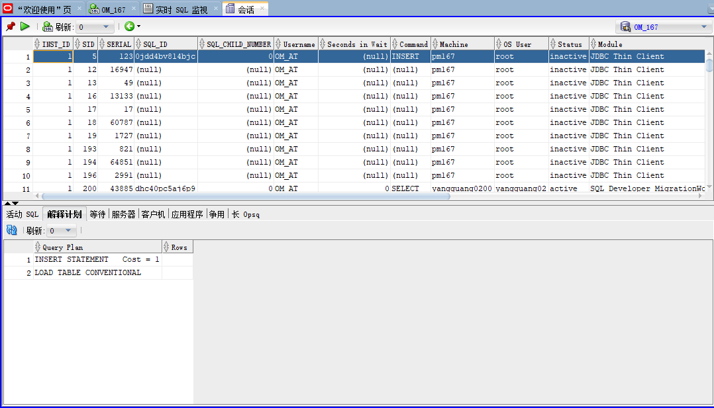
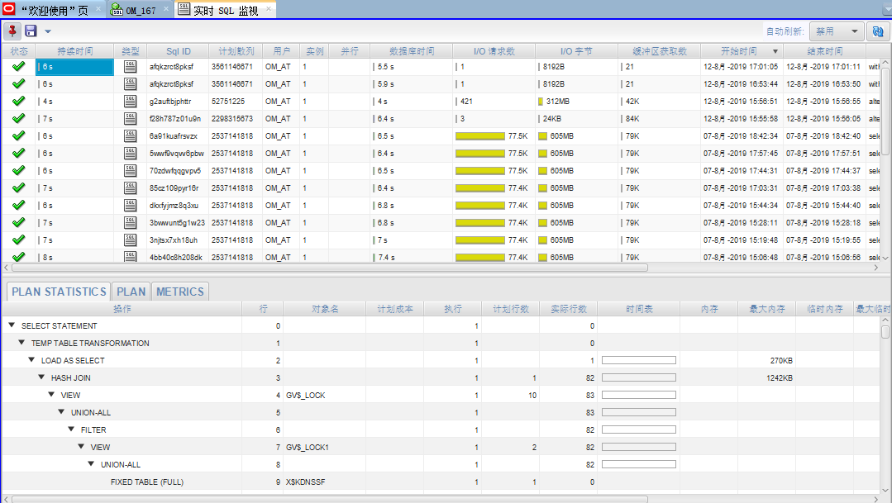
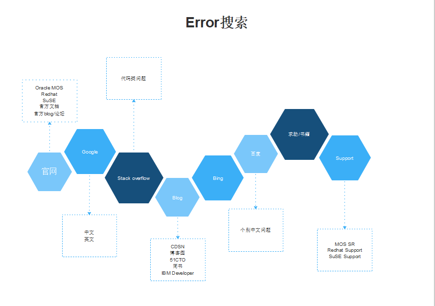
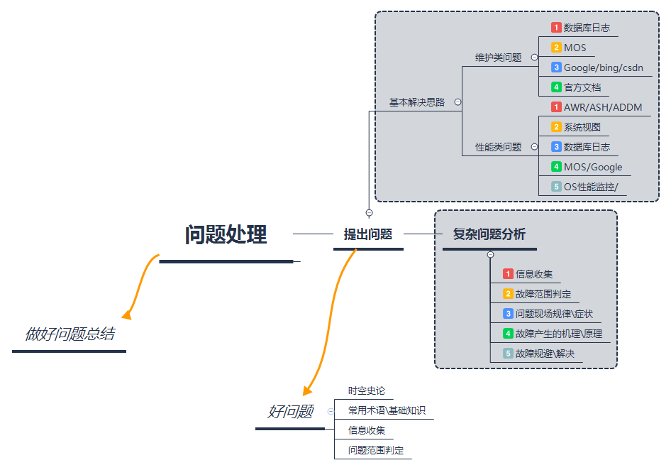

# Oracle故障处理指导


## 一、故障处理思想

### 1.1 搞明白问题

会问问题、会反馈问题、有效沟通

​		时空史论

常用术语、指标

### 1.2 信息收集

常用指标、状态/配置查看、日志、监控工具/软件

### 1.3 故障范围判定

硬件/OS/软件/应用/架构

CPU、内存、网络、IO、文件系统

### 1.4 需求、目的

- 需求--模块/功能

- 分层、劳动分工、线性扩展

  闻道有先后、术业有专攻，让合适的人干合适的自己事

  **分层**：应用层、服务层、数据层

### 1.5 万物一理

- 尊重客观事实

- 万物皆文件

- 处处皆缓存

  - 硬件缓存**：CPU一级、二级缓存，内存、SWAP、硬盘缓存、存储缓存
  
  - 软件缓存：MongoDB、Redis、Memcached
  - CDN加速

- 一个事务所作的修改对其他事务是不可见的，好似是串行执行的；
- 大型网站架构演化历程 https://www.hollischuang.com/archives/728
- 对比/对照 

常识:

​	你碰到的问题别人肯定都碰到了;你想到了别人肯定也想到了.


**参考文档**：

- 大型网站技术架构：核心原理与案例分析

- 人月神话（40周年中文纪念版）

  

## 二、Oracle性能类故障处理

### 2.1 AWR、ASH、ADDM、AWRSQRPT

## 1.  生成脚本

```plsql
脚本目录 $ORACLE_HOME/rdbms/admin
@?/rdbms/admin/addmrpt.sql
@?/rdbms/admin/awrrpt.sql
@?/rdbms/admin/ashrpt.sql
@?/rdbms/admin/awrsqrpt.sql
```

## 2.  快照、基线

```plsql
-- 查看快照保留期限，11g默认为8天
 SELECT retention FROM dba_hist_wr_control;
 -- 修改快照时间间隔
 EXEC DBMS_WORKLOAD_REPOSITORY.MODIFY_SNAPSHOT_SETTINGS( interval => 30);
 -- 手动生成快照
 EXEC DBMS_WORKLOAD_REPOSITORY.CREATE_SNAPSHOT('TYPICAL');
 或
 BEGIN 
 DBMS_WORKLOAD_REPOSITORY.create_snapshot(); 
 END; 
 /
```

### 2.2 动态性能视图、等待事件

```plsql
Oracle最重要的9个动态性能视图
v$session v$session_wait
v$process
v$sql
v$sqltext
v$bh (更宁愿是x$bh)
v$lock
v$latch_children
v$sysstat
v$system_event

--按组分的几组重要的性能视图
1.System的overview
v$sysstat,v$system_event,v$parameter
2.某个session 的当前情况
v$process,v$session,v$session_wait,v$session_event,v$sesstat
3.SQL 的情况
v$sql,v$sqlarea,v$SQL_PLAN,V$SQL_PLAN_STATISTICS,v$sqltext_with_newlines
4.Latch/lock/ENQUEUE
v$latch,v$latch_children,v$latch_holder,v$lock,V$ENQUEUE_STAT,V$ENQUEUE_LOCK,v$locked_object
5.IO 方面的
v$segstat,v$filestat,v$tempstat,v$datafile,v$tempfile
6.shared pool/Library cache
v$Librarycache,v$rowcache,x$ksmsp
7.advice也不错
v$db_cache_advice,v$PGA_TARGET_ADVICE,v$SHARED_POOL_ADVICE
```


### 2.3 SQL Developer









### 2.4 MOS/Google


## 三、Oracle维护类故障处理

### 3.1 数据库日志、OS日志

```plsql
--Oracle日志
select * from v$diag_info;
```

### 3.2 资料搜索



### 3.3 网址链接

|                                                              |                                                              |
| ------------------------------------------------------------ | ------------------------------------------------------------ |
| [MOS 中文文档列表](https://support.oracle.com/epmos/faces/DocumentDisplay?_afrLoop=274652291319490&id=1533057.1&displayIndex=27&_afrWindowMode=0&_adf.ctrl-state=13mq0a0pi9_618#aref_section22) | [阿里云帮助与文档](https://help.aliyun.com/?spm=a2c4g.11186623.201511181.1.qM1Nlp) |
| [My Oracle Support](https://support.oracle.com/epmos/faces/MosIndex.jspx?_afrLoop=185267211786600&_afrWindowMode=0&_adf.ctrl-state=1bnl89ywrk_4) | [AWS产品使用文档](https://aws.amazon.com/cn/documentation/?nc2=h_ql_d&awsm=ql-5) |
| [Oracle Help Center](http://docs.oracle.com/en/)             | [数据库内核月报](http://mysql.taobao.org/monthly/)           |
| [Redhat Documentation](https://access.redhat.com/documentation/en/) | [Brendan Gregg](http://www.brendangregg.com/)                |
| [IBM developerWorks ](http://www.ibm.com/developerworks/cn/) | [惜分飞](http://www.xifenfei.com/)                           |
| [Stack overflow](http://stackoverflow.com/)                  | [Oracle Life](http://www.eygle.com/)                         |
| [极客时间](https://time.geekbang.org/?category=0&sort=2&order=desc) | [iMySQL](http://www.imysql.cn/)                              |

## 四、问题处理总结

